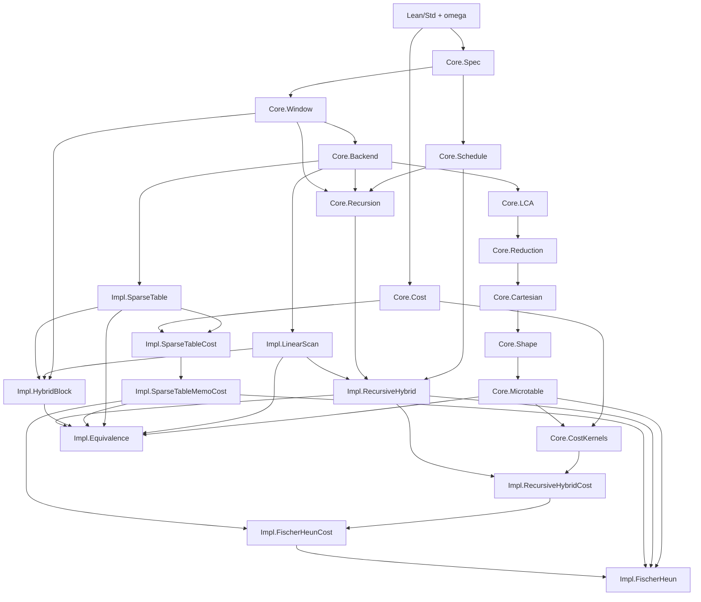

# RMQ Family Summary

Snapshot: 2026-06-16, after `23a0113 Use microtables in Fischer-Heun boundary queries`.

This document is the family-level map for the current Lean development. It
records the module dependency DAG, correctness and cost status by structure,
modeling scope notes, and declaration inventories. The theorem inventory lists
public theorem declarations by module; private helper theorems are listed in a
separate appendix.

## Status At A Glance

- Core contract: half-open RMQ ranges `[left, right)` over `List Int`, returning
  the leftmost minimum index when `left < right` and `right <= xs.length`.
- Exact public RMQ backends: linear scan, sparse table, memoized sparse table,
  hybrid block, recursive hybrid, raw whole-list microtable, and value-level
  Fischer-Heun.
- Exact LCA bridge: generated Euler traces plus exact RMQ backends induce exact
  LCA backends, and certified LCA encodings induce exact RMQ backends.
- Reverse RMQ-to-LCA witness: the built Cartesian tree supplies a concrete
  `RMQToLCAReduction`.
- Cost layer: Mathlib-free `Costed` monad, sparse-table build/query costs,
  recursive-hybrid build recurrence solved linear, raw microtable lookup/count
  profile, and assembled Fischer-Heun linear-build/constant-supplied-query
  profile.
- Main open integration point: connect the current microtable-backed
  value-level Fischer-Heun query directly to its costed erasure theorem, then
  add the final all-input wrapper with the small-input and tail policy.

## Dependency DAG

`RMQ.lean` imports the full family root.

## Correctness And Cost Status

| Structure | Correctness status | Cost status | Notes |
| --- | --- | --- | --- |
| Core RMQ spec and backend contract | `LeftmostArgMin`, `CandidateExact`, `RMQBackend`, and contract-level backend equality are proved. | No cost model here. | All public RMQ backends target the same half-open leftmost-argmin contract. |
| Linear scan | Exact query, soundness, completeness, invalid-range rejection, backend. | Costed scan kernel exists in `Core.CostKernels`; no separate backend-level cost wrapper. | Direct reference backend. |
| Sparse table | Exact materialized sparse table query and backend. | `SparseTableCost` gives costed materialized build, supplied-table query, fresh-table query erasure/run/cost. | Supplied-table query is constant under RAM/unit-cost indexed access. |
| Memoized sparse table | Memoized build is extensionally equivalent to the verified sparse table, with backend and fresh-query erasure/cost theorems. | Exact log-row build cost formula, memo row count, and fresh-query cost equality. | This is the cost-faithful sparse-table builder used by Fischer-Heun summaries. |
| Hybrid block | Exact public hybrid backend with boundary scans and sparse middle summaries. | No first-class cost profile yet. | Useful proof predecessor for the recursive and Fischer-Heun schedules. |
| Recursive hybrid | Exact public recursive backend via `recurseOnSummary`. | Build recurrence solved: `buildCost xs <= 2 * xs.length`; query-step costed erasure and cost formula with supplied summary query. | End-to-end recursive query bound is still not the flagship result; Fischer-Heun now carries the constant-query story. |
| Shape and microtable core | Shape/RMQ behavior equivalence, exact fixed-size shape signatures, shape universe count, certified raw local microtable, exact in-block backend. | Raw shape lookup cost bounded by `blockSize + 1`; shape count bounded by Catalan envelope `shapeCount b <= 4^b`. | The local theorem is now consumed by `Impl.FischerHeun`. |
| Fischer-Heun value backend | `State` carries block size, raw microtable, block-minimum summary, and summary sparse table. `queryWithState` composes full-boundary microtable lookups, recursive-middle summary query, and a direct scan for the short trailing right boundary. Exactness, soundness, completeness, invalid rejection, and backend wrappers are proved. | Cost profile is proved separately in `FischerHeunCost`; direct erasure connection from this value query remains to be added. | Current value-level short-tail fallback is exact but not yet charged in the final all-input wrapper. |
| Fischer-Heun cost profile | Correctness-independent counting/cost assumptions are packaged as theorem premises and canonical corollaries. | `buildCost <= 15 * xs.length`; supplied query cost `<= 8`; canonical theorem discharges budgets when `16 <= canonicalBlockSize xs`. | Cost claims are scoped to the RAM/unit-cost indexed-access model. |
| LCA from RMQ | Generated Euler trace plus `TracePathAgreement` turns an exact RMQ backend over depths into an exact `LCABackend`; unique labels discharge trace/path agreement structurally. | No LCA build/query cost profile yet. | Natural next bridge: costed Euler build plus Fischer-Heun RMQ over depths gives O(n), O(1) LCA. |
| RMQ from LCA | `RMQToLCAReduction` plus an exact LCA backend gives an exact RMQ backend. | No cost profile yet. | `Core.Cartesian` supplies a concrete certified reduction for RMQ intervals. |
| Equivalence layer | Contract-level equality proved among linear scan, sparse table, memo sparse table, hybrid block, recursive hybrid, and raw whole-list microtable. | No cost layer. | Fischer-Heun can be added once desired as another backend equality instance. |

## Consolidated Scope Notes

- The RMQ contract is half-open: a valid query satisfies `left < right` and
  `right <= xs.length`; invalid or empty ranges return `none`.
- Ties are resolved by the leftmost index. This is part of the semantic
  contract, not an implementation accident.
- Value-level structures use Lean `List Int` and `Nat` indices. The proof
  objects certify functional behavior over lists.
- Cost theorems are model-level `Costed` counts. They do not claim that Lean's
  executable `List` representation has random-access runtime behavior.
- Supplied sparse-table and materialized microtable lookups use the standard
  RAM/unit-cost indexed-access model. This is explicitly reflected by
  one-tick row/cell lookups and constant materialized microtable lookup cost.
- The canonical Fischer-Heun profile uses
  `canonicalBlockSize xs = Nat.log2 xs.length / 4` and currently assumes
  `16 <= canonicalBlockSize xs`. Under that large-input regime the microtable
  slot budget and summary sparse-table log-row budget are discharged.
- The value-level Fischer-Heun query is exact for all inputs, but the current
  cost profile is not yet an erasure theorem for that exact value query. The
  remaining wrapper should choose scan/sparse-table behavior for small inputs
  and a canonical Fischer-Heun state for large inputs.
- The project remains Mathlib-free: imports are Lean/Std plus existing Lean
  arithmetic automation such as `omega`.

## Primary Definitions And Structures

- `RMQ/Core/Spec.lean`: `ValidRange`, `betterIndex`, `combineIndex`,
  `LeftmostArgMin`, `CandidateExact`.
- `RMQ/Core/Window.lean`: `windowTailIndices`, `scanWindow`.
- `RMQ/Core/Backend.lean`: `RMQBackend`, `RMQBackend.queryBuilt`.
- `RMQ/Core/Cost.lean`: `Costed`, `Costed.erase`, `Costed.run`,
  `Costed.pure`, `Costed.bind`, `Costed.tick`, `Costed.tickValue`,
  `Costed.map`.
- `RMQ/Core/CostKernels.lean`: `scanWindowCosted`, `rangeScanCost`,
  `rangeScanCosted`, `queryOffsetCosted?`, `rawMicrotableLookupCosted`.
- `RMQ/Core/Schedule.lean`: `compressedLength`, `leftBoundaryBlock`,
  `rightBoundaryBlock`.
- `RMQ/Core/Recursion.lean`: `lengthRec`, `blockMinIndex`, `blockMinValue`,
  `blockMinSummary`, `liftBlockCandidate`, `recursiveMiddleCandidate`,
  `SummaryShape`, `recurseOnSummary`, `publicBlockSummaryShape`,
  `publicSummaryDepth`.
- `RMQ/Core/Shape.lean`: `CartesianShape`, `CartesianShape.size`,
  `CartesianShape.rootOffset?`, `shapeRange`, `shape`, `SameRMQBehavior`,
  `ShapeOfSize`, `shapesOfSize`, `shapeCount`, `CartesianShape.fullCode`,
  `blockSignature`.
- `RMQ/Core/Microtable.lean`: `CartesianShape.queryOffset?`, `LocalValid`,
  `shapeUniverse`, `localScanOffset`, `Microtable`, `Microtable.raw`,
  `Microtable.queryIndex?`, `Microtable.backend`, `Microtable.rawBackend`.
- `RMQ/Core/LCA.lean`: `RoseTree`, `UnitDepthMove`, `UnitDepthMoves`,
  `depthsFromMoves`, `depthAfterMoves`, `AdjacentDepthsDifferByOne`,
  `RoseTree.eulerDepthsAt`, `RoseTree.eulerDepths`, `LabelsUnique`,
  `eulerPaths`, `pathDepth`, `commonPrefix`, path-level and tree-level
  `pathLCA?`, `PathCommonAncestor`, `IsPathLCAOfPaths`, `IsPathLCA`,
  `firstIndexOf?`, `EulerTrace`, `EulerPathTrace`, generated Euler traces,
  `firstOccurrence?`, `occurrenceWindow`, `leftmostMinNode?`,
  `minDepthNodeInWindow`, trace/tree `lcaCandidate`, `IsLCAAnswer`,
  `TracePathAgreement`, `EulerPathWindowAgreement`,
  `PathWindowPrefixInvariant`, `EulerPathWindowPrefixInvariant`,
  `PathWindowCommonPrefixWitness`, `EulerPathWindowCommonPrefixWitness`,
  `TracePathExactOnLabels`, `labelPairAgreement`,
  `duplicateLabelCounterexample`.
- `RMQ/Core/Reduction.lean`: `LCABackend`, `LCABackend.queryBuilt`,
  `RoseTree.lcaBackendOfRMQBackend`, `RoseTree.lcaBackendOfRMQBackendUnique`,
  `RoseTree.lcaBackendOfRMQBackendChecked`, `RMQToLCAReduction`,
  `RMQToLCAReduction.queryWithLCABackend`,
  `RMQToLCAReduction.rmqBackendOfLCABackend`,
  `rmq_lca_reduction_equiv`, `rmq_lca_reduction_equiv_checked`.
- `RMQ/Core/Cartesian.lean`: `childIf`, `treeRange`, `tree`, `rootLabel`,
  `InRange`, `indexPath`, `RangeLCASpec`, `reductionOfRangeLCASpec`,
  `BuiltRangeLCASpec`, `reduction`, `certifiedReduction`.
- `RMQ/Impl/LinearScan.lean`: `query`, `backend`.
- `RMQ/Impl/SparseTable.lean`: `blockLen`, `combineIndex`, `blockArgMin`,
  `sparseRow`, `rowCell`, `buildSparseTable`, `tableRow`, `queryFromTable`,
  `query`, `backend`.
- `RMQ/Impl/SparseTableCost.lean`: `blockArgMinCost`,
  `blockArgMinCosted`, `sparseRowBuildCost`, `sparseRowCosted`,
  `buildSparseTableCost`, `buildSparseTableCosted`, `tableRowCosted`,
  `rowCellCosted`, `combineIndexCosted`, `queryFromTableCost`,
  `queryFromTableCosted`, `queryCosted`.
- `RMQ/Impl/SparseTableMemoCost.lean`: `memoNextRow`, `memoNextCellCost`,
  `memoNextRowCost`, `memoNextRowCosted`, `memoRowCount`,
  `memoBaseRowCost`, `memoBaseRowCosted`, `memoBuildSparseTableCost`,
  `memoBuildRowsFrom`, `memoBuildRowsFromCost`, `memoBuildRowsFromCosted`,
  `memoBuildSparseTable`, `memoBuildSparseTableCosted`, `memoQuery`,
  `memoBackend`, `memoQueryCosted`.
- `RMQ/Impl/HybridBlock.lean`: `chunkSpan`, `publicBlockSize`,
  `combineIndex`, `rangeScan`, `chunkCell`, `chunkRow`, `rowCell`,
  `buildChunkSparseTable`, `tableRow`, `sparseChunkQueryFromTable`,
  `State`, `build`, `queryWithState`, `query`, `backend`.
- `RMQ/Impl/RecursiveHybrid.lean`: `combineIndex`, `rangeScan`,
  `queryWithSummaryBackend`, `backendWithSummary`, `backend`, `query`.
- `RMQ/Impl/RecursiveHybridCost.lean`: `blockSummaryEntryCost`,
  `blockMinSummaryBuildCost`, `blockMinSummaryCosted`, `buildCost`,
  `queryWithSummaryCost`, `queryWithSummaryCosted`.
- `RMQ/Impl/FischerHeunCost.lean`: `rawLookupCostBound`,
  `rawShapeTableCount`, `localQuerySlotBudget`, `rawMicrotableSlotBudget`,
  `shapeCountEnvelope`, `canonicalBlockSize`, `summarySparseBuildCost`,
  `materializedMicrotableLookupCost`, `suppliedQueryCost`, `buildCost`.
- `RMQ/Impl/FischerHeun.lean`: `MicrotableFor`, `State`,
  `rightBoundaryCandidate`, `summaryBackend`, `buildWithBlockSize`, `build`,
  `queryWithState`, `queryWithBlockSize`, `query`, `backendWithBlockSize`,
  `backend`.

## Public Theorem Inventory

The names below are grouped by source module. Repeated base names in
`Core/LCA.lean` live in different namespaces, for example `EulerTrace` and
`RoseTree`.

### Core

- `RMQ/Core/Spec.lean` (9): `LeftmostArgMin.valid`,
  `leftmostArgMin_unique`, `combineLeftmost`, `candidateExact_none`,
  `candidateExact_some`, `CandidateExact.exists_of_nonempty`,
  `candidateExact_combineAdjacent`, `candidateExact_combineThree`,
  `combineHybridLeftmost`.
- `RMQ/Core/Window.lean` (3): `singleton_leftmostArgMin`,
  `extend_leftmostArgMin`, `scanWindow_leftmost`.
- `RMQ/Core/Backend.lean` (1): `RMQBackend.queryBuilt_eq`.
- `RMQ/Core/Cost.lean` (28): `Costed.erase_mk`, `Costed.run_mk`,
  `Costed.value_pure`, `Costed.cost_pure`, `Costed.erase_pure`,
  `Costed.run_pure`, `Costed.value_bind`, `Costed.cost_bind`,
  `Costed.erase_bind`, `Costed.run_bind`, `Costed.value_tick`,
  `Costed.cost_tick`, `Costed.erase_tick`, `Costed.run_tick`,
  `Costed.value_tickValue`, `Costed.cost_tickValue`,
  `Costed.erase_tickValue`, `Costed.run_tickValue`, `Costed.pure_bind`,
  `Costed.bind_pure`, `Costed.bind_assoc`, `Costed.cost_bind_assoc`,
  `Costed.tick_bind_cost`, `Costed.bind_tick_cost`,
  `Costed.tickValue_eq_tick_bind_pure`, `Costed.map_value`,
  `Costed.map_cost`, `Costed.erase_map`.
- `RMQ/Core/CostKernels.lean` (15): `scanWindowCosted_value`,
  `scanWindowCosted_erase`, `scanWindowCosted_cost`,
  `scanWindowCosted_run`, `scanWindowCosted_leftmost`,
  `rangeScanCosted_value`, `rangeScanCosted_erase`,
  `rangeScanCosted_cost`, `rangeScanCosted_run`,
  `CartesianShape.queryOffsetCosted?_value`,
  `CartesianShape.queryOffsetCosted?_erase`,
  `CartesianShape.queryOffsetCosted?_cost_le_size_succ`,
  `Cartesian.rawMicrotableLookupCosted_value`,
  `Cartesian.rawMicrotableLookupCosted_erase`,
  `Cartesian.rawMicrotableLookupCosted_cost_le`.
- `RMQ/Core/Schedule.lean` (4): `compressedLength_lt_self`,
  `left_lt_leftBoundaryBlock_mul`, `rightBoundaryBlock_mul_le`,
  `rightBoundaryBlock_le_compressed`.
- `RMQ/Core/Recursion.lean` (14): `block_bound_of_lt_compressedLength`,
  `block_start_lt_of_lt_compressedLength`, `blockMinSummary_length`,
  `blockMinSummary_get?_eq_blockMinValue`, `blockMinIndex_leftmost`,
  `blockMinSummary_entry_exact`, `blockMinSummary_lift_leftmost`,
  `blockMinSummary_lift_candidate`, `recursiveMiddleCandidate_exact`,
  `combineRecursiveMiddleLeftmost`, `publicBlockSize_gt_one_of_length_gt_one`,
  `publicCompressedLength_lt_self`, `recurseOnSummary_of_small`,
  `recurseOnSummary_of_large`.
- `RMQ/Core/Shape.lean` (22): `shapeRange_size`, `shape_size`,
  `rootOffset?_shapeRange`, `shapeRange_eq_of_sameRMQBehavior`,
  `shape_eq_of_sameRMQBehavior`, `scanWindow_eq_of_shapeRange_eq`,
  `sameRMQBehavior_of_shapeRange_eq`, `sameRMQBehavior_iff_shapeRange_eq`,
  `ShapeOfSize.size_eq`, `shapeCount_zero`, `shapeCount_succ`,
  `mem_shapesOfSize_shapeOfSize`, `shapeOfSize_mem_shapesOfSize`,
  `mem_shapesOfSize_iff_shapeOfSize`, `CartesianShape.fullCode_length`,
  `CartesianShape.fullCode_injective`, `shapesOfSize_nodup`,
  `CartesianShape.fullCode_tail_length_of_shapeOfSize`,
  `shapeCount_le_four_pow`, `shapeRange_shapeOfSize`, `shape_shapeOfSize`,
  `blockSignature_shapeOfSize`.
- `RMQ/Core/Microtable.lean` (11): `shapeUniverse_length`,
  `blockSignature_mem_shapeUniverse`, `localScanOffset_bounds`,
  `localScanOffset_add_start`, `localScanOffset_leftmost`,
  `CartesianShape.queryOffset?_blockSignature`, `Microtable.queryIndex?_eq`,
  `Microtable.queryIndex?_leftmost`, `Microtable.queryIndex?_sound`,
  `Microtable.queryIndex?_complete`, `Microtable.queryIndex?_invalid`.
- `RMQ/Core/LCA.lean` (86): `unitDepthMoves_append`,
  `depthAfterMoves_append`, `depthsFromMoves_append_cons`,
  `unitDepthMove_step`, `depthsFromMoves_adjacent`,
  `depthsFromMoves_length`, `RoseTree.eulerDepthsAt_adjacent`,
  `RoseTree.eulerDepths_adjacent`, `nodup_append_not_mem_right`,
  `nodup_append_not_mem_left`, `labelsUnique_root_not_mem_children`,
  `labelsUnique_children_nodup`, `labelsUnique_child_of_cons`,
  `labelsUnique_root_rest_of_cons`, `labelsUnique_child_not_mem_rest`,
  `labelsUnique_rest_not_mem_child`, `getLast?_append_singleton`,
  `eulerPaths_length_eq_eulerNodes`,
  `eulerDepths_eq_eulerPaths_map_pathDepth`,
  `eulerPaths_last?_eq_eulerNodes`, `pathTo?_mem_eulerPaths`,
  `getElem?_length_of_append_singleton_prefix`,
  `here_prefix_of_mem_eulerPathsAt_node`,
  `first_extra_of_mem_eulerPathsAt_node`,
  `first_extra_mem_labelsPreorderForest_of_mem_eulerPathsForestAt`,
  `commonPrefix_prefix_left`, `commonPrefix_prefix_right`,
  `commonPrefix_eq_left_of_prefix`, `commonPrefix_eq_right_of_prefix`,
  `commonPrefix_append_common`, `commonPrefix_comm`,
  `prefix_eq_of_prefix_of_length_le`, `prefix_commonPrefix_of_prefixes`,
  `getElem?_of_prefix`, `eq_commonPrefix_of_prefixes_of_length_ge`,
  `commonPrefix_eq_parentPath_of_child_and_rightForest`,
  `pathLCA?_isPathLCAOfPaths`, `RoseTree.pathLCA?_isPathLCA`,
  `RoseTree.pathLCA?_eq_of_isPathLCA`, `labels_mem_of_pathLCA?_some`,
  `isPathLCA_of_pathTo_prefixes_of_commonPrefix_length_le`,
  `pathTo?_eq_of_mem_eulerPaths_unique`, `firstIndexOf?_lt_length`,
  `firstIndexOf?_getElem?`, `firstIndexOf?_mem`,
  `firstIndexOf?_exists_of_mem`, `pathAt?_of_nodeAt?`,
  `EulerTrace.occurrenceWindow_shift_fst`,
  `EulerTrace.occurrenceWindow_shift_snd`,
  `EulerTrace.occurrenceWindow_valid`,
  `EulerTrace.minDepthNodeInWindow_valid_exact`,
  `EulerTrace.leftmostMinNode?_eq_of_isLCAAnswer`,
  `EulerTrace.isLCAAnswer_of_leftmostMinNode?_eq`,
  `EulerTrace.lcaCandidate_valid_exact`, `EulerTrace.lcaCandidate_isLCAAnswer`,
  `RoseTree.lcaCandidate_valid_exact`, `RoseTree.lcaCandidate_isLCAAnswer`,
  `eulerPathAt?_of_eulerTraceNodeAt?`, `pathWitness_of_isLCAAnswer`,
  `pathWitness_pathTo_of_isLCAAnswer_unique`,
  `pathAtFirstOccurrence?_pathTo_unique`,
  `pathWitness_with_endpoints_of_isLCAAnswer_unique`,
  `firstOccurrence?_exists_of_mem_labelsPreorder`,
  `leftmostMinNode?_exists_of_mem_labelsPreorder`,
  `pathWindowPrefixInvariant_cons`, `pathWindowCommonPrefixWitness_cons`,
  `pathWindowPrefixInvariant_append`, `pathWindowCommonPrefixWitness_append`,
  `eulerPathWindowAgreement_of_prefix_and_witness`,
  `tracePathAgreement_of_eulerPathWindowAgreement`,
  `tracePathAgreement_of_eulerPathWindowInvariants`,
  `eulerPathWindowPrefixInvariant_of_labelsUnique`,
  `eulerPathWindowCommonPrefixWitness_of_labelsUnique`,
  `eulerPathWindowAgreement_of_labelsUnique`,
  `tracePathAgreement_of_labelsUnique`,
  `tracePathExactOnLabels_of_tracePathAgreement`,
  `tracePathAgreement_of_leftmostMinNode_eq_pathLCA`,
  `tracePathAgreement_of_tracePathExactOnLabels`,
  `tracePathExactOnLabels_of_labelPairAgreement`,
  `tracePathAgreement_of_labelPairAgreement`,
  `lcaCandidate_isPathLCA_of_tracePathAgreement`,
  `lcaCandidate_isPathLCA_of_tracePathExactOnLabels`,
  `lcaCandidate_isPathLCA_of_labelPairAgreement`,
  `lcaCandidate_isPathLCA_of_pathLCA`,
  `duplicateLabelCounterexample_traceAnswer`,
  `duplicateLabelCounterexample_not_tracePathAgreement`.
- `RMQ/Core/Reduction.lean` (6):
  `RoseTree.leftmostMinNode?_eq_pathLCA_of_labelPairAgreement`,
  `EulerTrace.lcaCandidate_eq_leftmostMinNode?`,
  `RMQToLCAReduction.queryWithLCABackend_sound`,
  `RMQToLCAReduction.queryWithLCABackend_complete`,
  `RMQToLCAReduction.queryWithLCABackend_invalid_none`,
  `rmq_lca_reduction_equiv_exists`.
- `RMQ/Core/Cartesian.lean` (25): `betterIndex_eq_left_or_right`,
  `scanWindow_bounds`, `indexPath_root`, `indexPath_exists_of_inRange`,
  `indexPath_none_of_not_inRange`, `indexPath_head_inRange`,
  `commonPrefix_eq_nil_of_head_separated`,
  `pathLCA?_root_cons_of_tail_separated`,
  `pathLCA?_root_cons_of_tail_lca`, `pathToForest?_append_none`,
  `pathToForest?_append_left_some`, `pathToForest?_append_right_of_left_none`,
  `treeRange_pathTo?_none_of_not_inRange`,
  `treeRange_pathTo?_exists_of_inRange`, `treeRange_pathTo?_eq_indexPath`,
  `treeRange_root_leftmost`, `treeRange_pathTo_root`,
  `treeRange_pathLCA_root_root`, `treeRange_pathLCA_root_of_contains`,
  `treeRange_pathLCA_left_lift`, `treeRange_pathLCA_right_lift`,
  `leftmostArgMin_restrict_containing`, `treeRange_root_leftmost_of_contains`,
  `treeRange_rangeLCASpec`, `builtRangeLCASpec`.

### Implementations

- `RMQ/Impl/LinearScan.lean` (4): `query_valid_exact`, `query_sound`,
  `query_complete`, `invalid_none`.
- `RMQ/Impl/SparseTable.lean` (7): `blockArgMin_leftmost_exists`,
  `sparseRow_cell_eq_blockArgMin`, `tableRow_build_eq_sparseRow`,
  `query_valid_exact`, `query_sound`, `query_complete`, `invalid_none`.
- `RMQ/Impl/SparseTableCost.lean` (24): `blockArgMinCosted_value`,
  `blockArgMinCosted_erase`, `blockArgMinCosted_cost`,
  `sparseRowCosted_value`, `sparseRowCosted_erase`, `sparseRowCosted_cost`,
  `buildSparseTableCosted_value`, `buildSparseTableCosted_erase`,
  `buildSparseTableCosted_cost`, `buildSparseTableCosted_run`,
  `tableRowCosted_value`, `tableRowCosted_cost`, `rowCellCosted_value`,
  `rowCellCosted_cost`, `combineIndexCosted_value`, `combineIndexCosted_cost`,
  `queryFromTableCosted_value`, `queryFromTableCosted_erase`,
  `queryFromTableCosted_cost`, `queryFromTableCosted_run`,
  `queryCosted_value`, `queryCosted_erase`, `queryCosted_cost`,
  `queryCosted_run`.
- `RMQ/Impl/SparseTableMemoCost.lean` (30):
  `blockArgMin_none_of_length_le_start`, `sparseRow_cell_eq_blockArgMin_total`,
  `memoNextRow_sparseRow`, `memoNextRowCosted_value`,
  `memoNextRowCosted_erase`, `memoNextRowCosted_cost`,
  `memoNextRowCosted_sparseRow_value`, `memoBaseRowCosted_value`,
  `memoBaseRowCosted_erase`, `memoBaseRowCosted_cost`,
  `memoBuildSparseTableCost_eq_log`, `memoBuildRowsFromCosted_value`,
  `memoBuildRowsFromCosted_erase`, `memoBuildRowsFromCosted_cost`,
  `memoBuildRowsFrom_length`, `memoBuildRowsFrom_get?_sparseRow_of_lt`,
  `memoBuildSparseTableCosted_value`, `memoBuildSparseTableCosted_erase`,
  `memoBuildSparseTableCosted_cost`, `memoBuildSparseTableCosted_run`,
  `memoBuildSparseTable_length`, `tableRow_memoBuildSparseTable_eq_sparseRow`,
  `log2_le_log2_of_le`, `queryLevel_lt_memoRowCount`, `memoQuery_eq_query`,
  `memoQueryCosted_value`, `memoQueryCosted_erase`, `memoQueryCosted_cost`,
  `memoQueryCosted_run`, `memoQueryCosted_cost_eq_log`.
- `RMQ/Impl/HybridBlock.lean` (14): `chunkSpan_pos`, `chunkSpan_succ`,
  `chunkCell_leftmost_exists`, `chunkRow_cell_eq_chunkCell`,
  `tableRow_build_eq_chunkRow`, `sparseChunkIntervalCover`,
  `sparseChunkQuery_valid_exact`, `publicBlockSize_pos`,
  `queryWithState_invalid_none`, `queryWithState_eq_linear_of_small`,
  `query_valid_exact`, `query_sound`, `query_complete`, `invalid_none`.
- `RMQ/Impl/RecursiveHybrid.lean` (7):
  `queryWithSummaryBackend_invalid_none`,
  `queryWithSummaryBackend_valid_exact`, `queryWithSummaryBackend_sound`,
  `queryWithSummaryBackend_complete`, `query_sound`, `query_complete`,
  `invalid_none`.
- `RMQ/Impl/RecursiveHybridCost.lean` (15):
  `blockMinSummaryCosted_value`, `blockMinSummaryCosted_erase`,
  `blockMinSummaryCosted_cost`, `buildCost_of_small`, `buildCost_of_large`,
  `blockMinSummaryBuildCost_le_length`, `publicCompressedLength_le_half`,
  `blockMinSummary_public_length_le_half`, `two_mul_half_le`,
  `buildCost_le_two_mul_length`, `buildCost_linear`,
  `queryWithSummaryCosted_value`, `queryWithSummaryCosted_erase`,
  `queryWithSummaryCosted_cost`, `queryWithSummaryCosted_run`.
- `RMQ/Impl/FischerHeunCost.lean` (32):
  `rawShapeTableCount_eq_shapeCount`,
  `rawMicrotableSlotBudget_eq_shapeCount_mul`,
  `rawMicrotableSlotBudget_le_of_local_slots_le_shape_count`,
  `rawLookupCosted_cost_le_bound`, `rawMicrotable_cost_count_profile`,
  `rawShapeTableCount_le_envelope`, `rawShapeTableCount_le_shapeCountEnvelope`,
  `rawShapeTableCount_square_le_of_envelope_square`,
  `rawShapeTableCount_square_le_of_envelope_budget`,
  `shapeCountEnvelope_eq_two_pow_two_mul`,
  `shapeCountEnvelope_square_eq_two_pow_four_mul`,
  `shapeCountEnvelope_square_le_of_four_mul_le_log2`,
  `rawShapeTableCount_square_le_of_four_mul_le_log2`,
  `canonicalBlockSize_four_mul_le_log2`,
  `localQuerySlotBudget_le_shapeCountEnvelope`,
  `rawMicrotableSlotBudget_le_shapeCountEnvelope_square`,
  `rawMicrotableSlotBudget_le_length_of_four_mul_le_log2`,
  `rawMicrotableSlotBudget_canonical_le_length`,
  `summaryLog_canonical_le_four_mul`,
  `canonicalBlockSize_pos_length_of_ge_sixteen`,
  `blockMinSummary_length_mul_le_length`, `blockMinSummary_length_le_length`,
  `summarySparseBuildCost_le_thirteen_mul_length`,
  `sparseQueryFromTableCost_le_four`, `suppliedQueryCost_le_eight`,
  `buildCost_le_fifteen_mul_length`,
  `buildCost_le_fifteen_mul_length_of_shape_budget`,
  `buildCost_linear_under_budget`, `suppliedQueryCost_constant`,
  `linearBuild_constantQuery_profile`,
  `linearBuild_constantQuery_profile_of_shape_budget`,
  `linearBuild_constantQuery_profile_canonical`.
- `RMQ/Impl/FischerHeun.lean` (13): `microQueryIndex_valid_exact`,
  `rightBoundaryCandidate_exact`, `buildWithBlockSize_blockSize`,
  `buildWithBlockSize_summary`, `buildWithBlockSize_summaryTable`,
  `buildWithBlockSize_microtable`, `queryWithState_valid_exact`,
  `queryWithState_sound`, `queryWithState_complete`,
  `queryWithState_invalid_none`, `query_sound`, `query_complete`,
  `invalid_none`.
- `RMQ/Impl/Equivalence.lean` (11): `linearScan_query_eq_sparseTable_query`,
  `sparseTable_query_eq_memoSparseTable_query`,
  `linearScan_query_eq_memoSparseTable_query`,
  `linearScan_query_eq_hybridBlock_query`,
  `linearScan_query_eq_recursiveHybrid_query`,
  `linearScan_query_eq_microtableRaw_query`,
  `sparseTable_query_eq_hybridBlock_query`,
  `sparseTable_query_eq_recursiveHybrid_query`,
  `sparseTable_query_eq_microtableRaw_query`,
  `hybridBlock_query_eq_recursiveHybrid_query`,
  `recursiveHybrid_query_eq_hybridBlock_query`.

## Private Helper Theorem Inventory

These are intentionally non-API helpers, but they are listed here for audit
completeness.

- `RMQ/Core/Window.lean`: `get?_some_of_lt`.
- `RMQ/Core/Shape.lean`: `sum_map_const_nat`, `fin_succ_inj`, `nodup_ofFn`,
  `finRange_nodup`, `boolLists_length`, `mem_boolLists_of_length`,
  `decodeFullCodeFuel_fullCode_append`, `mem_erase_of_ne_of_mem`,
  `length_le_of_nodup_injective_into`, `nodup_map_node_left`,
  `mem_nodeProducts`, `nodup_nodeProducts`,
  `nodup_flatMap_of_nodup_disjoint`, `mem_splitShapeProducts`,
  `splitShapeProducts_nodup`, `fullCode_eq_of_tail_eq_of_pos`.
- `RMQ/Impl/SparseTable.lean`: `get?_some_of_lt`, `betterIndex_self`,
  `leftmost_singleton`, `sparseRow_get?_eq_blockArgMin`, `log2_block_bounds`.
- `RMQ/Impl/HybridBlock.lean`: `chunkRow_get?_eq_chunkCell`,
  `log2_chunk_bounds`.
- `RMQ/Impl/FischerHeunCost.lean`: `nat_le_two_pow`,
  `nat_succ_le_two_pow`, `log2_le_of_lt_pow_succ`,
  `div_lt_pow_of_lt_pow_add_four`.

## Suggested Next Milestones

1. Cost erasure for `FischerHeun.queryWithState`: define a costed counterpart
   that charges materialized microtable lookups, summary sparse-table supplied
   query, two combines, and the current short-tail fallback.
2. Final all-input Fischer-Heun wrapper: small input falls back to scan or
   sparse table; large input uses canonical quarter-log Fischer-Heun and
   discharges the large-input side condition.
3. Add Fischer-Heun to `Impl/Equivalence.lean` once the public value backend is
   considered stable.
4. Costed LCA via RMQ: build Euler depths, instantiate Fischer-Heun over those
   depths, and package an O(n), O(1) LCA backend under the same model notes.
