# RMQ Family Summary

Snapshot: 2026-07-01, after the reusable table/access and payload models,
indexed LCA query-cost layer, Fischer-Heun-backed LCA model, traced sparse-query
substrate, fixed-length exact-RMQ space sandwich, payload-lower-bound hub
adapter, the proved coefficient-correct doubled Catalan lower-bound bridge,
packed plus-minus-one RMQ/LCA model layer, uniform charged-budget lower-bound
theorems, reusable hub import surface layers, and the total two-sided BP-native
succinct RMQ capstone. The final succinct path now includes a generic
sparse-exception select close-access witness over `shape.bpCode`, a concrete
compact BP close/LCA directory, rank-backed local BP seed routing through the
final payload-live access family, and a public generic-select theorem surface
that packages the `2*n + o(n)` upper structure with the doubled Catalan lower
slack. The older relative-split capstone is now an intentionally checked old
capstone; archived obstruction anchors live in
`RMQ/Archive/SelectObstructions.lean`, the old capstone alias lives in
`RMQ/Archive/BPSpecializedCapstone.lean`, and compatibility aliases remain in
`RMQ/Archive/SelectCompatibility.lean`. These archive modules are no longer
imported by the main `RMQ` root; use the optional `RMQArchive` Lake target/import
root for local compatibility checks. The corresponding trust-base checks live
in `scripts/archive_axiom_check.lean`, which is run by the gate. Short public
aliases for the main citeable theorem
surfaces now live in `RMQ/Headlines.lean`.  The standalone rank/select spoke
now also exposes the concrete fixed-weight compressed/FID capstone family
`RankSelect.compressedFIDFixedWeightFamilyProfile`, with headline alias
`Headlines.rankSelectCompressedFIDFixedWeightFamilyProfile`, and the additive
interpreter-backed replay
`RankSelect.compressedFIDFixedWeightInterpretedFamilyProfile`, with headline
alias
`Headlines.rankSelectCompressedFIDFixedWeightInterpretedFamilyProfile`.

This document is the family-level map for the current Lean development. It
records the module dependency DAG, correctness and cost status by structure,
modeling scope notes, and declaration inventories. The theorem inventory lists
public theorem declarations by module; private helper theorems are listed in a
separate appendix.

## Status At A Glance

- Core contract: half-open RMQ ranges `[left, right)` over `List Int`, returning
  the leftmost minimum index when `left < right` and `right <= xs.length`.
- Exact public RMQ backends: linear scan, plus-minus-one linear instance,
  sparse table, memoized sparse table, hybrid block, recursive hybrid, raw
  whole-list microtable, and value-level Fischer-Heun.
- Exact LCA bridge: generated Euler traces plus exact RMQ backends induce exact
  LCA backends, and certified LCA encodings induce exact RMQ backends.
- Reverse RMQ-to-LCA witness: the built Cartesian tree supplies a concrete
  `RMQToLCAReduction`.
- Cost/model layer: Mathlib-free `Costed` monad, generic indexed-access and
  payload-accounting views, sparse-table build/query costs,
  recursive-hybrid build recurrence solved linear, raw microtable lookup/count
  profile, assembled Fischer-Heun linear-build/constant-supplied-query
  profile, and costed LCA-via-RMQ bridge wrappers, including an explicit
  indexed-access query path that charges first-occurrence reads, a supplied
  RMQ query, and the returned-node read. The canonical Fischer-Heun-backed LCA
  wrapper now instantiates that path with a concrete large-regime query bound.
  The cost-headline LCA path is the dense-label direct-address built query
  state backed by a counted first-occurrence-table builder. The dense LCA
  profile now also has counted Euler node/depth Array views, an assembled
  preprocessing-plus-query theorem, and a normalized public-facing
  linear-build/constant-query theorem,
  `denseLCA_linearBuild_constantQuery_profile`.
- Derived-cost substrate: `Core.RAM` defines a tiny traced primitive-operation
  model and `Impl.SparseTableInstrumented` proves Array-backed sparse-table
  cell, row, and query refinements with derived trace bounds.
- Reusable hub surface: `RMQ.Core.ModelHub` and the standalone `RMQHub` Lake
  target collect the RMQ-free
  `Cost`/`RAM`/`Refine`/`TableModel`/`LowerBound`/`PayloadLowerBound` layer;
  `scripts/hub_axiom_check.lean` checks that surface without importing the RMQ
  spoke. The payload layer now includes both pointwise and uniform charged
  payload-budget lower bounds. The first extraction spoke is now standalone
  rank/select: `RMQRankSelect` builds the public plain-bitvector
  `n + o(n)` payload profile with constant modeled `access`, `rank`, and
  `select`, stated independently from RMQ while reusing the succinct bitvector
  machinery where appropriate; it now also exposes the compressed/FID
  fixed-weight theorem surface, its Word-RAM replay surface, and the counted
  binomial universe. The second
  extraction spoke is
  `RMQBPNavigation`, exposing the compact balanced-parentheses close/LCA
  navigation facade consumed by succinct RMQ, now with the public rank-backed
  excess and inorder-close-plus-excess bridge.
- Optional archive root: `RMQArchive` imports the retired compatibility and
  obstruction surfaces under `RMQ.Archive`, while the main `RMQ` root stays
  focused on live proof surfaces and public headlines.
- Succinct role barrels: `RMQ.Core.SuccinctSpace`,
  `RMQ.Core.GenericSelect`, `RMQ.Core.SuccinctRankSelect`,
  `RMQ.Core.BPCloseNavigation`, and `RMQ.Core.SuccinctRMQ` are thin import
  roots for the live succinct stack. They keep downstream imports organized by
  dependency role while the underlying implementation files are split by
  theorem/model role.
- Lower-bound layer: fixed-length lossless Cartesian-shape capacity theorem,
  exact-RMQ-decoder bridge, Mathlib-free Remy-style proof of
  `2^(2*n) <= (2*n+1)^2 * shapeCount n`, the resulting no-premise
  logarithmic-slack bit lower bound, and the proved coefficient-correct
  doubled Catalan bridge
  `4*n - (3*log2(2*n+1)+3) <= 2*bits` from
  `shapeCount_cubic_square_lower`. A canonical representative state encoding
  now instantiates the abstract state-encoding adapter, and
  `Impl.FischerHeun` adds a Fischer-Heun-shaped state encoder that separates
  counted payload bits from proof-only built-state fields. The
  `ExactRMQSpaceBounds` wrapper and its canonical/Fischer-Heun-shaped
  instantiations now give a non-vacuous fixed-length `2*n` upper witness paired
  with the universal logarithmic-slack lower bound, while
  `exactRMQ_tight_fixed_length_payload_space_bound_doubled_catalan_slack`
  packages the coefficient-correct doubled Catalan slack with the same
  canonical exact-payload witness.
- Shape sample layer: recursive canonical representative arrays are proved for
  every Cartesian shape, with exact length and computed-shape theorems. These
  witnesses now feed the concrete baseline state-encoding instance.
- Succinct layer: normalized plus-minus-one delta signatures, exact
  rank/select primitives, balanced-parentheses predicates, model-level packed
  rank/select with unit-cost query theorems, generated Euler-tour parentheses
  proved balanced and depth-exact, and a packed-payload plus-minus-one RMQ
  model over a fixed exact signature table. A reduction-facing succinct adapter
  now turns both generic plus-minus-one backends and the concrete packed
  Euler-parentheses backend into tree LCA backends; `Impl.LCACost` specializes
  the indexed LCA query path to that packed backend with a `<= 4` modeled-read
  capstone. `Core.SuccinctSpace` is now a public barrel over role modules for
  the final broadword theorem shape: counted auxiliary payload, constant
  costed payload-only queries, exact RMQ refinement, an explicit Mathlib-free
  `o(n)` overhead predicate, closure lemmas for combining component overheads,
  exact-to-budget padding, and a componentized BP-directory profile. The split
  modules also expose the concrete packed rank/select component boundary and a
  balanced-parentheses access layer for generated Euler-tour parentheses,
  including transported prefix balance, final balance, and two-rank excess cost
  bounds. The Cartesian-shape BP code is now proved balanced with exact length
  `2*n`, and `bpCloseOfInorder?` proves that closing-parenthesis rank recovers
  inorder/RMQ indices.

## Dependency DAG

```mermaid
flowchart TD
  Std["Lean/Std + omega"]

  Std --> Spec["Core.Spec"]
  Std --> Cost["Core.Cost"]
  Cost --> RAM["Core.RAM"]
  Cost --> TableModel["Core.TableModel"]
  Std --> LowerBoundHub["Core.LowerBound"]
  TableModel --> PayloadLowerBound["Core.PayloadLowerBound"]
  LowerBoundHub["Core.LowerBound"] --> PayloadLowerBound

  Spec --> Window["Core.Window"]
  Window --> Backend["Core.Backend"]
  Spec --> Schedule["Core.Schedule"]

  Backend --> LinearScan["Impl.LinearScan"]
  Backend --> SparseTable["Impl.SparseTable"]
  Backend --> LCA["Core.LCA"]
  LCA --> PlusMinusOneCore["Core.PlusMinusOne"]
  PlusMinusOneCore --> Succinct["Core.Succinct"]
  Succinct --> SuccinctSpace["Core.SuccinctSpace"]
  SuccinctSpace --> RankSelectSpec["Core.RankSelectSpec"]
  SuccinctSpace --> SuccinctRank["Core.SuccinctRank"]
  SuccinctRank --> GenericSelectSelectSource["Core.GenericSelect.SelectSource"]
  SuccinctRank --> GenericSelectSelectFacts["Core.GenericSelect.SelectFacts"]
  RankSelectSpec --> SuccinctSelectTwoLevel["Core.SuccinctSelect.TwoLevel"]
  SuccinctRank --> SuccinctSelectTwoLevel
  SuccinctSelectTwoLevel --> SuccinctSelectObstructions["Core.SuccinctSelect.Obstructions"]
  SuccinctSelectObstructions --> SuccinctSelectDenseLocal["Core.SuccinctSelect.DenseLocalTables"]
  GenericSelectDenseEntryTable --> SuccinctSelectDenseLocal
  SuccinctSelectDenseLocal --> SuccinctSelect["Core.SuccinctSelect"]
  GenericSelectSelectSource -->|feeds downstream select layer| SuccinctSelect
  GenericSelectSelectFacts --> GenericSelectArithmetic["Core.GenericSelect.Arithmetic"]
  GenericSelectArithmetic --> GenericSelectDenseEntryTable["Core.GenericSelect.DenseEntryTable"]
  GenericSelectDenseEntryTable --> GenericSelectDenseWord["Core.GenericSelect.DenseWord"]
  GenericSelectDenseWord --> GenericSelectRelativeSplit["Core.GenericSelect.RelativeSplit"]
  GenericSelectRelativeSplit --> GenericSelectLegacyNames["Core.GenericSelect.LegacyNames"]
  GenericSelectRelativeSplit --> GenericSelectLowLevel["Core.GenericSelect.LowLevel"]
  GenericSelectLowLevel --> GenericSelectParams["Core.GenericSelect.Params"]
  GenericSelectLowLevel --> GenericSelectPrimitives["Core.GenericSelect.Primitives"]
  GenericSelectPrimitives --> GenericSelectPrimitiveLegacyNames["Core.GenericSelect.PrimitiveLegacyNames"]
  GenericSelectPrimitives --> GenericSelectSuccinctSelectLegacyNames["Core.GenericSelect.SuccinctSelectLegacyNames"]
  SuccinctSelect --> GenericSelectSuccinctSelectLegacyNames
  GenericSelectLegacyNames --> GenericSelectLegacyRoot["Core.GenericSelectLegacy"]
  GenericSelectPrimitiveLegacyNames --> GenericSelectLegacyRoot
  GenericSelectSuccinctSelectLegacyNames --> GenericSelectLegacyRoot
  GenericSelectParams --> GenericSelectSlots["Core.GenericSelect.Slots"]
  GenericSelectPrimitives --> GenericSelectSlots
  GenericSelectSlots --> GenericSelectEntries["Core.GenericSelect.Entries"]
  GenericSelectEntries --> GenericSelectFlagRank["Core.GenericSelect.FlagRank"]
  GenericSelectFlagRank --> GenericSelectRelativeTables["Core.GenericSelect.RelativeTables"]
  GenericSelectRelativeTables --> GenericSelectDirectory["Core.GenericSelect.Directory"]
  GenericSelectDirectory --> GenericSelectSource["Core.GenericSelect.Source"]
  GenericSelectSelectSource --> GenericSelectSource
  GenericSelectSource --> GenericSelectFamily["Core.GenericSelect.Family"]
  GenericSelectFamily --> GenericSelectBPCompat["Core.GenericSelect.BPCompat"]
  GenericSelectBPCompat --> GenericSelectBPCompatRoot["Core.GenericSelectBPCompat"]
  RankSelectSpec --> GenericSelectFamily
  RankSelectSpec --> RankSelectPublic["Core.RankSelectPublic"]
  GenericSelectFamily --> RankSelectPublic
  GenericSelectFamily --> SuccinctFinal["Core.SuccinctFinal"]
  EncodingLowerBound --> SuccinctSpace
  LCA --> Reduction["Core.Reduction"]
  Succinct --> SuccinctReduction["Core.SuccinctReduction"]
  Reduction --> SuccinctReduction
  Reduction --> Cartesian["Core.Cartesian"]
  Cartesian --> Shape["Core.Shape"]
  Shape --> EncodingLowerBound["Core.EncodingLowerBound"]
  TableModel --> EncodingLowerBound
  PayloadLowerBound --> EncodingLowerBound
  Shape --> Microtable["Core.Microtable"]

  Cost --> CostKernels["Core.CostKernels"]
  Microtable --> CostKernels
  TableModel --> Succinct

  Schedule --> Recursion["Core.Recursion"]
  Backend --> Recursion
  Window --> Recursion

  RAM --> SparseTableInstrumented["Impl.SparseTableInstrumented"]
  SparseTable --> SparseTableInstrumented
  SparseTable --> SparseTableMemoCost["Impl.SparseTableMemoCost"]
  Cost --> SparseTableMemoCost

  Window --> HybridBlock["Impl.HybridBlock"]
  LinearScan --> HybridBlock
  SparseTable --> HybridBlock

  PlusMinusOneCore --> PlusMinusOneImpl["Impl.PlusMinusOne"]
  LinearScan --> PlusMinusOneImpl

  Schedule --> RecursiveHybrid["Impl.RecursiveHybrid"]
  Recursion --> RecursiveHybrid
  LinearScan --> RecursiveHybrid

  CostKernels --> RecursiveHybridCost["Impl.RecursiveHybridCost"]
  RecursiveHybrid --> RecursiveHybridCost

  RecursiveHybridCost --> FischerHeunCost["Impl.FischerHeunCost"]
  SparseTableMemoCost --> FischerHeunCost
  Reduction --> LCACost["Impl.LCACost"]
  SuccinctReduction --> LCACost
  Cost --> LCACost
  LCACost --> LCAFischerHeun["Impl.LCAFischerHeun"]

  Microtable --> FischerHeun["Impl.FischerHeun"]
  RecursiveHybrid --> FischerHeun
  SparseTableMemoCost --> FischerHeun
  FischerHeunCost --> FischerHeun
  FischerHeun --> LCAFischerHeun

  Microtable --> Equivalence["Impl.Equivalence"]
  LinearScan --> Equivalence
  SparseTable --> Equivalence
  SparseTableMemoCost --> Equivalence
  HybridBlock --> Equivalence
  RecursiveHybrid --> Equivalence
  FischerHeun --> Equivalence
```

`RMQ.lean` imports the live family root through the succinct role barrels.
`RMQArchive.lean` imports the archived compatibility and obstruction surfaces
as an opt-in checked root.

## Correctness And Cost Status

| Structure | Correctness status | Cost status | Notes |
| --- | --- | --- | --- |
| Core RMQ spec and backend contract | `LeftmostArgMin`, `CandidateExact`, `RMQBackend`, and contract-level backend equality are proved. | No cost model here. | All public RMQ backends target the same half-open leftmost-argmin contract. |
| Traced RAM substrate | `Core.RAM` defines primitive operation traces, derived `steps`, and a `toCosted` bridge whose cost is definitionally the trace length. The raw primitive constructor is internal; clients build programs through typed primitives such as branches, reads, writes, comparisons, allocations, and array pushes. | Primitive branches, Array reads/writes, integer comparisons, Array allocations, and Array pushes each contribute one trace operation. | This is a hardened shallow trace substrate, not yet a full first-order interpreter. It is currently used by the sparse-table query and memoized-build bridge, and now by the dense LCA first-occurrence builder. |
| Word-RAM interpreter | `Core.WordRAM` adds a first-order payload-memory query language whose evaluator computes value and trace together, then projects one-way into `Costed`. The core provenance theorems prove trace reads agree with the payload store and dynamically read words respect the chosen machine-word bound. | Payload word reads each contribute one trace event; word-local rank/select primitives are counted trace events when their input word is present. | This is an anti-oracle refinement layer for query paths, not a Lean-runtime claim and not a compiler. `Core.SuccinctSpace.*RAM` currently consumes it for fixed-width table reads, stored-word rank/select leaves, and a payload-live BP close/LCA table-read skeleton. |
| Reusable model hub | `RMQ.Core.ModelHub` imports exactly the RMQ-free model layer: `Cost`, `Amortized`, `AmortizedSequence`, `RAM`, `Refine`, `TableModel`, `LowerBound`, and `PayloadLowerBound`. The standalone `RMQHub` Lake target imports the same barrel. | No algorithmic cost claim by itself; the hub exposes the cost, potential-method, sequence-telescope, trace, refinement, table, payload, capacity, payload-accounted finite-encoding APIs, and uniform charged-budget lower-bound theorems used by the spokes. | This is the first extraction test: the hub builds and has a hub-only axiom gate without importing RMQ specs, Cartesian shapes, LCA, or implementations. |
| Refinement and table/access model | `Core.Refine` now owns `StoredSeq` and `StoredMatrix`, reusable Array/List erasure certificates for one-dimensional direct-address tables and list-of-lists tables. `Core.TableModel` keeps generic indexed access, finite indexed sequences, list-backed reference adapters, compatibility aliases for both stored views, unit-cost modeled reads, and payload views with uncharged auxiliary-state extension. | Indexed reads cost `indexedReadCost = 1`; payload views track serialized payload bits and a charged bit budget. | This keeps List tables as reference semantics while letting executable Array-backed representations prove erasure/refinement once at the boundary. Sparse-table stored queries and Fischer-Heun summary tables use `Refine.StoredMatrix`; dense LCA first-occurrence reads now use `Refine.StoredSeq`. |
| Linear scan | Exact query, soundness, completeness, invalid-range rejection, backend. | Costed scan kernel exists in `Core.CostKernels`; no separate backend-level cost wrapper. | Direct reference backend. |
| Plus-minus-one RMQ | `Core.PlusMinusOne` packages `AdjacentDepthsDifferByOne` as a first-class RMQ input, adds delta-signature replay, and proves a certified normalized signature-table contract. Euler traces, generated rose-tree Euler depths, and generated Euler-tour parenthesis bits instantiate the invariant directly. | The old raw constant-cost packed PM1 wrapper has been retired; remaining packed PM1 facts are exact value/reference scaffolding, not the final broadword query-cost model. | `Impl.PlusMinusOne` provides both the conservative linear instance and a normalized delta-signature backend, with contract-level equivalence between them. The packed PM1 model uses the fixed exact signature table as a universal decoder; it is not yet a broadword/block-decomposition implementation. |
| Succinct bit layer | `Core.Succinct` defines exact rank/select over `List Bool`, balanced-parentheses predicates, model-level `PackedBitVector`, `PackedBalancedParens`, `PackedPlusMinusOneRMQ`, and generated Euler-tour parentheses with proofs of balance and depth-trace agreement. `Core.SuccinctReduction` turns a plus-minus-one backend over generated Euler parentheses, including the concrete packed Euler-parentheses backend, into the ordinary RMQ/LCA reduction interface. `Core.SuccinctSpace` is the public barrel for the split broadword directory interface and family-level `2*n + o(n)` theorem shape over exact RMQ shape representatives, with role modules for asymptotics, word/table payloads, rank/select components, BP shape/access facts, broadword RMQ profiles, close-navigation wrappers, and the first `WordRAM` consumer modules. `Core.RankSelectSpec` wraps that directory boundary as a standalone plain-bitvector surface with stored-bit `access`, exact rank/select, payload length `n + overhead n`, and family theorem `RankSelectSpec.BitVectorRankSelectFamily.n_plus_o_constant_query_profile`. The BP bridge proves `bpCode_balanced`, exact `2*n` BP payload length, inorder close-position existence/bounds, full close-rank count, `bpCloseOfInorder?_rankFalse_succ`, and `select_false_bpCode_eq_bpCloseOfInorder?`. `Core.SuccinctRank` and the `Core.SuccinctSelect` helper modules isolate the sampled rank/select builder targets, while `Core.SuccinctSelect` keeps the remaining sparse/dense relative-split false-close construction. | The packed/reference rank/select and packed PM1 wrappers erase to exact List-level semantics and are useful correctness scaffolding, but their old raw constant-cost profiles are retired: they wrapped aggregate reference computations instead of reading from a real o(n)-bit directory. The faithful rebuild now has both word primitives: `RAM.rankBoolWordPrefix` and `RAM.selectBoolWord`. `Succinct.select_min_length_eq` adds the select-side clamping fact needed for finite locator tables. `SuccinctSpace.StoredWordRankData.rankCostedClamped_exact` gives total rank via a valid stored-read path plus clamping; `SuccinctSpace.FixedWidthNatTable.profile`, `SuccinctSpace.FixedWidthRankSampleTables.profile`, and `SuccinctSpace.PayloadLiveStoredWordRankData.profile` add a payload-live fixed-width sample layer for rank, with `ofEncodedWords_profile` and `ofEntries_profile` constructors tying bounded entries or explicit encoded word lists to the charged payload. `SuccinctSpace.PayloadLiveStoredWordRankData.rankProgram_profile` now routes the stored-word rank leaf through a first-order `WordRAM` program. `SuccinctSpace.StoredWordSelectData.selectCosted_profile` gives select via a locator read, payload-word read, and word-select primitive; `SuccinctSpace.FixedWidthSelectSampleTable.profile`, `SuccinctSpace.FixedWidthSelectSampleTables.profile`, and `SuccinctSpace.PayloadLiveStoredWordSelectData.profile` add the analogous payload-live fixed-width locator layer for select, again with encoded-word and bounded-entry constructors. `SuccinctSpace.FixedWidthSelectSampleTable.readInterpretedCosted_refines_readCosted`, `SuccinctSpace.FixedWidthSelectSampleTables.sampleInterpretedCosted_refines_sampleCosted`, and `SuccinctSpace.PayloadLiveStoredWordSelectData.selectInterpreted_profile` make the select locator and payload-word reads interpreter-backed while keeping the domain-specific locator decoder outside the generic interpreter. `SuccinctSpace.RankSelectDirectory.ofPayloadLiveRankSelectData_profile` combines the payload-live rank/select components; `RankSelectSpec.BitVectorRankSelectDirectory.ofPayloadLiveRankSelectData_profile` exposes the same combined component as a full bitvector access/rank/select API; `SuccinctSpace.BalancedParensAccess.ofPayloadLiveStoredWordRankSelectData_profile` and `SuccinctSpace.BalancedParensAccess.ofShapePayloadLiveStoredWordRankSelectData_close_profile` lift them to BP rank/select/excess access and the Cartesian close-select/rank-close legs with cost `<= 3`; `SuccinctSpace.FixedWidthOptionNatTable.profile`, `SuccinctSpace.PayloadLiveBPCloseLCADirectory.profile`, and `SuccinctSpace.PayloadLiveBPCloseLCADirectory.ofEntries_profile` add the payload-live fixed-width optional-close table for BP LCA-close navigation, with `SuccinctSpace.PayloadLiveBPCloseLCADirectory.lcaCloseProgram_profile` giving the corresponding interpreted optional-close table read. The older payload-backed stored-word layer remains as compatibility scaffolding for intermediate migration theorems, but the current BP-native path uses payload-live rank/select plus payload-live LCA-close. `SuccinctSpace.BPBroadwordRMQDirectory` is the BP-native `shape.bpCode ++ aux` payload counterpart to the older canonical full-code-tail directory. `BPCloseRMQNavigationDirectory.queryEncodedCosted_exact` proves the abstract select-close, LCA-close, rank-close composition exact; `PayloadLiveBPCloseRMQNavigationDirectory.profile` proves the stateful built-query version exact with cost `<= 10`, `WordBoundedSampledPayloadLiveBPCloseRMQNavigationFamily.two_n_plus_o_bounded_built_query_profile` adds bounded stored-word discipline, and `WordBoundedSampledEncodedPayloadLiveBPCloseRMQNavigationFamily.two_n_plus_o_word_bounded_encoded_query_profile` gives the sampled payload-only theorem target with bounded rank/select payload words. `PayloadLiveBPCloseRMQNavigationDirectory.queryBuiltInterpretedCosted_refines_queryBuiltCosted`, `PayloadLiveBPCloseRMQNavigationDirectory.interpreted_profile`, and `WordBoundedSampledEncodedPayloadLiveBPCloseRMQNavigationFamily.two_n_plus_o_interpreted_word_bounded_query_profile` add the first whole-query interpreted close-navigation profile. `SuccinctSpace.logLogSampledDirectoryOverhead_littleO` now supplies the Mathlib-free `n/log n * log log n = o(n)` arithmetic needed for local two-level delta tables. `SuccinctSpace.chunkPayloadWords_get?_some_of_mul_lt` proves strict-position chunk presence. `SuccinctRank` now has canonical super/block rank sample entries, fixed-width sample-table constructors, presence/bound lemmas, chunk-local rank exactness for ordinary chunks, `ofChunks_word_present_of_lt`, `CanonicalRankWordBridge`, and `canonicalTwoLevelRankDataOfBridge`/`canonicalTwoLevelRankDataOfChunksPresent`, plus canonical two-level rank overhead lemmas. `GenericSelect.RAM` routes the generic sparse-exception select source through interpreted table/word reads. `Core.RankSelectCompressedSubLogRAM` and `Core.RankSelectPublicRAM` replay the concrete compressed/FID access, rank, and select paths through the same `WordRAM` bridge layer while preserving the public family theorem shape. `Core.SuccinctSelect.TwoLevel`, `Core.SuccinctSelect.Obstructions`, and `Core.SuccinctSelect.DenseLocalTables` factor the two-level select/rank-select/BP-navigation layer, finite-table obstruction facts, and dense-local table codecs out of the proposal root. `Core.SuccinctSelect.CloseSelect` now has the remaining sparse/dense false-close/select locator machinery, relative-split sparse-exception close access, and branch-obligation closure consumed by `SuccinctFinal`; `SuccinctSelectProposal` is now only a compatibility import root. | The concrete BP-native succinct RMQ capstone now consumes the generic sparse-exception select source through `SuccinctFinal.builtGenericSparseExceptionBPNativeSuccinctRMQFamily_total_two_sided_doubled_catalan_slack_profile`, with a concrete compact close/LCA directory and rank-backed local BP seed routing on the final path. `SuccinctFinalRAM` adds `builtGenericSparseExceptionBPNativeSuccinctRMQFamily_total_two_sided_doubled_catalan_slack_interpreted_profile`, an additive final-capstone theorem whose query routes close-select, compact close/LCA, and answer-rank leaves through the `WordRAM` bridge layer. The standalone compressed/FID rank/select spoke now has the analogous interpreted family theorem `RankSelect.compressedFIDFixedWeightInterpretedFamilyProfile`. The older relative-split capstone remains compatibility for the BP-specialized witness; the older single-level/table wrappers remain migration scaffolding. Remaining work is BP-navigation/tree-navigation spoke work over `RankSelectSpec` and optional flatter whole-query `WordRAM` presentations where they clarify the model boundary. |
| Sparse table | Exact materialized sparse table query and backend. `SparseTableInstrumented` replays cell construction, counted array row pushes, memoized log-row building, supplied-table querying, and build-then-query execution through Array-facing primitive traces and refines the verified List definitions. | The obsolete `SparseTableCost` build/fresh-query module has been retired. `SparseTableInstrumented` gives derived trace bounds for cells, rows, the memoized log-row build, stored supplied-table queries, and a build-then-query execution, with headline theorems `memoBuild_refine_with_steps`, `memoBuild_and_query_refine_with_steps`, and `memoQueryWithTracedBuild_refine_with_steps`. | The traced query guard uses `Array.size`, not `List.length`, so the constant-step query statement no longer hides list materialization in the validity check. Generic Array-table/List-table refinement is factored through `Refine.StoredMatrix` row/cell erasure, `queryFromArrayTable_value_of_refines`, and `queryFromStoredTable`. |
| Memoized sparse table | Memoized build is extensionally equivalent to the verified sparse table, with backend and build-cost theorems for Fischer-Heun summaries. `SparseTableInstrumented.memoBuild_refine_with_steps` and `memoBuild_and_query_refine_with_steps` give the same log-row build a derived primitive-trace implementation over Arrays. | Exact log-row build cost formula, memo row count, a traced Array build bound, and a true build-then-query trace bound of `memoBuildSparseTableArraySteps xs.length + 7`. | This is the cost-faithful sparse-table builder used by Fischer-Heun summaries. The old fresh sparse-table query `Costed` wrapper was retired; Fischer-Heun's summary query now consumes a `Refine.StoredMatrix`/`StoredTable` Array representation. |
| Hybrid block | Exact public hybrid backend with boundary scans and sparse middle summaries. | No first-class cost profile yet. | Useful proof predecessor for the recursive and Fischer-Heun schedules. |
| Recursive hybrid | Exact public recursive backend via `recurseOnSummary`. | Build recurrence solved: `buildCost xs <= 2 * xs.length`; query-step costed erasure and cost formula with supplied summary query. | End-to-end recursive query bound is still not the flagship result; Fischer-Heun now carries the constant-query story. |
| Shape and microtable core | Shape/RMQ behavior equivalence, exact fixed-size shape signatures, recursive canonical representative arrays, shape universe count, certified raw local microtable, exact in-block backend. | Raw shape lookup cost bounded by `blockSize + 1`; shape count bounded by Catalan envelope `shapeCount b <= 4^b`. | The local theorem is now consumed by `Impl.FischerHeun`; representative arrays now provide concrete shape witnesses for lower-bound interfaces. |
| Encoding lower-bound scaffold | `Core.LowerBound` factors the generic finite bitstring universe, finite-domain lossless encoding interface, injection/capacity theorem, logarithmic-slack arithmetic bridge, and squared-count doubled-bit bridge. `Core.PayloadLowerBound` adds the reusable adapter from payload-accounted built states to fixed-length lossless encodings, plus `PayloadSpaceBounds` for two-sided finite-domain payload-space packages. `Core.EncodingLowerBound` instantiates that hub layer for Cartesian shapes: fixed-length lossless shape encodings must have at least `shapeCount n` available bitstrings; exact RMQ query decoders over representative arrays induce such encodings; and a Remy-style insertion/counting proof establishes `2^(2*n) <= (2*n+1)^2 * shapeCount n`, yielding the concrete no-premise `2*n - (2*log2(2*n+1)+2)` bit lower bound. The strengthened theorem `shapeCount_cubic_square_lower` proves the squared count `2^(4*n) <= (2*n+1)^3 * shapeCount n^2`; `four_mul_sub_three_log_slack_le_two_mul_bits_of_exactRMQStateEncoding_payloadView` consumes it with the fixed-length payload capacity theorem to expose the coefficient-correct doubled statement `4*n - (3*log2(2*n+1)+3) <= 2*bits`. Concrete state encodings adapt through `ExactRMQStateEncoding`, the baseline canonical representative payload instantiates it, and `Impl.FischerHeun.stateEncoding` gives a one-block Fischer-Heun-shaped instance. `ExactRMQSpaceBounds`, `canonicalRepresentativeSpaceBounds`, and `exactRMQ_two_sided_log_slack_space_bound` package the coarse fixed-length lower/upper sandwich; `exactRMQ_tight_fixed_length_payload_space_bound` is the sharper capstone, combining the state-encoding lower bound, uniform charged-payload budget lower bound, and an exact `2*n`-bit canonical upper witness. | No runtime cost model; this is information-theoretic capacity. `PayloadLosslessEncoding.payloadBitCount_ge_bits_of_mem` relates charged payload counts to fixed payload length without identifying them by default; `doubledLogSlackLower_le_two_mul_payloadBitCount_of_exactRMQStateEncoding` and `doubledLogSlackLower_le_two_mul_budget_of_exactRMQStateEncoding` provide the analogous doubled-bit charged-payload and uniform-budget forms for the Catalan slack API. | The fixed-length concrete instances store the explicit preorder shape payload of length `2*n`; they are exact, non-vacuous upper witnesses. The BP-native succinct capstone is the stronger constant-query `2*n + o(n)` upper-bound profile under the stated model. |
| Fischer-Heun value backend | `State` carries block size, raw microtable, block-minimum summary, a List reference summary sparse table, and a `Refine.StoredMatrix` Array representation refining it. `SummaryTableRefines` records when a supplied state carries the canonical memoized sparse table for an input, and `liftedSummaryStoredQuery_refines_recursiveMiddle_with_steps` proves the stored middle leg refines the recursive middle candidate with at most seven traced steps. `StoredMicrotableView` reads a stored block signature and then a shape/query slot; exact-input and padded-input stored views are proved extensionally equal to the supplied state's certified local microtable when the block index is in range. `queryWithState` composes padded local microtable lookups for same-block/boundary windows with the recursive-middle summary query. Exactness, soundness, completeness, invalid rejection, backend wrappers, and an all-input wrapper are proved. | `buildWithBlockSizeCosted` erases to `buildWithBlockSize` and costs exactly `buildCost`; the raw microtable build folds over shape rows and local-query slots; `queryWithStateCosted` now charges stored signature/slot microtable reads, the stored Array-backed summary sparse-table query, and combines; fresh-query and all-input cost/run theorems compose both costs. Positive-block supplied query cost is bounded by `13`; `fischerHeun_refines_with_steps` bundles supplied-query value refinement with the large-regime constant query bound, and `fischerHeun_fresh_refines_with_build_query_steps_of_large` bundles fresh-query value refinement with `buildCost <= 15 * xs.length` and total fresh cost `<= 15 * xs.length + 13`. | The supplied-query budget is an upper bound because the traced sparse-table query may do fewer than seven steps when a candidate is absent. The all-input wrapper is exact and costed, with linear scan outside the large canonical regime. |
| Fischer-Heun cost profile | Correctness-independent counting/cost assumptions are packaged as theorem premises and canonical corollaries. | `buildCost <= 15 * xs.length`; supplied query budget `<= 13`; canonical theorem discharges budgets when `16 <= canonicalBlockSize xs`. | Cost claims are scoped to the RAM/unit-cost indexed-access model. |
| LCA from RMQ | Generated Euler trace plus `TracePathAgreement` turns an exact RMQ backend over depths into an exact `LCABackend`; unique labels discharge trace/path agreement structurally. `LabelsBoundedBySize` and `DenseNatLabels` now name the dense/preindexed node-ID regime used by cost headlines without removing arbitrary-label correctness. The generated Euler-parentheses plus-minus-one input has a dedicated LCA adapter, including the concrete packed PM1 backend. `Impl.LCAFischerHeun` instantiates the bridge with canonical and all-input Fischer-Heun RMQ backends. | `Impl.LCACost` gives costed Euler-trace construction, the original abstract supplied-backend query wrapper, an explicit indexed-access LCA-via-RMQ query path, and an Euler-parentheses plus-minus-one wrapper over that path. `queryViaPackedEulerParensRMQIndexedCosted_refines_with_steps_of_labelsUnique` specializes this route to the packed PM1 backend with path-LCA soundness and cost `<= 4`. The detailed path uniformly costs at most two first-occurrence reads, one supplied RMQ query, and one returned-node read; successful first-occurrence lookups give an exact cost equation. The earlier association-list first-occurrence path has been retired; the cost headline uses the direct-address dense first-occurrence table. The dense table has a counted RAM builder with value erasure to the direct rows and step bound `labelsPreorder.length + 1 + 3 * eulerTrace.nodes.length`; Euler node/depth Array views now share the generic `RAM.arrayOfList` builder. `Impl.LCAFischerHeun` proves trace-read, dense built-state, first-occurrence-build-plus-dense-query, full dense component-preprocessing-plus-query path-LCA capstones, and the normalized `denseLCA_linearBuild_constantQuery_profile` with preprocessing cost bounded by `22 * eulerTrace.nodes.length + 3`, large-regime query cost `<= 16`, and combined cost bounded by that linear budget plus `16`. | The association-list cost wrapper and LCA capstones were retired because lookup is linear. The dense preprocessing theorem is an assembled component-budget theorem rather than one monolithic `RAM.Exec` program. The packed PM1 LCA route is still supplied-query/table-model level, not yet a BP-native LCA structure. |
| RMQ from LCA | `RMQToLCAReduction` plus an exact LCA backend gives an exact RMQ backend. | No cost profile yet. | `Core.Cartesian` supplies a concrete certified reduction for RMQ intervals. |
| Equivalence layer | Contract-level equality proved among linear scan, sparse table, memo sparse table, hybrid block, recursive hybrid, raw whole-list microtable, canonical Fischer-Heun, and all-input Fischer-Heun. | No cost layer. | Uses the generic backend contract rather than implementation-specific reasoning. |

## Consolidated Scope Notes

Rank/select update: the standalone plain-bitvector surface now has a concrete
Jacobson/Clark instantiation.  `RankSelect.jacobsonClarkNPlusOConstantQuery`
combines `SuccinctRank.jacobsonRankData` with two
`GenericSelect.sparseExceptionSelectSource` values behind
`RankSelectSpec.BitVectorRankSelectFamily`, proving stored-bit access, exact
rank/select, `n + o(n)` counted payload bits, and one fixed modeled query
bound.  `RankSelectCompressed` adds the compressed/FID profile shape: a
Mathlib-free fixed-weight bitvector universe counted by `binomialCount`,
canonical finite-universe encode/decode functions
`RankSelect.fixedWeightEncode?` / `RankSelect.fixedWeightDecode?`, and the
two-sided codec theorems `RankSelect.fixedWeightCodecRoundTrip` and
`RankSelect.fixedWeightDecodeEqSomeIff`.  The total code
`RankSelect.fixedWeightCode` is proved below
`2 ^ fixedWeightPayloadBudget bits`; `RankSelect.fixedWeightPackedPayload`
stores that code in the budgeted little-endian bit payload, and
`RankSelect.fixedWeightPackedPayloadProfile` proves its length, readback, and
decode-to-original facts.  `RankSelect.fixedWeightPackedReadbackDirectoryProfile`
adds the first charged non-oracular query consumer: each query reads back the
full packed payload, decodes it, and answers access/rank/select against the
decoded reference bitvector.  `RankSelect.fixedWeightPackedReadbackDataOfChunksProfile`
adds the bounded-word version, charging one modeled read per stored packed word
and preserving the word-size bound.  `RankSelect.FixedWeightCompressedAuxiliaryData`
is now the constant-read compressed/FID join layer: it stores
`fixedWeightPackedPayload bits` and an auxiliary payload in bounded word stores,
uses explicit packed/auxiliary read schedules, and proves the resulting
directory profile via `RankSelect.fixedWeightCompressedAuxiliaryDataProfile`.
`RankSelect.FixedWeightDependentAuxiliaryData` is the dependent-read companion:
its auxiliary read schedule may depend on the charged packed read values, with
`RankSelect.fixedWeightDependentAuxiliaryDataProfile` exporting the same
compressed-directory shape for pointwise kernels.  This scaffold still has
abstract evaluator fields; concrete non-oracular instances must expose fixed
code over the charged reads.
At the family level, `RankSelect.fixedWeightCompressedAuxiliaryConstantQueryProfile`
feeds the public compressed theorem shape with payload budget
`Nat.log2 (binomialCount bits.length (trueCount bits)) + 1 + o(n)`.  The
concrete sub-log/Packed-Clark path now consumes that shape:
`RankSelect.compressedFIDFixedWeightOverheadLittleO` proves the auxiliary
overhead is `o(n)`, and
`RankSelect.compressedFIDFixedWeightFamily` packages the concrete directory for
every `bits : List Bool`.  The reusable theorem
`RankSelect.compressedFIDFixedWeightFamilyProfile` proves payload length
`fixedWeightPayloadBudget bits + compressedFIDFixedWeightOverhead bits.length`
and exact access/rank/select under one uniform modeled constant query bound.
The remaining rank/select development target is no longer "find a positive
compressed/FID constructor", "package the pointwise capstone", or "replay the
family through the Word-RAM bridge layer": the interpreted replay theorem
`RankSelect.compressedFIDFixedWeightInterpretedFamilyProfile` is now public.
Further refinement should focus on a flatter whole-query program presentation
only if it improves reviewability without changing the theorem shape.
The pointwise theorem `RankSelect.compressedFIDFixedWeightConstantQueryProfile`
remains as the one-bitvector component.
`RankSelect.FixedWeightTableBackedFIDData` is the first stricter pointwise
query scaffold: access/rank/select are fixed one-read payload-table queries
with counted table payloads and machine-word-sized entries, exposed by
`RankSelect.fixedWeightTableBackedFIDDataProfile`.  It deliberately remains a
pointwise/non-asymptotic layer because dense answer tables may be linear; the
next local kernel,
`RankSelect.FixedWeightTableRAMBlockData`, removes the arbitrary-evaluator
escape hatch for one fixed-weight block: it reads the packed code, uses the
charged code value to read the universal decoded-word table, then uses direct
decoded-word access plus the repository RAM word primitives for rank/select.
Its public profile
`RankSelect.fixedWeightTableRAMBlockDataProfile` accounts for both the packed
code payload and the dense decoded-word-table payload and proves query cost
`<= 3`.  `RankSelect.fixedWeightTableRAMBlockDependentReadProfile` exposes the
lower-level spine needed for later global composition: slot-zero packed-code
read, decoded-table read at the erased code, decoded-word access, and fixed
RAM rank/select primitives.  `RankSelect.fixedWeightTableRAMBlockDependentAuxiliaryDataProfile`
packages that same kernel through the generic dependent-read auxiliary
scaffold, while `RankSelect.fixedWeightTableRAMBlockDependentAuxiliaryBridgeProfile`
proves agreement between the scaffold-backed directory and the direct local
block directory.  `RankSelect.fixedWeightTableRAMBlockDependentAuxiliaryFullProfile`
is the combined citation point for the generic scaffold profile, the stronger
local dependent-read facts, and the bridge.  This is still a local/dense block
theorem, not the finished FID family: the decoded table is dense and the
current word-size bound is local to the block length.
`RankSelect.FixedWeightAmbientTableRAMRouteDirectoryData` is the new ambient
replacement envelope for a table/RAM local decoder. It separates primary
block-code payload, charged route metadata, charged class/length metadata, and
a counted shared decoded-word table. Its query path reads the routed code word,
reads class/length plus route metadata, computes a shared decode-table slot
from those charged values, reads the decoded local word, and then uses fixed
RAM access/rank/select word primitives. The pointwise profile
`RankSelect.fixedWeightAmbientTableRAMRouteDirectoryProfile` records the
payload split, route-read equations, ambient word bounds, and exact constant
modeled access/rank/select. The family theorem
`RankSelect.fixedWeightAmbientTableRAMRouteDirectoryFamilyWordBoundedCompressedProfileOfPrimaryBudget`
is the compressed/FID bridge for this replacement envelope: under `o(n)` route,
class/length, decoder, and primary-overhead budgets, it gives payload
`fixedWeightPayloadBudget bits + o(n)` with constant modeled queries. The
remaining constructor debt is now concrete: build the shared decoder payload
and prove its overhead is `o(n)` for the selected microblock/block-size
discipline.  The log-chunk specialization
`RankSelect.fixedWeightAmbientTableRAMLogChunkRouteDirectoryFamilyWordBoundedCompressedProfile`
now consumes the log-chunk primary block-code budget and the narrow
class/length metadata budget.  The route-field layout bridge
`RankSelect.fixedWeightAmbientComputedRRRRouteFieldTableLayoutFamilyToTableRAMRouteDirectoryFamily`
also connects the existing payload-backed fixed-width route tables to this
table/RAM envelope.  The split-width repair lives in
`RankSelect.FixedWeightAmbientTableRAMSplitWidthRouteDirectoryFamily` and
`RankSelect.fixedWeightAmbientTableRAMLogChunkSplitWidthRouteDirectoryFamilyWordBoundedCompressedProfile`:
global route words and local class/length words now have separate widths, so
the narrow class/length budget is no longer forced to pay route-width padding.
The adapter
`RankSelect.fixedWeightAmbientComputedRRRRouteFieldTableLayoutFamilyToSplitWidthTableRAMRouteDirectoryFamily`
feeds the existing charged route tables into that split-width family.  The
frontier is not a hidden missing lemma: the repo now also proves
`RankSelect.noFixedWeightLogChunkDenseDecoderLittleO`, so a dense all-code
decoder at log-chunk size cannot be the counted `o(n)` shared decoder, and
`RankSelect.noFixedWeightAmbientTableRAMLogChunkRouteDirectoryFamilyRouteWidthClassLength`
rules out the old single-width log-chunk table/RAM family when class/length
fields are padded to route width.
`RankSelect.FixedWeightComputedRRRBlockData` is the stricter packed-code-only
local checkpoint.  It stores only `RankSelect.fixedWeightPackedPayload bits`,
decodes the charged packed code through
`RankSelect.fixedWeightComputedRRRDecodeFromReadValuesCosted`, and spends the
explicit budget `RankSelect.fixedWeightComputedRRRDecodeTicks bits` before
using direct access or the RAM rank/select primitives.  The direct profile is
`RankSelect.fixedWeightComputedRRRBlockKernelProfile`, and
`RankSelect.fixedWeightComputedRRRBlockDependentAuxiliaryDataProfile` packages
the same kernel through the generic dependent-read scaffold with zero
auxiliary payload.  `RankSelect.fixedWeightComputedRRRBlockBoundedCompressedDirectoryProfile`
is the bounded local-regime theorem: once a caller proves
`fixedWeightComputedRRRQueryCost bits <= queryCost`, the packed-code-only
kernel becomes a zero-auxiliary compressed/FID directory with all
access/rank/select costs bounded by `queryCost`.
`RankSelect.fixedWeightComputedRRRBlockDependentAuxiliaryBridgeProfile` proves
that the generic dependent-auxiliary adapter exposes the same payload, costs,
and erased query answers as the direct local computed-RRR directory, and
`RankSelect.fixedWeightComputedRRRBlockDependentAuxiliaryFullProfile` packages
that bridge with the direct kernel profile and dependent-auxiliary directory
profile.  This removes the dense decoded-table payload at the local kernel
level.  It is not yet the global O(1) FID theorem because the chosen
block-size/table model still has to discharge that local constant-bound
premise, and global composition still needs charged class/routing metadata.
`RankSelect.FixedWeightComputedRRRClassLengthBlockData` is the charged
class/length-read local kernel: it stores two fixed-width metadata words for
the block length and class, decodes through
`RankSelect.fixedWeightComputedRRRDecodeFromClassLengthReadValuesCosted`, and
proves exact access/rank/select behavior in
`RankSelect.fixedWeightComputedRRRClassLengthBlockKernelProfile`.
`RankSelect.fixedWeightComputedRRRClassLengthBlockDependentAuxiliaryDataProfile`
packages the same local kernel through the generic dependent-read scaffold
with concrete auxiliary reads `[0, 1]`.  Its block-size cap is exposed by
`RankSelect.fixedWeightComputedRRRClassLengthBlockSizeQueryCost`; the remaining
global task is to route those length/class words from ambient metadata.
`RankSelect.FixedWeightAmbientComputedRRRBlockData` is the first ambient
consumer of that local kernel.  It converts to
`RankSelect.FixedWeightAmbientBlockCompositionData`, but the generated query
evaluators are fixed: they read a routed packed block-code word, charge
route/class metadata reads through the auxiliary store, invoke the local
computed block's `toDependentAuxiliaryData`, and combine the local result with
the supplied route metadata.  Its public profile
`RankSelect.fixedWeightAmbientComputedRRRBlockCompositionProfile` records the
ambient composition profile, code-store alignment, singleton charged code
reads for each routed block, local dependent-auxiliary profiles for those
blocks, and the uniform discipline bounding metadata reads plus local decoder
cost under the ambient `queryCost`.  This consumes the packed-code-only local
kernel inside the global block-composition layer.
`RankSelect.FixedWeightAmbientComputedRRRRouteTableData` is the next
route/class table envelope.  It owns a counted `routePayload` and bounded
`routeStore`, exposes the charged access/rank/select metadata-read kernels,
and proves through
`RankSelect.fixedWeightAmbientComputedRRRRouteTableReadProfile` that these
reads erase to the route store values with cost bounded by `routeCost`.
`RankSelect.fixedWeightAmbientComputedRRRRouteTableFamilyProfile` lifts this to
a family whose route/class auxiliary payload is the existing
`RankSelect.fixedWeightAmbientBlockAuxiliaryOverhead`, hence `o(n)`, while the
composed ambient directory keeps payload
`fixedWeightBlockPayloadBudget (blocks bits) + o(n)` and query cost bounded by
`queryCost`.  `RankSelect.FixedWeightAmbientComputedRRRDecodedRouteTableData`
is the stricter route/class metadata checkpoint: it supplies explicit
metadata-read schedules and fixed decoders, and
`RankSelect.fixedWeightAmbientComputedRRRDecodedMetadataReadProfile` proves
that mapping those decoders over the charged route-store reads recovers the
access block/offset, rank block/local-limit/base-rank, and select
block/local-occurrence/block-start fields used by the ambient evaluator.
`RankSelect.fixedWeightAmbientComputedRRRDecodedRouteTableProfile` and
`RankSelect.fixedWeightAmbientComputedRRRDecodedRouteTableFamilyProfile`
package this with the route-table profile and `o(n)` route-payload envelope.
`RankSelect.FixedWeightAmbientComputedRRRPackedRouteTableData` strengthens the
checkpoint by requiring the route fields to be stored as fixed-width payload
words: access metadata reads return the two packed words for block/offset, and
rank/select metadata reads return the three packed words for their routed
fields.  `RankSelect.fixedWeightAmbientComputedRRRPackedRouteTableProfile` and
`RankSelect.fixedWeightAmbientComputedRRRPackedRouteTableFamilyProfile` carry
that packed readback discipline through the ambient query profile and the same
`o(n)` route-payload envelope.  This is still not the finished non-oracular FID
construction, but the route field-table constructor gap is now closed:
`RankSelect.FixedWeightAmbientComputedRRRRouteFieldTablesData` derives the
packed route-table profile from a canonical `FixedWidthNatTable.ofEntries`
route-field table aligned with the route store, while
`RankSelect.FixedWeightAmbientComputedRRRRouteFieldTableLayoutData` splits the
fields into eight canonical fixed-width tables and proves the packed profile
from the concatenated table-word layout.  The per-block class/length metadata
substrate is now concrete as well:
`RankSelect.FixedWeightAmbientComputedRRRClassLengthTableData` stores
`RankSelect.fixedWeightBlockLengthEntries` and
`RankSelect.fixedWeightBlockClassEntries` as two fixed-width table segments,
`RankSelect.fixedWeightBlockClassLengthTablePayloadLength` accounts for the
extra counted payload, and
`RankSelect.fixedWeightAmbientComputedRRRClassLengthTableProfile` proves the
charged readback and local dependent-auxiliary bridge.  The route/class
envelope
`RankSelect.fixedWeightAmbientComputedRRRRouteClassLengthTableEnvelopeProfile`
pairs those class/length tables with the eight-table route layout, concatenates
both into one charged ambient auxiliary store, and exposes
`RankSelect.fixedWeightAmbientComputedRRRRouteClassLengthEnvelopeToClassLengthAmbientBlockCompositionData`,
whose evaluator consumes the class/length prefix before running the local RRR
kernel.  The adapter
`RankSelect.fixedWeightAmbientComputedRRRRouteFieldTableLayoutToRouteClassLengthTableEnvelopeProfile`
builds that envelope directly from an eight-table route layout when the
block-size/field-width and class/length local-cost side conditions hold.
The route layout now has a canonical payload constructor:
`RankSelect.fixedWeightRouteFieldTableLayoutPayloadLength` accounts for the
concatenated eight-table fixed-width payload,
`RankSelect.fixedWeightRouteFieldTableLayoutBoundedStoreWordsToList` proves the
store alignment, and
`RankSelect.fixedWeightAmbientComputedRRRRouteFieldTableLayoutOfCanonicalFixedWidthTables`
builds the layout data without assuming `routeStore_words_eq`.  The
family bridge
`RankSelect.fixedWeightAmbientComputedRRRRouteClassLengthTableEnvelopeFamilyProfile`
accounts for combined route plus class/length metadata under a supplied
`o(n)` class/length budget, and
`RankSelect.fixedWeightAmbientComputedRRRRouteClassLengthTableEnvelopeWordBoundedCompressedProfileOfPrimaryBudget`
carries that combined budget through the conditional compressed/FID
primary-budget theorem.  The layout-family promotion
`RankSelect.fixedWeightAmbientComputedRRRRouteFieldTableLayoutFamilyToRouteClassLengthTableEnvelopeFamilyProfile`
and compressed bridge
`RankSelect.fixedWeightAmbientComputedRRRRouteFieldTableLayoutFamilyToRouteClassLengthTableEnvelopeWordBoundedCompressedProfileOfPrimaryBudget`
now instantiate that family surface from an eight-table route layout family
under explicit field-width/block-size/local-cost and class/length-overhead
premises.  The fixed block-size specialization
`RankSelect.fixedWeightAmbientComputedRRRRouteFieldTableLayoutFixedBlockSizeRouteClassLengthTableEnvelopeFamilyProfile`
packages the common case where `blockSize`, `fieldWidth`, and the class/length
local query budget are uniform across the family.  The helper
`RankSelect.fixedWeightBlockClassLengthTableOverheadLeOfBounds` gives the
first block-count/field-width arithmetic bridge for that overhead premise, and
`RankSelect.fixedWeightAmbientComputedRRRRouteFieldTableLayoutFixedBlockSizeWordBoundedCompressedProfileOfBlockBounds`
is the global compressed/FID budget bridge: it packages
`RankSelect.fixedWeightBlockClassLengthTableOverheadBudget` from block-count
and field-width bound functions, consumes
`RankSelect.fixedWeightBlockClassLengthTableOverheadLeBudget`, and returns the
word-bounded compressed profile for the promoted fixed-block route/class-length
envelope.  The concrete chunk-block side is now present:
`RankSelect.fixedWeightChunkBlocks` uses `SuccinctSpace.chunkPayloadWords`,
`RankSelect.fixedWeightChunkBlocksLengthLe` proves the
`bits.length / blockSize + 1` block-count bound, and
`RankSelect.fixedWeightBlockClassLengthTableOverheadLeChunkBudget` feeds that
bound into the class/length metadata budget bridge.  The route-total variant
`RankSelect.fixedWeightChunkBlocksWithSentinel` appends one empty fallback
block, preserves flattening, proves the
`bits.length / blockSize + 2` count bound through
`RankSelect.fixedWeightChunkBlocksWithSentinelLengthLe`, and exposes
`RankSelect.fixedWeightChunkBlocksWithSentinelGetSentinel` for invalid-query
routes.  The access route exactness leg is now constructive through
`RankSelect.fixedWeightChunkAccessRouteWithSentinel`, backed by
`RankSelect.fixedWeightChunkBlocksGetAccessExact`: in-range accesses route to
the computed chunk and invalid accesses route to the empty sentinel block.
The route-exactness side is now constructive for all three bitvector queries:
`RankSelect.fixedWeightChunkBlocksGetRankPrefixAddExact` and
`RankSelect.fixedWeightChunkRankRouteWithSentinel` prove the additive
chunk-prefix rank route, while
`RankSelect.fixedWeightChunkBlocksGetSelectExactOfGlobalSelect` and
`RankSelect.fixedWeightChunkSelectRouteWithSentinel` localize a successful
global select to the selected chunk and route missing selects to the sentinel.
The log-sized block-count side is also formalized:
`RankSelect.fixedWeightLogChunkBlockCountBoundLittleO` and
`RankSelect.fixedWeightLogChunkBlockCountBoundWithSentinelLittleO` prove
`n / (log n + 1) + O(1) = o(n)`, with
`RankSelect.fixedWeightLogChunkBlocksLengthLe` and
`RankSelect.fixedWeightLogChunkBlocksWithSentinelLengthLe` supplying the
corresponding decomposition bounds.  The class/length metadata width has now
been separated from route-width padding:
`RankSelect.fixedWeightLogChunkClassLengthFieldWidthBoundLittleO` and
`RankSelect.fixedWeightLogChunkClassLengthOverheadLittleO` prove the narrow
log-log field-width budget is `o(n)`, while
`RankSelect.fixedWeightLogChunkBlockClassLengthTableOverheadLe` shows the
sentinel log-chunk class/length table fits that budget.  The obstruction
`RankSelect.fixedWeightLogChunkRouteWidthClassLengthOverheadNotLittleO` records
the old trap: if class/length metadata is padded to the log-sized route width,
the overhead is already not `o(n)`.
The block-size route-table refinement
`RankSelect.FixedWeightAmbientComputedRRRBlockSizeRouteTableData` now derives
the ambient local-cost hypothesis from the uniform block-length cap, and the
family surfaces
`RankSelect.fixedWeightAmbientComputedRRRBlockSizeRouteTableFamilyProfile` and
`RankSelect.fixedWeightAmbientComputedRRRBlockSizeRouteTableWordBoundedCompressedProfileOfPrimaryBudget`
carry that discipline through the route-table profile.  The remaining
constructor gap is no longer the combined store; it is a concrete block
route-directory family over the chunk blocks that supplies the primary
block-code budget and discharges the semantic
route fields from charged routing tables.  The class/length width caveat is now
formalized and narrowed: the narrow class/length budget is proved, but the
current combined route/class-length envelope still uses one route-layout
`fieldWidth`, so the next constructor must either split that width in the
charged envelope or route class/length reads through an equivalent narrow
layout.
`RankSelect.FixedWeightAmbientBlockCompositionData` is now the ambient/global
predecessor surface: it counts one packed fixed-weight code word per block via
`RankSelect.fixedWeightBlockCodePayload`, counts the remaining directory bits
under `RankSelect.fixedWeightAmbientBlockAuxiliaryOverhead`, proves that
auxiliary envelope is `o(n)`, and exposes explicit bounded payload reads
through `RankSelect.fixedWeightAmbientBlockCompositionWordBoundedDataProfile`.
At the family level,
`RankSelect.fixedWeightAmbientBlockCompositionFamilyWordBoundedProfile` proves
payload `fixedWeightBlockPayloadBudget (blocks bits) + o(n)` with code and
auxiliary words bounded by `Nat.log2 bits.length + 1`.  The alignment facts
`RankSelect.fixedWeightBlockCodeBoundedStoreWordsToList`,
`RankSelect.fixedWeightAmbientBlockCodeStoreGetOfAligned`, and
`RankSelect.fixedWeightBlockCodeBoundedStoreGetOfBlock` give the future global
router a formal path from block index to charged packed-code word.
`RankSelect.fixedWeightAmbientBlockCompositionCompressedProfileOfPrimaryBudget`
isolates the remaining primary-budget theorem needed to reach the public
compressed/FID shape: prove the sum of block fixed-weight code budgets is at
most the global `fixedWeightPayloadBudget bits` plus `o(n)`, then the ambient
auxiliary envelope composes with it.
`RankSelect.fixedWeightAmbientBlockCompositionWordBoundedCompressedProfileOfPrimaryBudget`
is the stronger predecessor citation: under the same primary-budget premise,
it keeps the directory profile and the ambient word-size bounds while exposing
the public `fixedWeightPayloadBudget bits + o(n)` compressed/FID payload shape.
The conditional compressed bridge is now also specialized to ambient
computed-RRR route layers:
`RankSelect.fixedWeightAmbientComputedRRRRouteTableWordBoundedCompressedProfileOfPrimaryBudget`
does this for the base route-table family,
`RankSelect.fixedWeightAmbientComputedRRRBlockSizeRouteTableWordBoundedCompressedProfileOfPrimaryBudget`
adds the derived block-size local-cost discipline, while
`RankSelect.fixedWeightAmbientComputedRRRDecodedRouteTableWordBoundedCompressedProfileOfPrimaryBudget`
carries the decoded metadata-read discipline through the same compressed/FID
shape, and
`RankSelect.fixedWeightAmbientComputedRRRPackedRouteTableWordBoundedCompressedProfileOfPrimaryBudget`
adds the fixed-width route-word discipline to that conditional bridge.
`RankSelect.fixedWeightAmbientComputedRRRRouteFieldTablesWordBoundedCompressedProfileOfPrimaryBudget`
and
`RankSelect.fixedWeightAmbientComputedRRRRouteFieldTableLayoutWordBoundedCompressedProfileOfPrimaryBudget`
carry the canonical field-table and eight-table layout constructors through
the same bridge, while
`RankSelect.fixedWeightAmbientComputedRRRRouteFieldTableLayoutFamilyToRouteClassLengthTableEnvelopeWordBoundedCompressedProfileOfPrimaryBudget`
does the same after adding the concrete class/length metadata store. For
sentinel log chunks, the primary block-code budget is no longer a hypothesis:
`RankSelect.fixedWeightBlockPayloadBudgetLePayloadBudgetFlattenAddBlocks`
proves the generic fixed-weight product/counting bridge, and
`RankSelect.fixedWeightLogChunkBlockPayloadBudgetLePayloadBudgetAddBound`
specializes it to the global fixed-weight budget plus the `o(n)` sentinel
log-chunk block count. The consumed profiles
`RankSelect.fixedWeightAmbientBlockCompositionWordBoundedCompressedProfileOfLogChunkBlocks`
and
`RankSelect.fixedWeightAmbientComputedRRRRouteClassLengthTableEnvelopeWordBoundedCompressedProfileOfLogChunkBlocks`
therefore remove the explicit primary-budget premise for log-chunk block
families.
`RankSelect.fixedWeightAmbientComputedRRRLogChunkRouteClassLengthTableEnvelopeWordBoundedCompressedProfile`
then specializes the latter bridge to a log-chunk envelope family whose block
decomposition is definitionally `fixedWeightLogChunkBlocksWithSentinel` and
whose class/length metadata budget is the narrow
`fixedWeightLogChunkClassLengthOverhead`.
That specialized computed-RRR envelope is now formally marked as the wrong
final constructor target:
`RankSelect.noFixedWeightAmbientComputedRRRLogChunkRouteClassLengthTableEnvelopeFamily`
proves it cannot be inhabited with a fixed modeled local query cost. The
supporting obstructions
`RankSelect.noFixedWeightComputedRRRClassLengthLogChunkBlockSizeUniformCost`
and
`RankSelect.noFixedWeightLogChunkRouteFieldTableLayoutFamilyToEnvelopeUniformCost`
isolate the unbounded local computed decoder and the failed route-layout
promotion path.
The remaining standalone rank/select frontier is therefore a concrete global
routing/table constructor that instantiates the replacement table/RAM envelope
without the dead shortcuts. It can consume
`RankSelect.fixedWeightAmbientTableRAMLogChunkRouteDirectoryFamilyWordBoundedCompressedProfile`
for the primary budget, and should target the split-width theorem
`RankSelect.fixedWeightAmbientTableRAMLogChunkSplitWidthRouteDirectoryFamilyWordBoundedCompressedProfile`.
The remaining positive work is to instantiate concrete route-directory payloads
and a counted shared decoder payload whose overhead is really `o(n)`. The dense
log-chunk decoder path is ruled out by
`RankSelect.noFixedWeightLogChunkDenseDecoderLittleO`, so the next constructor
cannot merely materialize a full local decode table.
The
conservative theorem
`RankSelect.fixedWeightLogChunkBlockPayloadBudgetLeLengthAddBound` shows the
current block-code payload is at most raw `n` plus the `o(n)` log-chunk block
count; the stronger fixed-weight bridge above is now the theorem to consume
for compressed/FID payload accounting.
The
strengthened public theorem
`RankSelect.jacobsonClarkWordBoundedNPlusOConstantQuery` additionally exposes
the machine-word discipline from the concrete components: Jacobson rank payload
words flatten to the stored bitvector, and the concrete rank/select payload
word reads are bounded by `SuccinctRank.machineWordBits bits.length`.

Namespace cleanup note: `RMQ.Core.SuccinctRank` / `RMQ.SuccinctRank` are now
the canonical rank-side implementation names. `RMQ.Core.SuccinctRankProposal`
is retained only as a compatibility import root exporting the historical
`RMQ.SuccinctRankProposal` namespace.
`RMQ.Core.SuccinctSelect` / `RMQ.SuccinctSelect` are likewise the canonical
select-side implementation names. `RMQ.Core.SuccinctSelectProposal` is retained
only as a compatibility import root exporting the historical
`RMQ.SuccinctSelectProposal` namespace.
`RMQ.Core.SuccinctClose` / `RMQ.SuccinctClose` are likewise the canonical
BP close-navigation names. `RMQ.Core.SuccinctCloseProposal` is retained only as
a compatibility import root exporting the historical
`RMQ.SuccinctCloseProposal` namespace.
The current in-repository live roots, scripts, and archive witnesses use the
canonical rank/select/close roots directly; these proposal files are retained
only for external compatibility with old namespace-qualified imports. The
repository gate runs `scripts/shim_lint.ps1` to keep those compatibility roots
out of live imports and namespace opens.

Succinct E1 update: the concrete two-level rank/select chunk-backed path has
advanced beyond the older table-row wording above. Rank now has the
sentinel-backed `canonicalTwoLevelRankDataOfChunksExact_profile` and the
local-span variant
`canonicalTwoLevelRankDataOfChunksExactLocalBlock_profile`, whose block-table
field width is justified by `blocksPerSuper * wordSize` instead of
`bits.length`; select has slice-local word exactness and
`canonicalTwoLevelSelectDataOfChunksExact_selectCosted_profile`; the combined
`canonicalTwoLevelRankSelectDirectoryOfChunksExact_profile` and
`canonicalTwoLevelBalancedParensAccessOfChunksExact_profile` lift the global
width identity-index path, while the `...LocalRankBlock_profile` variants lift
the reduced rank-block parameter. The select-side two-level API now routes
local locator reads through an explicit block index, so the reusable
payload-live/exact/profile layer no longer forces one local table word at every
occurrence index; the canonical finite constructor remains the old identity
index witness until a concrete dense/sparse select builder supplies compact
block indexes. The BP close-navigation proposal is now split under
`Core.SuccinctClose`: dense block-local close/LCA tables, absolute and relative
BP summaries, position-bearing range witnesses, endpoint-fringe repair, and
the final relative-rmM macro interface live in separate role modules. The
endpoint-fringe repair itself is further split into prefix-range witnesses,
interior candidate machinery, endpoint range macro, and micro-codebook
fallback layers under the canonical `SuccinctClose` namespace.
`SuccinctClose.BlockMicroCodebook.profile` and
`SuccinctClose.MacroMicroBPCloseLCADirectory.profile` add the
close-LCA micro-codebook/fallback skeleton that the final BP navigation layer
should instantiate. `SuccinctClose.BlockCodeTable.profile`,
`SuccinctClose.PayloadLiveBlockMicroCodebook.profile`, and
`SuccinctClose.PayloadLiveMacroMicroBPCloseLCAFamily.profile` move that
path to a charged per-block code classifier plus componentwise LittleOLinear
codebook/macro overhead.
`SuccinctClose.PayloadLiveMacroMicroBPCloseNavigationFamily.two_n_plus_o_built_query_profile`
now consumes that payload-live macro/micro LCA family together with
payload-live rank/select data, giving a built-query BP close-navigation profile
with payload length `2*n + o(n)` and query cost `<= 9 + lcaQueryCost`. That
staging path has now been consumed by the generic sparse-exception
false-close/select witness and the concrete compact BP close directory in
`SuccinctFinal.builtGenericSparseExceptionBPNativeSuccinctRMQFamily_two_n_plus_o_constant_query_profile`,
then paired with the sharpened Catalan lower side in
`SuccinctFinal.builtGenericSparseExceptionBPNativeSuccinctRMQFamily_total_two_sided_doubled_catalan_slack_profile`.
The older relative-split theorem trio is intentionally retained as an archived
old capstone for the BP-specialized witness.
The local BP seed-routing hardening item is now closed for the final BP-native
path. The main remaining succinct work is optional presentation polish,
especially packaging an encoded/payload-only view of the same final theorem. The positive
block-size same-block decoder has been routed through the charged
bounded-local-BP primitive. The final two-sided asymptotic profile remains total:
`SuccinctFinal.builtGenericSparseExceptionBPNativeSuccinctRMQFamily_total_two_sided_doubled_catalan_slack_profile`
has no large-regime premise and exposes both the `2*n + o(n)` constant-query
upper structure and the doubled Catalan lower slack. The all-input zero-block
semantic fallback remains present for tiny/inactive cases; the large-regime
normalization lemmas
`SuccinctClose.canonicalBPRelativeSummaryBlockSize_pos_of_size_ge`
and
`SuccinctClose.ConcreteCompactBPCloseLCADirectory.lcaCloseCostedWithRankSeed_eq_positive_dispatch_of_size_ge`
prove that the large/canonical regime dispatches through the positive-block
decoded/cross-block branches, while
`SuccinctClose.zeroBlockSameBlock_does_not_imply_localBPWindowCoverage`
records why the small zero-block fallback cannot pretend to have four-word
window coverage. The seeded
local decoder path now proves coverage, charged-window recovery, and seed
recovery through
`SuccinctClose.localBPWindowBits_eq_flatten_localBPBlockWordsRead`,
`SuccinctClose.localBPWindowGet?_eq_bpCode_get?`,
`SuccinctClose.localBPBlockWordsRead_get?_eq_bpCode_get?`,
`SuccinctClose.localBPSeedFromRankFalse_eq_localBPSeedExcess`,
`SuccinctClose.localBPSeedFromRankFalseCosted_eq_localBPSeedExcess`,
`SuccinctClose.localBPSeedFromRankCloseCosted_eq_localBPSeedExcess`,
and `SuccinctClose.localBPSeededExcessAt_eq_bpExcessAt`, plus seeded
left/right fringe erasure theorems
`SuccinctClose.localBPLeftFringeCandidateSeededCosted_eq_semantic` and
`SuccinctClose.localBPRightFringeCandidateSeededCosted_eq_semantic`,
and same-block theorems
`SuccinctClose.localBPSameBlockCloseDecodedCosted_eq_semantic` and
`SuccinctClose.localBPSameBlockCloseDecodedCosted_exact_of_query_same_block`,
plus the rank-backed sibling
`SuccinctClose.localBPSameBlockCloseDecodedCostedWithRankSeed_exact_of_query_same_block`.
`SuccinctClose.ConcreteCompactBPCloseLCADirectory.crossBlockCloseCosted`
now reads the rank-false seed at each endpoint window base and consumes the
seeded endpoint helpers before reusing the semantic merge theorem, while its
positive block-size same-block branch reads the left endpoint seed and computes
the answer from `flattenPayloadWords (localBPBlockWordsRead ...)`. This local
hardening gap is no longer a rank endpoint, rank local-width, proof-only
block-code, select API-shape, built-query close-navigation, dense/sparse
select-descriptor, concrete macro-directory, or same-block local-decoder
blocker. The final BP-native stack now consumes the sibling
`SuccinctClose.ConcreteCompactBPCloseLCADirectory.lcaCloseCostedWithRankSeed_exact_of_query`,
which routes local decoder seeds through the final payload-backed
`rankCloseCosted` access path. The compact LCA leg also has a Word-RAM-backed
rank-seed bridge:
`SuccinctClose.ConcreteCompactBPCloseLCADirectory.lcaCloseCostedWithInterpretedRankSeed_refines_lcaCloseCostedWithRankSeed`
builds the false-rank callback from
`SuccinctSpace.PayloadLiveStoredWordRankData.rankProgramClamped` and
`rankWordRAMStore false`, with a consumed cost/exactness profile. This bridge
is now consumed by `RMQ/Core/SuccinctFinalRAM.lean`, whose interpreted final
query also routes the generic sparse-exception select-close and final
answer-rank leaves through their Word-RAM bridges. The large-regime wrapper
`SuccinctClose.ConcreteCompactBPCloseLCADirectory.lcaCloseCostedWithRankSeed_exact_of_query_of_size_ge`
is a branch-normal-form corollary, not a premise of the total final profile.
The theorem-shaped local-decoder path is recorded in
`docs/internal/LOCAL_BP_DECODER_PATH.md`.

Historical C1/C2 proof-expedition notes have been moved out of the live status
path. The current succinct RMQ story is: the public capstone consumes the
generic sparse-exception select source over `shape.bpCode` at target `false`,
the compact BP close/LCA directory, and rank-backed local BP seed routing. The
old sparse/dense BP-specialized route is retained only through checked
obstruction witnesses, while the old relative-split BP-specialized capstone is
intentionally kept as an archived old capstone rather than a headline. Detailed
design history and anti-patterns remain in
`docs/internal/SUCCINCT_FINAL_PATH.md`, `docs/internal/SUCCINCT_SELECT_LOCATOR_ARCHITECTURE.md`,
and `docs/internal/LOCAL_BP_DECODER_PATH.md`.

- The RMQ contract is half-open: a valid query satisfies `left < right` and
  `right <= xs.length`; invalid or empty ranges return `none`.
- Ties are resolved by the leftmost index. This is part of the semantic
  contract, not an implementation accident.
- Value-level structures use Lean `List Int` and `Nat` indices. The proof
  objects certify functional behavior over lists.
- Cost theorems are model-level `Costed` counts. They do not claim that Lean's
  executable `List` representation has random-access runtime behavior.
- `Core.TableModel` centralizes the vocabulary for model-level indexed reads
  and payload-bit accounting. It provides reference adapters for list-backed
  data but does not itself claim that Lean lists are constant-time arrays.
- `Core.RAM` is separate from `Core.TableModel`: its cost is the length of a
  primitive-operation trace, and `Impl.SparseTableInstrumented` is the first
  bridge from that derived-cost substrate back to a verified List backend.
  `RAM.Exec` and the raw one-step primitive are sealed behind typed primitives,
  but `Exec.pure` still means this is a disciplined shallow model rather than
  an interpreter-level anti-vacuity guarantee. `RAM.arrayOfList` is the generic
  counted List-to-Array materializer now reused by LCA stored node/depth views.
- `Impl.LCACost` uses `Core.TableModel` to model first-occurrence, node-list,
  and depth-list indexed accesses. The earlier association-list
  first-occurrence path was retired because lookup is linear. The direct-address
  first-occurrence table is proved equal to the generated trace lookup under
  `LabelsBoundedBySize` and supports the dense query-side capstone. Its RAM
  builder initializes an Array of empty slots and scans Euler nodes with counted
  read/branch/write steps. Euler node/depth views now have counted Array
  builders via `RAM.arrayOfList`; `Impl.LCAFischerHeun` composes those pieces
  with the Fischer-Heun RMQ build in a dense component-budget theorem.
- `Impl.LCAFischerHeun` instantiates the indexed LCA query model with the
  canonical Fischer-Heun RMQ query over Euler depths. Its `<= 13` RMQ theorem is a
  supplied-query bound in the large canonical regime. The dense
  `densePreprocessAndQuery_refines_with_steps_of_denseNatLabels` theorem
  includes Euler-trace construction in the existing tick model, counted
  node/depth stored views, counted dense first-occurrence construction, and
  Fischer-Heun RMQ-state build. It is still a component-budget theorem rather
  than one monolithic RAM program.
- Supplied sparse-table and stored microtable lookups use the standard
  RAM/unit-cost indexed-access model. This is explicitly reflected by
  one-tick row/cell lookups and two modeled reads per live microtable candidate:
  one block-signature read and one shape/query-slot read.
- The canonical Fischer-Heun profile uses
  `canonicalBlockSize xs = Nat.log2 xs.length / 4` and currently assumes
  `16 <= canonicalBlockSize xs`. Under that large-input regime the microtable
  slot budget and summary sparse-table log-row budget are discharged.
- The value-level Fischer-Heun build/query path is exact for all inputs. The
  all-input wrapper chooses linear scan outside the canonical large-input
  regime and canonical Fischer-Heun inside it; both branches have costed
  erasure/run theorems. Same-block and final-boundary windows are handled by
  padded local microtable lookups, so positive-block supplied queries are now
  bounded by a constant.
- The lower-bound scaffold works at the Cartesian-shape encoding level and now
  includes the exact-RMQ-decoder bridge, the quadratic Catalan count, the
  unconditional fixed-length exact-RMQ `2*n - O(log n)` bit lower bound, and the
  coefficient-correct doubled-bit cubic-square bridge
  `4*n - (3*log2(2*n+1)+3) <= 2*bits`, packaged by
  `exactRMQ_tight_fixed_length_payload_space_bound_doubled_catalan_slack`
  together with the uniform charged-budget form and canonical exact `2*n`
  payload witness.
- The concrete canonical representative state encoding uses the explicit
  preorder shape payload of length `2*n` and decodes it back to a shape before
  scanning the canonical representative array. It is intentionally a simple
  baseline instance of the lower-bound interface, not a compressed backend
  representation.
- `Impl.FischerHeun.stateEncoding` carries an ordinary built Fischer-Heun state
  as proof-only data and exposes only the explicit shape payload through
  `encodeState`. Its decoder uses the payload-only one-block raw microtable
  query, so it exercises the implementation-layer local-query machinery while
  preserving the payload/accounting split.
- The plus-minus-one RMQ package records the Euler-depth adjacent-step
  invariant at the input/API level. It now includes normalized delta-signature
  tables and a packed-payload query wrapper over a fixed exact signature table.
  This is a model-level universal-decoder interface, not yet a broadword
  plus-minus-one RMQ implementation.
- The succinct layer remains value-level for bit contents, but the final
  BP-native RMQ theorem now has payload-accounted storage: exact `2*n`
  balanced-parentheses bits plus `o(n)` auxiliary payload, with constant modeled
  query cost under the RAM/unit-cost indexed-access model, and the public
  two-sided wrapper packages the coefficient-correct doubled Catalan lower
  slack alongside that upper structure. The theorem is a model-level succinct
  data-structure profile, not a claim about extracted wall-clock runtime.
- The project remains Mathlib-free: imports are Lean/Std plus existing Lean
  arithmetic automation such as `omega`.

## Primary Definitions And Structures

- `RMQ/Core/Spec.lean`: `ValidRange`, `betterIndex`, `combineIndex`,
  `LeftmostArgMin`, `CandidateExact`.
- `RMQ/Core/Window.lean`: `windowTailIndices`, `scanWindow`.
- `RMQ/Core/Backend.lean`: `RMQBackend`, `RMQBackend.queryBuilt`.
- `RMQ/Core/ModelHub.lean`: import-only reusable hub barrel for `Cost`, `RAM`,
  `Refine`, `TableModel`, `LowerBound`, and `PayloadLowerBound`.
- `RMQ/Core/ListLemmas.lean`: tiny Mathlib-free shared List facts, currently
  including `sum_map_const_nat` for finite-universe counting proofs.
- `RMQ/Core/Cost.lean`: `Costed`, `Costed.erase`, `Costed.run`,
  `Costed.pure`, `Costed.bind`, `Costed.tick`, `Costed.tickValue`,
  `Costed.map`.
- `RMQ/Core/RAM.lean`: `RAM.Op`, `RAM.Exec`, `RAM.Exec.steps`,
  `RAM.Exec.pure`, `RAM.Exec.bind`,
  `RAM.Exec.toCosted`, `RAM.branch`, `RAM.readArray?`,
  `RAM.writeArray?`, `RAM.compareLtInt`, `RAM.allocArray`,
  `RAM.pushArray`, `RAM.rankBoolWordPrefix`, `RAM.selectBoolWord`,
  `RAM.pushListToArray`, `RAM.arrayOfList`.
- `RMQ/Core/WordRAM.lean`: `WordRAM.Store`, `WordRAM.TraceEvent`,
  `WordRAM.Program`, `WordRAM.Program.eval`, `WordRAM.Result.toCosted`,
  payload word reads, fixed-width decoders, sampled rank, and word-local
  select instructions for first-order query refinement.
- `RMQ/Core/Refine.lean`: `Refine.StoredSeq`, `Refine.StoredSeq.ofList`,
  `Refine.StoredSeq.erases_eq`, `Refine.StoredSeq.get?`,
  `Refine.StoredSeq.absGet?`, `Refine.StoredSeq.get?_eq_absGet?`,
  `Refine.StoredMatrix`,
  `Refine.StoredMatrix.ofList`, `Refine.StoredMatrix.erases_eq`,
  `Refine.StoredMatrix.row?`, `Refine.StoredMatrix.absRow?`,
  `Refine.StoredMatrix.cell?`, `Refine.StoredMatrix.absCell?`,
  `Refine.StoredMatrix.row?_getD_toList_eq_absRow?_getD`,
  `Refine.StoredMatrix.cell?_getD_eq_absCell?_getD`.
- `RMQ/Core/TableModel.lean`: `TableModel.indexedReadCost`,
  `TableModel.IndexedAccess`, `TableModel.IndexedAccess.getCosted`,
  `TableModel.IndexedSeq`, `TableModel.IndexedSeq.ofList`,
  `TableModel.IndexedSeq.getCosted`, `TableModel.StoredSeq`,
  `TableModel.StoredSeq.ofList`, `TableModel.StoredMatrix`,
  `TableModel.StoredMatrix.ofList`, `TableModel.PayloadView`,
  `TableModel.PayloadView.exact`,
  `TableModel.PayloadView.withUnchargedAux`.
- `RMQ/Core/LowerBound.lean`: `LowerBound.bitStrings`,
  `LowerBound.LosslessEncoding`,
  `LowerBound.domain_length_le_two_pow_of_lossless_encoding`,
  `LowerBound.lower_le_bits_of_count_lower_bound`,
  `LowerBound.count_log_lower_of_quadratic_bound`,
  `LowerBound.two_mul_bits_lower_of_count_square_lower_bound`,
  `LowerBound.two_mul_bits_lower_of_cubic_square_bound`.
- `RMQ/Core/PayloadLowerBound.lean`:
  `LowerBound.PayloadLosslessEncoding`,
  `LowerBound.PayloadLosslessEncoding.toLosslessEncoding`,
  `LowerBound.PayloadSpaceBounds`,
  `LowerBound.domain_length_le_two_pow_of_payload_lossless_encoding`.
- `RMQ/Core/CostKernels.lean`: `scanWindowCosted`, `rangeScanCost`,
  `rangeScanCosted`, `queryOffsetCosted?`, `rawMicrotableLookupCosted`.
- `RMQ/Core/Schedule.lean`: `compressedLength`, `leftBoundaryBlock`,
  `rightBoundaryBlock`.
- `RMQ/Core/Recursion.lean`: `lengthRec`, `blockMinIndex`, `blockMinValue`,
  `blockMinSummary`, `liftBlockCandidate`, `recursiveMiddleCandidate`,
  `SummaryShape`, `recurseOnSummary`, `publicBlockSummaryShape`,
  `publicSummaryDepth`.
- `RMQ/Core/Shape.lean`: `CartesianShape`, `CartesianShape.size`,
  `CartesianShape.rootOffset?`, `shapeRange`, `shape`, `SameRMQBehavior`,
  `addConst`, `CartesianShape.representative`, `ShapeOfSize`,
  `shapesOfSize`, `shapeCount`, `CartesianShape.fullCode`,
  `CartesianShape.decodeFullCode?`, `blockSignature`.
- `RMQ/Core/EncodingLowerBound.lean`: `LosslessShapeEncoding`,
  `ExactRMQShapeEncoding`,
  `ExactRMQStateEncoding`,
  `ExactRMQSpaceBounds`, `logSlackLower`, `doubledLogSlackLower`,
  `losslessShapeEncoding_of_exactRMQShapeEncoding`,
  `losslessShapeEncoding_of_exactRMQStateEncoding`,
  `canonicalShapePayload`, `fullCodeOfPayload`, `decodeShapePayload?`,
  `canonicalRepresentativeStateQuery`,
  `canonicalRepresentativeStateEncoding`,
  `canonicalRepresentativePayloadSpaceBounds`,
  `canonicalRepresentativeSpaceBounds`.
- `RMQ/Core/Microtable.lean`: `CartesianShape.queryOffset?`, `LocalValid`,
  `shapeUniverse`, `localScanOffset`, `Microtable`, `Microtable.raw`,
  `Microtable.queryIndex?`, `Microtable.backend`, `Microtable.rawBackend`.
- `RMQ/Core/LCA.lean`: `RoseTree`, `UnitDepthMove`, `UnitDepthMoves`,
  `depthsFromMoves`, `depthAfterMoves`, `AdjacentDepthsDifferByOne`,
  `RoseTree.eulerDepthsAt`, `RoseTree.eulerDepths`, `LabelsUnique`,
  `eulerPaths`, `pathDepth`, `commonPrefix`, path-level and tree-level
  `pathLCA?`, `PathCommonAncestor`, `IsPathLCAOfPaths`, `IsPathLCA`,
  `firstIndexOf?`, `EulerTrace`, `EulerPathTrace`, generated Euler traces,
  `firstOccurrence?`, `occurrenceWindow`, `leftmostMinNode?`,
  `minDepthNodeInWindow`, trace/tree `lcaCandidate`, `IsLCAAnswer`,
  `TracePathAgreement`, `EulerPathWindowAgreement`,
  `PathWindowPrefixInvariant`, `EulerPathWindowPrefixInvariant`,
  `PathWindowCommonPrefixWitness`, `EulerPathWindowCommonPrefixWitness`,
  `TracePathExactOnLabels`, `labelPairAgreement`,
  `duplicateLabelCounterexample`.
- `RMQ/Core/PlusMinusOne.lean`: `PlusMinusOne.IsDepthTrace`,
  `PlusMinusOne.stepValue`, `PlusMinusOne.blockDeltaSignature`,
  `PlusMinusOne.traceFromSignature`, `PlusMinusOne.SignatureTable`,
  `PlusMinusOne.Input`, `PlusMinusOne.inputOfSignature`,
  `PlusMinusOne.Input.ofEulerTrace`, `PlusMinusOne.Input.ofRoseTree`,
  `PlusMinusOne.Backend`,
  `PlusMinusOne.Backend.toRMQBackend`,
  `PlusMinusOne.Backend.queryBuilt`.
- `RMQ/Core/Succinct.lean`: `Succinct.rankPrefix`, `Succinct.select`,
  `Succinct.BalancedPrefixes`, `Succinct.Balanced`,
  `Succinct.BalancedParens`, `Succinct.depthsFromParens`,
  `Succinct.plusMinusOneInputOfParens`, `Succinct.RankSelectIndex`,
  `Succinct.PackedBitVector`, `Succinct.PackedBalancedParens`,
  `Succinct.PackedPlusMinusOneRMQ`,
  `Succinct.PackedPlusMinusOneRMQ.signatureUniverse`,
  `Succinct.PackedPlusMinusOneRMQ.localQuerySlotBudget`,
  `Succinct.PackedPlusMinusOneRMQ.localQuerySlotIndex`,
  `Succinct.PackedPlusMinusOneRMQ.fixedTableSlotBudget`,
  `Succinct.bitOfMove`, `Succinct.bitsFromMoves`,
  `Succinct.eulerParens`, `Succinct.balancedEulerParens`,
  `Succinct.plusMinusOneInputOfEulerParens`,
  `Succinct.packedEulerParens`, `Succinct.packedBalancedEulerParens`,
  `Succinct.packedEulerParensRMQ`, `Succinct.packedEulerParensBackend`.
- `RMQ/Core/SuccinctSpace.lean` and its role modules under
  `RMQ/Core/SuccinctSpace/`: `SuccinctSpace.LittleOLinear`,
  `SuccinctSpace.bpCode_balanced`, `SuccinctSpace.bpParensOfShape`,
  `SuccinctSpace.bpCloseOfInorder?`,
  `SuccinctSpace.PayloadWordStore`,
  `SuccinctSpace.BoundedPayloadWordStore`,
  `SuccinctSpace.FixedWidthNatTable`,
  `SuccinctSpace.FixedWidthOptionNatTable`,
  `SuccinctSpace.FixedWidthRankSampleTables`,
  `SuccinctSpace.FixedWidthSelectSampleTables`,
  `SuccinctSpace.PayloadLiveStoredWordRankData`,
  `SuccinctSpace.PayloadLiveStoredWordSelectData`,
  `SuccinctSpace.PayloadLiveStoredWordRankSelectFamily`,
  `SuccinctSpace.RankSelectDirectory`, `SuccinctSpace.RankSelectFamily`,
  `SuccinctSpace.StoredWordRankData`,
  `SuccinctSpace.StoredWordSelectData`,
  `SuccinctSpace.PayloadBackedStoredWordRankSelectData`,
  `SuccinctSpace.PayloadBackedStoredWordRankSelectFamily`,
  `SuccinctSpace.ValidRankDirectory`,
  `SuccinctSpace.ValidRankBalancedParensAccess`,
  `SuccinctSpace.StoredRankBalancedParensAccess`,
  `SuccinctSpace.StoredRankBalancedParensAccessFamily`,
  `SuccinctSpace.BalancedParensAccess`,
  `SuccinctSpace.BalancedParensAccessFamily`,
  `SuccinctSpace.BroadwordRMQDirectory`,
  `SuccinctSpace.BroadwordSuccinctRMQFamily`,
  `SuccinctSpace.BPBroadwordRMQDirectory`,
  `SuccinctSpace.StoredBPCloseLCADirectory`,
  `SuccinctSpace.PayloadLiveBPCloseLCADirectory`,
  `SuccinctSpace.StoredBPCloseLCAFamily`,
  `SuccinctSpace.BPCloseRMQNavigationDirectory`,
  `SuccinctSpace.BPCloseRMQNavigationFamily`,
  `SuccinctSpace.PayloadLiveBPCloseRMQNavigationDirectory`,
  `SuccinctSpace.PayloadLiveBPCloseRMQNavigationFamily`,
  `SuccinctSpace.SampledPayloadLiveBPCloseRMQNavigationFamily`,
  `SuccinctSpace.EncodedPayloadLiveBPCloseRMQNavigationView`,
  `SuccinctSpace.EncodedPayloadLiveBPCloseRMQNavigationFamily`,
  `SuccinctSpace.SampledEncodedPayloadLiveBPCloseRMQNavigationFamily`,
  `SuccinctSpace.WordBoundedSampledPayloadLiveBPCloseRMQNavigationFamily`,
  `SuccinctSpace.WordBoundedSampledEncodedPayloadLiveBPCloseRMQNavigationFamily`,
  `SuccinctSpace.BPBroadwordSuccinctRMQFamily`,
  `SuccinctSpace.bpAuxOverhead`,
  `SuccinctSpace.ComponentizedBPRMQFamily`,
  `SuccinctSpace.bpCloseNavigationOverhead`.
- `RMQ/Core/SuccinctReduction.lean`:
  `Succinct.rmqBackendOfEulerParensBackend`,
  `Succinct.lcaBackendOfEulerParensBackend`,
  `Succinct.lcaBackendOfEulerParensBackendUnique`,
  `Succinct.lcaCandidateOfEulerParensBackend`,
  `Succinct.packedEulerParensLCABackend`,
  `Succinct.packedEulerParensLCABackendUnique`,
  `Succinct.packedEulerParensLCACandidate`.
- `RMQ/Core/Reduction.lean`: `LCABackend`, `LCABackend.queryBuilt`,
  `RoseTree.lcaBackendOfRMQBackend`, `RoseTree.lcaBackendOfRMQBackendUnique`,
  `RoseTree.lcaBackendOfRMQBackendChecked`, `RMQToLCAReduction`,
  `RMQToLCAReduction.queryWithLCABackend`,
  `RMQToLCAReduction.rmqBackendOfLCABackend`,
  `rmq_lca_reduction_equiv`, `rmq_lca_reduction_equiv_checked`.
- `RMQ/Core/Cartesian.lean`: `childIf`, `treeRange`, `tree`, `rootLabel`,
  `InRange`, `indexPath`, `RangeLCASpec`, `reductionOfRangeLCASpec`,
  `BuiltRangeLCASpec`, `reduction`, `certifiedReduction`.
- `RMQ/Impl/LinearScan.lean`: `query`, `backend`.
- `RMQ/Impl/PlusMinusOne.lean`: `linearScanBackend`, `query`,
  `signatureBackend`, `signatureQuery`, `linearScanBackendOfEulerTrace`,
  `linearScanBackendOfRoseTree`.
- `RMQ/Impl/SparseTable.lean`: `blockLen`, `combineIndex`, `blockArgMin`,
  `sparseRow`, `rowCell`, `buildSparseTable`, `tableRow`, `queryFromTable`,
  `query`, `backend`.
- `RMQ/Impl/SparseTableInstrumented.lean`:
  `SparseTable.Instrumented.ArrayValidRange`,
  `SparseTable.Instrumented.blockArgMinArraySteps`,
  `SparseTable.Instrumented.rowArray`,
  `SparseTable.Instrumented.tableArray`,
  `SparseTable.Instrumented.tableRowArray`,
  `SparseTable.Instrumented.rowCellArray`,
  `SparseTable.Instrumented.betterIndexArray`,
  `SparseTable.Instrumented.combineIndexArray`,
  `SparseTable.Instrumented.memoNextCellArray`,
  `SparseTable.Instrumented.memoNextRowArrayValuesFrom`,
  `SparseTable.Instrumented.memoNextRowArray`,
  `SparseTable.Instrumented.blockArgMinArray`,
  `SparseTable.Instrumented.rowArrayValuesFrom`,
  `SparseTable.Instrumented.sparseRowArrayBuild`,
  `SparseTable.Instrumented.memoBuildRowsFromArray`,
  `SparseTable.Instrumented.memoBuildRowsFromArraySteps`,
  `SparseTable.Instrumented.memoBuildSparseTableArraySteps`,
  `SparseTable.Instrumented.memoBuildSparseTableArray`,
  `SparseTable.Instrumented.queryFromArrayTable`,
  `SparseTable.Instrumented.query`,
  `SparseTable.Instrumented.memoQueryWithTracedBuild`.
- `RMQ/Impl/SparseTableMemoCost.lean`: `memoNextRow`, `memoNextCellCost`,
  `memoNextRowCost`, `memoNextRowCosted`, `memoRowCount`,
  `memoBaseRowCost`, `memoBaseRowCosted`, `memoBuildSparseTableCost`,
  `memoBuildRowsFrom`, `memoBuildRowsFromCost`, `memoBuildRowsFromCosted`,
  `memoBuildSparseTable`, `memoBuildSparseTableCosted`, `memoQuery`,
  `memoBackend`.
- `RMQ/Impl/HybridBlock.lean`: `chunkSpan`, `publicBlockSize`,
  `combineIndex`, `rangeScan`, `chunkCell`, `chunkRow`, `rowCell`,
  `buildChunkSparseTable`, `tableRow`, `sparseChunkQueryFromTable`,
  `State`, `build`, `queryWithState`, `query`, `backend`.
- `RMQ/Impl/RecursiveHybrid.lean`: `combineIndex`, `rangeScan`,
  `queryWithSummaryBackend`, `backendWithSummary`, `backend`, `query`.
- `RMQ/Impl/RecursiveHybridCost.lean`: `blockSummaryEntryCost`,
  `blockMinSummaryBuildCost`, `blockMinSummaryCosted`, `buildCost`,
  `queryWithSummaryCost`, `queryWithSummaryCosted`.
- `RMQ/Impl/LCACost.lean`: `eulerTraceBuildCost`, `eulerTraceCosted`,
  `firstOccurrenceIndex`, `firstOccurrenceCosted`,
  `firstOccurrenceDirectRows`,
  `firstOccurrenceDirectSlots`, `firstOccurrenceDirectStore`,
  `firstOccurrenceDirectIndex`, `firstOccurrenceDirectCosted`, `nodeIndex`,
  `depthIndex`, `nodeAtCosted`, `depthAtCosted`, `suppliedQueryCost`,
  `queryCosted`, `queryViaRMQCosted`, `suppliedRMQQueryCost`,
  `rmqQueryCosted`,
  `minDepthNodeInWindowIndexedCosted`, `traceQueryViaRMQIndexedCosted`,
  `queryViaRMQIndexedCosted`, `queryViaEulerParensRMQIndexedCosted`,
  `queryViaEulerParensRMQIndexedCost`,
  `queryViaPackedEulerParensRMQIndexedCosted`,
  `queryViaPackedEulerParensRMQIndexedCost`.
- `RMQ/Impl/LCAFischerHeun.lean`: `LCAFischerHeun.canonicalRMQBackend`,
  `LCAFischerHeun.allInputRMQBackend`,
  `LCAFischerHeun.canonicalBackend`,
  `LCAFischerHeun.canonicalBackendUnique`,
  `LCAFischerHeun.allInputBackend`,
  `LCAFischerHeun.allInputBackendUnique`,
  `LCAFischerHeun.canonicalCandidate`,
  `LCAFischerHeun.allInputCandidate`,
  `LCAFischerHeun.canonicalMinDepthNodeCosted`,
  `LCAFischerHeun.canonicalConcreteQueryCosted`,
  `LCAFischerHeun.ConcreteQueryState`,
  `LCAFischerHeun.buildDenseConcreteQueryState`,
  `LCAFischerHeun.stateFirstOccurrenceCosted`,
  `LCAFischerHeun.stateNodeAtCosted`,
  `LCAFischerHeun.stateMinDepthNodeCosted`,
  `LCAFischerHeun.queryWithConcreteStateCosted`,
  `LCAFischerHeun.densePreprocessBuildCost`,
  `LCAFischerHeun.densePreprocessBuildBudget`,
  `LCAFischerHeun.densePreprocessLinearBudget`,
  `LCAFischerHeun.canonicalQueryCosted`,
  `LCAFischerHeun.canonicalQueryCost`,
  `LCAFischerHeun.allInputQueryCosted`,
  `LCAFischerHeun.allInputQueryCost`.
- `RMQ/Impl/FischerHeunCost.lean`: `rawLookupCostBound`,
  `rawShapeTableCount`, `localQuerySlotBudget`, `rawMicrotableSlotBudget`,
  `shapeCountEnvelope`, `canonicalBlockSize`, `summarySparseBuildCost`,
  `storedMicrotableLookupCost`, `suppliedQueryCost`, `buildCost`.
- `RMQ/Impl/FischerHeun.lean`: `MicrotableFor`, `State`,
  `paddedInput`, `storedBlockSignatures`, `MicrotableSlotKey`,
  `StoredMicrotableView`, `storedExactBlockSignatures`,
  `microtableSlotAccess`, `microtableSlotReadCosted`,
  `storedMicrotableForInputWith`, `storedMicrotableForInput`,
  `storedMicrotableForExactInputWith`, `storedLocalBlockCandidateCost`,
  `storedLocalBlockCandidateCosted`, `localBlockCandidate`,
  `storedFullBlockCandidateCosted`,
  `storedStateLocalBlockCandidateCosted`,
  `rightBoundaryCandidate`,
  `summaryBackend`, `buildWithBlockSize`, `build`,
  `tickEachCosted`, `microtableSlotTokens`,
  `microtableShapeRowBuildCosted`, `microtableRowsBuildCostedFrom`,
  `microtableRowsBuildCosted`, `microtableBuildCosted`,
  `buildWithBlockSizeCosted`, `buildCosted`,
  `queryWithState`, `localBlockCandidateCost`,
  `rightBoundaryCandidateCost`,
  `rightBoundaryCandidateCosted`, `queryWithStateCost`,
  `queryWithStateCosted`, `queryWithBlockSize`, `queryWithBlockSizeCosted`,
  `query`, `queryCosted`, `queryWithBlockSizeFreshCosted`,
  `freshQueryCosted`, `backendWithBlockSize`, `backend`, `canonicalReady`,
  `allInputQuery`, `allInputQueryCost`, `allInputQueryCosted`,
  `EncodedState`, `encodedStateOfShape`, `encodedStateQuery`,
  `stateEncoding`,
  `allInputBackend`.

## Public Theorem Inventory

The names below are grouped by source module. Repeated base names in
`Core/LCA.lean` live in different namespaces, for example `EulerTrace` and
`RoseTree`.

### Core

- `RMQ/Core/Spec.lean` (9): `LeftmostArgMin.valid`,
  `leftmostArgMin_unique`, `combineLeftmost`, `candidateExact_none`,
  `candidateExact_some`, `CandidateExact.exists_of_nonempty`,
  `candidateExact_combineAdjacent`, `candidateExact_combineThree`,
  `combineHybridLeftmost`.
- `RMQ/Core/Window.lean` (3): `singleton_leftmostArgMin`,
  `extend_leftmostArgMin`, `scanWindow_leftmost`.
- `RMQ/Core/Backend.lean` (1): `RMQBackend.queryBuilt_eq`.
- `RMQ/Core/Cost.lean` (28): `Costed.erase_mk`, `Costed.run_mk`,
  `Costed.value_pure`, `Costed.cost_pure`, `Costed.erase_pure`,
  `Costed.run_pure`, `Costed.value_bind`, `Costed.cost_bind`,
  `Costed.erase_bind`, `Costed.run_bind`, `Costed.value_tick`,
  `Costed.cost_tick`, `Costed.erase_tick`, `Costed.run_tick`,
  `Costed.value_tickValue`, `Costed.cost_tickValue`,
  `Costed.erase_tickValue`, `Costed.run_tickValue`, `Costed.pure_bind`,
  `Costed.bind_pure`, `Costed.bind_assoc`, `Costed.cost_bind_assoc`,
  `Costed.tick_bind_cost`, `Costed.bind_tick_cost`,
  `Costed.tickValue_eq_tick_bind_pure`, `Costed.map_value`,
  `Costed.map_cost`, `Costed.erase_map`.
- `RMQ/Core/RAM.lean`: `RAM.Exec.steps_pure`,
  `RAM.Exec.value_pure`, `RAM.Exec.value_bind`,
  `RAM.Exec.steps_bind`, `RAM.Exec.toCosted_value`,
  `RAM.Exec.toCosted_cost_eq_steps`,
  `RAM.Exec.toCosted_run_eq_value_steps`, `RAM.branch_value`,
  `RAM.branch_steps`, `RAM.readArray?_value`, `RAM.readArray?_steps`,
  `RAM.writeArray?_value`, `RAM.writeArray?_steps`,
  `RAM.compareLtInt_value`, `RAM.compareLtInt_steps`,
  `RAM.allocArray_value`, `RAM.allocArray_steps`,
  `RAM.pushArray_value`, `RAM.pushArray_steps`,
  `RAM.rankBoolWordPrefix_value`, `RAM.rankBoolWordPrefix_steps`,
  `RAM.selectBoolWord_value`, `RAM.selectBoolWord_steps`,
  `RAM.branch_run`,
  `RAM.readArray?_run`, `RAM.writeArray?_run`, `RAM.compareLtInt_run`,
  `RAM.allocArray_run`, `RAM.pushArray_run`,
  `RAM.rankBoolWordPrefix_run`, `RAM.selectBoolWord_run`,
  `RAM.pushListToArray_value_toList`, `RAM.pushListToArray_steps`,
  `RAM.arrayOfList_value_toList`, `RAM.arrayOfList_steps`,
  `RAM.arrayOfList_refines_with_steps`, `RAM.arrayOfList_run`.
- `RMQ/Core/WordRAM.lean`: `WordRAM.Result.toCosted_run_eq_value_trace_length`,
  `WordRAM.Program.eval_toCosted_cost_eq_trace_length`,
  `WordRAM.Program.eval_reads_subset_payload`,
  `WordRAM.Program.eval_readWord_event_eq_store`,
  `WordRAM.Program.eval_word_reads_length_le_machine`,
  `WordRAM.Program.eval_eq_of_readWord_eq`,
  `WordRAM.Program.eval_toCosted_eq_of_readWord_eq`,
  `WordRAM.Program.eval_sampledRank_value`,
  `WordRAM.Program.eval_wordSelectFromOpt_value`.
- `RMQ/Core/TableModel.lean` (23):
  `TableModel.IndexedAccess.getCosted_value`,
  `TableModel.IndexedAccess.getCosted_erase`,
  `TableModel.IndexedAccess.getCosted_cost`,
  `TableModel.IndexedAccess.getCosted_run`,
  `TableModel.IndexedSeq.ofList_length`,
  `TableModel.IndexedSeq.ofList_get?`,
  `TableModel.IndexedSeq.getCosted_value`,
  `TableModel.IndexedSeq.getCosted_erase`,
  `TableModel.IndexedSeq.getCosted_cost`,
  `TableModel.IndexedSeq.getCosted_run`,
  `TableModel.IndexedSeq.ofList_getCosted_run`,
  `TableModel.StoredSeq.ofList_repr`,
  `TableModel.StoredSeq.ofList_erases`,
  `TableModel.StoredSeq.erases_eq`,
  `TableModel.StoredSeq.get?_eq_absGet?`,
  `TableModel.StoredMatrix.ofList_repr`,
  `TableModel.StoredMatrix.ofList_erases`,
  `TableModel.StoredMatrix.erases_eq`,
  `TableModel.StoredMatrix.ofList_heq_of_eq`,
  `TableModel.PayloadView.exact_payloadBitCount`,
  `TableModel.PayloadView.payloadBits_length_le`,
  `TableModel.PayloadView.withUnchargedAux_payloadBits`,
  `TableModel.PayloadView.withUnchargedAux_payloadBitCount`.
- `RMQ/Core/CostKernels.lean` (15): `scanWindowCosted_value`,
  `scanWindowCosted_erase`, `scanWindowCosted_cost`,
  `scanWindowCosted_run`, `scanWindowCosted_leftmost`,
  `rangeScanCosted_value`, `rangeScanCosted_erase`,
  `rangeScanCosted_cost`, `rangeScanCosted_run`,
  `CartesianShape.queryOffsetCosted?_value`,
  `CartesianShape.queryOffsetCosted?_erase`,
  `CartesianShape.queryOffsetCosted?_cost_le_size_succ`,
  `Cartesian.rawMicrotableLookupCosted_value`,
  `Cartesian.rawMicrotableLookupCosted_erase`,
  `Cartesian.rawMicrotableLookupCosted_cost_le`.
- `RMQ/Core/Schedule.lean` (4): `compressedLength_lt_self`,
  `left_lt_leftBoundaryBlock_mul`, `rightBoundaryBlock_mul_le`,
  `rightBoundaryBlock_le_compressed`.
- `RMQ/Core/Recursion.lean` (14): `block_bound_of_lt_compressedLength`,
  `block_start_lt_of_lt_compressedLength`, `blockMinSummary_length`,
  `blockMinSummary_get?_eq_blockMinValue`, `blockMinIndex_leftmost`,
  `blockMinSummary_entry_exact`, `blockMinSummary_lift_leftmost`,
  `blockMinSummary_lift_candidate`, `recursiveMiddleCandidate_exact`,
  `combineRecursiveMiddleLeftmost`, `publicBlockSize_gt_one_of_length_gt_one`,
  `publicCompressedLength_lt_self`, `recurseOnSummary_of_small`,
  `recurseOnSummary_of_large`.
- `RMQ/Core/Shape.lean` (42): `shapeRange_size`, `shape_size`,
  `rootOffset?_shapeRange`, `addConst_length`, `betterIndex_addConst`,
  `scanWindow_addConst`, `sameRMQBehavior_addConst`,
  `leftmostArgMin_congr_on_range`, `scanWindow_congr_on_range`,
  `shapeRange_congr_on_range`, `scanWindow_append_left`,
  `shapeRange_append_left`, `leftmostArgMin_append_right`,
  `scanWindow_append_right`, `shapeRange_append_right`,
  `shapeRange_eq_of_sameRMQBehavior`, `shape_eq_of_sameRMQBehavior`,
  `shapeRange_addConst`, `shape_addConst`,
  `CartesianShape.representative_length`,
  `CartesianShape.representative_nonnegative`,
  `CartesianShape.representative_shift_positive`,
  `CartesianShape.shape_representative`,
  `scanWindow_eq_of_shapeRange_eq`,
  `sameRMQBehavior_of_shapeRange_eq`, `sameRMQBehavior_iff_shapeRange_eq`,
  `ShapeOfSize.size_eq`, `ShapeOfSize.exists_representative_array`,
  `shapeCount_zero`, `shapeCount_succ`,
  `mem_shapesOfSize_shapeOfSize`, `shapeOfSize_mem_shapesOfSize`,
  `mem_shapesOfSize_iff_shapeOfSize`, `CartesianShape.fullCode_length`,
  `CartesianShape.fullCode_injective`,
  `CartesianShape.decodeFullCode?_fullCode`, `shapesOfSize_nodup`,
  `CartesianShape.fullCode_tail_length_of_shapeOfSize`,
  `shapeCount_le_four_pow`, `shapeRange_shapeOfSize`, `shape_shapeOfSize`,
  `blockSignature_shapeOfSize`.
- `RMQ/Core/LowerBound.lean` (11): `bitStrings_length`,
  `mem_bitStrings_of_length`, `length_le_of_nodup_injective_into`,
  `domain_length_le_two_pow_of_lossless_encoding`,
  `lower_le_bits_of_count_lower_bound`,
  `odd_square_le_two_pow_log_slack`,
  `odd_cubic_le_two_pow_log_slack`,
  `two_pow_sub_le_of_le_mul_pow`,
  `count_log_lower_of_quadratic_bound`,
  `two_mul_bits_lower_of_count_square_lower_bound`,
  `two_mul_bits_lower_of_cubic_square_bound`.
- `RMQ/Core/PayloadLowerBound.lean` (20):
  `LowerBound.PayloadLosslessEncoding.ofLosslessEncoding_payloadBits`,
  `LowerBound.PayloadLosslessEncoding.ofLosslessEncoding_payloadBitCount`,
  `LowerBound.PayloadLosslessEncoding.ofLosslessEncoding_toLosslessEncoding_encode`,
  `LowerBound.PayloadLosslessEncoding.withUnchargedAux_payloadBits`,
  `LowerBound.PayloadLosslessEncoding.withUnchargedAux_payloadBitCount`,
  `LowerBound.PayloadLosslessEncoding.toLosslessEncoding_encode`,
  `LowerBound.PayloadLosslessEncoding.domain_length_le_two_pow`,
  `LowerBound.PayloadLosslessEncoding.lower_le_bits_of_count_lower_bound`,
  `LowerBound.PayloadLosslessEncoding.payloadBitCount_ge_bits_of_mem`,
  `LowerBound.PayloadLosslessEncoding.bits_le_of_payloadBitCount_le_of_mem`,
  `LowerBound.PayloadLosslessEncoding.lower_le_payloadBitCount_of_mem_of_count_lower_bound`,
  `LowerBound.PayloadLosslessEncoding.lower_le_budget_of_payloadBitCount_bound`,
  `LowerBound.PayloadLosslessEncoding.exact_payloadBitCount_eq_bits_of_mem`,
  `LowerBound.domain_length_le_two_pow_of_payload_lossless_encoding`,
  `LowerBound.lower_le_budget_of_payload_lossless_encoding`,
  `LowerBound.PayloadSpaceBounds.lower_le_bits`,
  `LowerBound.PayloadSpaceBounds.lower_le_payloadBitCount_of_mem`,
  `LowerBound.PayloadSpaceBounds.lower_le_budget`,
  `LowerBound.PayloadSpaceBounds.upper_domain_length_le_two_pow`,
  `LowerBound.PayloadSpaceBounds.lower_le_upper`.
- `RMQ/Core/EncodingLowerBound.lean` (50): `bitStrings_length`,
  `mem_bitStrings_of_length`, `length_le_of_nodup_injective_into`,
  `fullCodeOfPayload_canonicalShapePayload`,
  `decodeShapePayload?_canonicalShapePayload`,
  `sameRMQBehavior_of_exactRMQShapeEncoding_eq`,
  `ExactRMQStateEncoding.payloadOf_length_eq`,
  `ExactRMQStateEncoding.sameRMQBehavior_of_payload_eq`,
  `ExactRMQStateEncoding.shape_eq_of_payload_eq`,
  `ExactRMQStateEncoding.payloadLosslessEncoding_toLosslessEncoding_encode`,
  `ExactRMQStateEncoding.payloadBitCount_ge_bits_of_mem`,
  `ExactRMQStateEncoding.payloadBitCount_eq_bits_of_mem`,
  `ExactRMQStateEncoding.payloadOf_withUnchargedAux`,
  `shapeCount_le_two_pow_of_lossless_shape_encoding`,
  `shapeCount_le_two_pow_of_exactRMQShapeEncoding`,
  `lower_le_bits_of_shapeCount_lower_bound`,
  `lower_le_bits_of_exactRMQShapeEncoding`,
  `shapeCount_pos`, `odd_square_le_two_pow_log_slack`,
  `shapeCount_quadratic_lower`, `shapeCount_cubic_square_lower`,
  `shapeCount_log_lower_of_quadratic_bound`,
  `two_mul_sub_slack_le_bits_of_exactRMQShapeEncoding`,
  `two_mul_sub_log_slack_le_bits_of_exactRMQShapeEncoding_of_quadratic_bound`,
  `two_mul_sub_log_slack_le_bits_of_exactRMQShapeEncoding`,
  `four_mul_sub_three_log_slack_le_two_mul_bits_of_losslessShapeEncoding_of_cubic_square_bound`,
  `four_mul_sub_three_log_slack_le_two_mul_bits_of_losslessShapeEncoding`,
  `four_mul_sub_three_log_slack_le_two_mul_bits_of_exactRMQShapeEncoding_of_cubic_square_bound`,
  `four_mul_sub_three_log_slack_le_two_mul_bits_of_exactRMQShapeEncoding`,
  `shapeCount_le_two_pow_of_exactRMQStateEncoding`,
  `shapeCount_le_two_pow_of_exactRMQStateEncoding_payloadView`,
  `two_mul_sub_log_slack_le_bits_of_exactRMQStateEncoding`,
  `two_mul_sub_log_slack_le_bits_of_exactRMQStateEncoding_payloadView`,
  `two_mul_sub_log_slack_le_payloadBits_of_exactRMQStateEncoding`,
  `four_mul_sub_three_log_slack_le_two_mul_bits_of_exactRMQStateEncoding`,
  `four_mul_sub_three_log_slack_le_two_mul_bits_of_exactRMQStateEncoding_payloadView`,
  `four_mul_sub_three_log_slack_le_two_mul_payloadBits_of_exactRMQStateEncoding`,
  `two_mul_sub_log_slack_le_bits_of_canonicalRepresentativeStateEncoding`,
  `four_mul_sub_three_log_slack_le_two_mul_bits_of_canonicalRepresentativeStateEncoding`,
  `logSlackLower_le_payloadBitCount_of_exactRMQStateEncoding`,
  `logSlackLower_le_budget_of_exactRMQStateEncoding`,
  `doubledLogSlackLower_le_two_mul_payloadBitCount_of_exactRMQStateEncoding`,
  `doubledLogSlackLower_le_two_mul_budget_of_exactRMQStateEncoding`,
  `canonicalRepresentative_payloadBitCount_eq_two_mul`,
  `canonicalRepresentativePayloadSpaceBounds_lower_le_bits`,
  `canonicalRepresentativePayloadSpaceBounds_lower_le_budget`,
  `canonicalRepresentativePayloadSpaceBounds_lower_le_upper`,
  `canonicalRepresentativeSpaceBounds_lower_le_any`,
  `canonicalRepresentativeSpaceBounds_upper_bits`,
  `exactRMQ_two_sided_log_slack_space_bound`,
  `exactRMQ_tight_fixed_length_payload_space_bound`,
  `exactRMQ_tight_fixed_length_payload_space_bound_doubled_catalan_slack`.
- `RMQ/Core/Microtable.lean` (11): `shapeUniverse_length`,
  `blockSignature_mem_shapeUniverse`, `localScanOffset_bounds`,
  `localScanOffset_add_start`, `localScanOffset_leftmost`,
  `CartesianShape.queryOffset?_blockSignature`, `Microtable.queryIndex?_eq`,
  `Microtable.queryIndex?_leftmost`, `Microtable.queryIndex?_sound`,
  `Microtable.queryIndex?_complete`, `Microtable.queryIndex?_invalid`.
- `RMQ/Core/LCA.lean` (92): `unitDepthMoves_append`,
  `depthAfterMoves_append`, `depthsFromMoves_append_cons`,
  `unitDepthMove_step`, `depthsFromMoves_adjacent`,
  `depthsFromMoves_length`, `RoseTree.eulerDepthsAt_adjacent`,
  `RoseTree.eulerDepths_adjacent`,
  `RoseTree.labelsPreorder_length_le_eulerNodes_length`,
  `RoseTree.labelsPreorderForest_length_le_eulerNodesForest_length`,
  `nodup_append_not_mem_right`,
  `nodup_append_not_mem_left`, `labelsUnique_root_not_mem_children`,
  `labelsUnique_children_nodup`, `labelsUnique_child_of_cons`,
  `labelsUnique_root_rest_of_cons`, `labelsUnique_child_not_mem_rest`,
  `labelsUnique_rest_not_mem_child`, `getLast?_append_singleton`,
  `eulerPaths_length_eq_eulerNodes`,
  `eulerDepths_eq_eulerPaths_map_pathDepth`,
  `eulerPaths_last?_eq_eulerNodes`, `pathTo?_mem_eulerPaths`,
  `getElem?_length_of_append_singleton_prefix`,
  `here_prefix_of_mem_eulerPathsAt_node`,
  `first_extra_of_mem_eulerPathsAt_node`,
  `first_extra_mem_labelsPreorderForest_of_mem_eulerPathsForestAt`,
  `commonPrefix_prefix_left`, `commonPrefix_prefix_right`,
  `commonPrefix_eq_left_of_prefix`, `commonPrefix_eq_right_of_prefix`,
  `commonPrefix_append_common`, `commonPrefix_comm`,
  `prefix_eq_of_prefix_of_length_le`, `prefix_commonPrefix_of_prefixes`,
  `getElem?_of_prefix`, `eq_commonPrefix_of_prefixes_of_length_ge`,
  `commonPrefix_eq_parentPath_of_child_and_rightForest`,
  `pathLCA?_isPathLCAOfPaths`, `RoseTree.pathLCA?_isPathLCA`,
  `RoseTree.pathLCA?_eq_of_isPathLCA`, `labels_mem_of_pathLCA?_some`,
  `isPathLCA_of_pathTo_prefixes_of_commonPrefix_length_le`,
  `pathTo?_eq_of_mem_eulerPaths_unique`, `firstIndexOf?_lt_length`,
  `firstIndexOf?_getElem?`, `firstIndexOf?_mem`,
  `firstIndexOf?_exists_of_mem`, `pathAt?_of_nodeAt?`,
  `EulerTrace.occurrenceWindow_fst_le_left`,
  `EulerTrace.occurrenceWindow_fst_le_right`,
  `EulerTrace.occurrenceWindow_left_lt_snd`,
  `EulerTrace.occurrenceWindow_right_lt_snd`,
  `EulerTrace.occurrenceWindow_shift_fst`,
  `EulerTrace.occurrenceWindow_shift_snd`,
  `EulerTrace.occurrenceWindow_valid`,
  `EulerTrace.minDepthNodeInWindow_valid_exact`,
  `EulerTrace.leftmostMinNode?_eq_of_isLCAAnswer`,
  `EulerTrace.isLCAAnswer_of_leftmostMinNode?_eq`,
  `EulerTrace.lcaCandidate_valid_exact`, `EulerTrace.lcaCandidate_isLCAAnswer`,
  `RoseTree.lcaCandidate_valid_exact`, `RoseTree.lcaCandidate_isLCAAnswer`,
  `eulerPathAt?_of_eulerTraceNodeAt?`, `pathWitness_of_isLCAAnswer`,
  `pathWitness_pathTo_of_isLCAAnswer_unique`,
  `pathAtFirstOccurrence?_pathTo_unique`,
  `pathWitness_with_endpoints_of_isLCAAnswer_unique`,
  `firstOccurrence?_exists_of_mem_labelsPreorder`,
  `leftmostMinNode?_exists_of_mem_labelsPreorder`,
  `pathWindowPrefixInvariant_cons`, `pathWindowCommonPrefixWitness_cons`,
  `pathWindowPrefixInvariant_append`, `pathWindowCommonPrefixWitness_append`,
  `eulerPathWindowAgreement_of_prefix_and_witness`,
  `tracePathAgreement_of_eulerPathWindowAgreement`,
  `tracePathAgreement_of_eulerPathWindowInvariants`,
  `eulerPathWindowPrefixInvariant_of_labelsUnique`,
  `eulerPathWindowCommonPrefixWitness_of_labelsUnique`,
  `eulerPathWindowAgreement_of_labelsUnique`,
  `tracePathAgreement_of_labelsUnique`,
  `tracePathExactOnLabels_of_tracePathAgreement`,
  `tracePathAgreement_of_leftmostMinNode_eq_pathLCA`,
  `tracePathAgreement_of_tracePathExactOnLabels`,
  `tracePathExactOnLabels_of_labelPairAgreement`,
  `tracePathAgreement_of_labelPairAgreement`,
  `lcaCandidate_isPathLCA_of_tracePathAgreement`,
  `lcaCandidate_isPathLCA_of_tracePathExactOnLabels`,
  `lcaCandidate_isPathLCA_of_labelPairAgreement`,
  `lcaCandidate_isPathLCA_of_pathLCA`,
  `duplicateLabelCounterexample_traceAnswer`,
  `duplicateLabelCounterexample_not_tracePathAgreement`.
- `RMQ/Core/PlusMinusOne.lean` (21):
  `PlusMinusOne.traceFromSignatureAt_length`,
  `PlusMinusOne.traceFromSignature_length`,
  `PlusMinusOne.traceFromSignatureAt_adjacent`,
  `PlusMinusOne.traceFromSignature_adjacent`,
  `PlusMinusOne.blockDeltaSignature_length`,
  `PlusMinusOne.SignatureTable.queryIndex?_eq`,
  `PlusMinusOne.SignatureTable.queryIndex?_leftmost`,
  `PlusMinusOne.SignatureTable.queryIndex?_sound`,
  `PlusMinusOne.SignatureTable.queryIndex?_complete`,
  `PlusMinusOne.SignatureTable.queryIndex?_invalid`,
  `PlusMinusOne.inputOfSignature_depths`,
  `PlusMinusOne.Input.ofEulerTrace_depths`,
  `PlusMinusOne.Input.ofEulerTrace_adjacent`,
  `PlusMinusOne.Input.ofRoseTree_depths`,
  `PlusMinusOne.Input.ofRoseTree_depths_eq_eulerDepths`,
  `PlusMinusOne.Input.ofRoseTree_adjacent`,
  `PlusMinusOne.Input.roseTree_eulerDepths_are_trace`,
  `PlusMinusOne.Backend.queryBuilt_sound`,
  `PlusMinusOne.Backend.queryBuilt_complete`,
  `PlusMinusOne.Backend.queryBuilt_invalid_none`,
  `PlusMinusOne.Backend.queryBuilt_eq`.
- `RMQ/Core/Succinct.lean`: `Succinct.rankPrefix_zero`,
  `Succinct.rankPrefix_nil`, `Succinct.rankPrefix_le_limit`,
  `Succinct.ram_boolRankPrefix_eq_rankPrefix`,
  `Succinct.rankBoolWordPrefix_toCosted_run`,
  `Succinct.rankPrefix_le_length`, `Succinct.rankPrefix_append_of_le`,
  `Succinct.rankPrefix_append_of_ge`, `Succinct.selectFrom_bounds`,
  `Succinct.select_bounds`, `Succinct.selectFrom_base_eq`,
  `Succinct.selectFrom_append_left_of_some`,
  `Succinct.selectFrom_append_right_after_count`,
  `Succinct.balanced_nil`,
  `Succinct.balanced_wrap_append`,
  `Succinct.BalancedParens.close_rank_le_open_rank`,
  `Succinct.BalancedParens.final_rank_eq`,
  `Succinct.depthsFromParens_adjacent`,
  `Succinct.depthsFromParens_length`,
  `Succinct.plusMinusOneInputOfParens_depths`,
  `Succinct.RankSelectIndex.rank_le_limit`,
  `Succinct.RankSelectIndex.select_bounds`,
  `Succinct.PackedBitVector.payloadCapacityBits_le_length_plus_wordSlack`,
  `Succinct.PackedBitVector.raw_payloadCapacityBits`,
  `Succinct.PackedBitVector.bitAccess_length`,
  `Succinct.PackedBitVector.bitAccess_get?`,
  `Succinct.PackedBitVector.bitAccess_getCosted_run`,
  `Succinct.PackedBitVector.rank_exact`,
  `Succinct.PackedBitVector.select_exact`,
  `Succinct.PackedPlusMinusOneRMQ.signatureUniverse_length`,
  `Succinct.PackedPlusMinusOneRMQ.mem_signatureUniverse_of_length`,
  `Succinct.PackedPlusMinusOneRMQ.signature_mem_own_universe`,
  `Succinct.PackedPlusMinusOneRMQ.localQuerySlotIndex_lt`,
  `Succinct.PackedPlusMinusOneRMQ.fixedTableSlotBudget_eq`,
  `Succinct.PackedPlusMinusOneRMQ.payloadView_bits`,
  `Succinct.PackedPlusMinusOneRMQ.payloadView_count`,
  `Succinct.PackedPlusMinusOneRMQ.payloadCapacityBits_le_signature_length_plus_wordSlack`,
  `Succinct.PackedPlusMinusOneRMQ.raw_payloadCapacityBits`,
  `Succinct.PackedPlusMinusOneRMQ.queryBuilt_eq_table`,
  `Succinct.PackedPlusMinusOneRMQ.queryBuilt_sound`,
  `Succinct.PackedPlusMinusOneRMQ.queryBuilt_complete`,
  `Succinct.PackedPlusMinusOneRMQ.queryBuilt_invalid_none`,
  `Succinct.stepValue_bitOfMove`, `Succinct.bitsFromMoves_length`,
  `Succinct.traceFromSignatureAt_bitsFromMoves`,
  `Succinct.eulerParens_length`,
  `Succinct.eulerParens_length_eq_eulerTrace_depths`,
  `Succinct.eulerParens_length_eq_eulerTrace_nodes`,
  `Succinct.eulerParens_balanced`,
  `Succinct.eulerParensForest_balanced`,
  `Succinct.depthsFromParens_eulerParens`,
  `Succinct.plusMinusOneInputOfEulerParens_depths`,
  `Succinct.plusMinusOneInputOfEulerParens_depths_eq_trace`,
  `Succinct.plusMinusOneInputOfEulerParens_adjacent`,
  `Succinct.packedBalancedEulerParens_bits`,
  `Succinct.packedEulerParensBackend_queryBuilt_eq_table`,
  `Succinct.packedEulerParensRMQ_payloadBitCount_eq`,
  `Succinct.packedEulerParensRMQ_payloadBitCount_add_one_eq_trace_nodes`,
  `Succinct.packedEulerParensRMQ_payloadCapacityBits_eq`,
  `Succinct.packedEulerParensRMQ_payloadCapacityBits_add_one_eq_trace_nodes`,
  `Succinct.select_none_of_length_le_occurrence`,
  `Succinct.select_min_length_eq`,
  `Succinct.packedEulerParensRMQ_space_profile`.
- `RMQ/Core/SuccinctSpace.lean` and its role modules under
  `RMQ/Core/SuccinctSpace/`:
  `SuccinctSpace.bpCode_balanced`,
  `SuccinctSpace.bpParensOfShape_bits_length_of_shapeOfSize`,
  `SuccinctSpace.bpCloseOfInorder?_some_of_lt`,
  `SuccinctSpace.bpCloseOfInorder?_bounds`,
  `SuccinctSpace.bpCode_rankFalse_full`,
  `SuccinctSpace.bpCloseOfInorder?_rankFalse_succ`,
  `SuccinctSpace.select_false_bpCode_eq_bpCloseOfInorder?`,
  `SuccinctSpace.littleOLinear_zero`,
  `SuccinctSpace.littleOLinear_const`,
  `SuccinctSpace.LittleOLinear.of_le`,
  `SuccinctSpace.LittleOLinear.of_eventually_le`,
  `SuccinctSpace.LittleOLinear.mul_left`,
  `SuccinctSpace.LittleOLinear.mul_right`,
  `SuccinctSpace.LittleOLinear.comp_two_mul_arg`,
  `SuccinctSpace.LittleOLinear.add`,
  `SuccinctSpace.LittleOLinear.add_const`,
  `SuccinctSpace.LittleOLinear.const_add`,
  `SuccinctSpace.littleOLinear_id_div_log2_succ`,
  `SuccinctSpace.littleOLinear_id_div_logLog_succ`,
  `SuccinctSpace.nat_succ_le_two_pow`,
  `SuccinctSpace.nat_le_two_pow`,
  `SuccinctSpace.two_mul_le_two_pow`,
  `SuccinctSpace.eventually_scale_log2_succ_le_self`,
  `SuccinctSpace.eventually_scale_logLog_succ_le_log_succ`,
  `SuccinctSpace.idDivLogLogOverhead_littleO`,
  `SuccinctSpace.sampledDirectoryOverhead_littleO`,
  `SuccinctSpace.logLogSampledDirectoryOverhead_littleO`,
  `SuccinctSpace.logLogSquaredSampledDirectoryOverhead_littleO`,
  `SuccinctSpace.logLogCubedSampledDirectoryOverhead_littleO`,
  `SuccinctSpace.natToBitsLE_length`,
  `SuccinctSpace.bitsToNatLE_natToBitsLE_of_lt`,
  `SuccinctSpace.optionNatToBitsLE_length`,
  `SuccinctSpace.bitsToOptionNatLE_optionNatToBitsLE_of_bound`,
  `SuccinctSpace.storedWordSelectSampleToBitsLE_length`,
  `SuccinctSpace.optionStoredWordSelectSampleToBitsLE_length`,
  `SuccinctSpace.bitsToStoredWordSelectSample_optionToBits_of_bound`,
  `SuccinctSpace.flattenPayloadWords_length_of_forall_length`,
  `SuccinctSpace.flattenPayloadWords_append`,
  `SuccinctSpace.flattenPayloadWords_replicate_nil`,
  `SuccinctSpace.flattenPayloadWords_chunkPayloadWords`,
  `SuccinctSpace.chunkPayloadWords_word_length_le`,
  `SuccinctSpace.chunkPayloadWords_get?_some_of_mul_lt`,
  `SuccinctSpace.BoundedPayloadWordStore.ofChunks_erases`,
  `SuccinctSpace.BoundedPayloadWordStore.ofChunks_word_length_le`,
  `SuccinctSpace.BoundedPayloadWordStore.ofChunksWithSentinel_erases`,
  `SuccinctSpace.BoundedPayloadWordStore.ofChunksWithSentinel_word_length_le`,
  `SuccinctSpace.FixedWidthNatTable.ofEncodedWords_profile`,
  `SuccinctSpace.FixedWidthNatTable.ofEntries_profile`,
  `SuccinctSpace.FixedWidthNatTable.readCosted_cost_le_one`,
  `SuccinctSpace.FixedWidthNatTable.readCosted_erase`,
  `SuccinctSpace.FixedWidthNatTable.profile`,
  `SuccinctSpace.FixedWidthOptionNatTable.ofEncodedWords_profile`,
  `SuccinctSpace.FixedWidthOptionNatTable.ofEntries_profile`,
  `SuccinctSpace.FixedWidthRankSampleTables.ofEncodedWords_profile`,
  `SuccinctSpace.FixedWidthRankSampleTables.ofEntries_profile`,
  `SuccinctSpace.FixedWidthRankSampleTables.sampleCosted_cost_le_one`,
  `SuccinctSpace.FixedWidthRankSampleTables.sampleCosted_erase`,
  `SuccinctSpace.FixedWidthRankSampleTables.profile`,
  `SuccinctSpace.PayloadLiveStoredWordRankData.rankCosted_cost_le_three`,
  `SuccinctSpace.PayloadLiveStoredWordRankData.rankCostedClamped_cost_le_three`,
  `SuccinctSpace.PayloadLiveStoredWordRankData.rankCosted_exact`,
  `SuccinctSpace.PayloadLiveStoredWordRankData.rankCostedClamped_exact`,
  `SuccinctSpace.PayloadLiveStoredWordRankData.rankProgram_profile`,
  `SuccinctSpace.PayloadLiveStoredWordRankData.profile`,
  `SuccinctSpace.FixedWidthSelectSampleTable.ofEncodedWords_profile`,
  `SuccinctSpace.FixedWidthSelectSampleTable.ofEntries_profile`,
  `SuccinctSpace.FixedWidthSelectSampleTable.readInterpretedCosted_refines_readCosted`,
  `SuccinctSpace.FixedWidthSelectSampleTable.readInterpretedCosted_profile`,
  `SuccinctSpace.FixedWidthSelectSampleTable.readCosted_cost_le_one`,
  `SuccinctSpace.FixedWidthSelectSampleTable.readCosted_erase`,
  `SuccinctSpace.FixedWidthSelectSampleTable.profile`,
  `SuccinctSpace.FixedWidthSelectSampleTables.ofEncodedWords_profile`,
  `SuccinctSpace.FixedWidthSelectSampleTables.ofEntries_profile`,
  `SuccinctSpace.FixedWidthSelectSampleTables.sampleInterpretedCosted_refines_sampleCosted`,
  `SuccinctSpace.FixedWidthSelectSampleTables.sampleInterpretedCosted_profile`,
  `SuccinctSpace.FixedWidthSelectSampleTables.sampleCosted_cost_le_one`,
  `SuccinctSpace.FixedWidthSelectSampleTables.sampleCosted_erase`,
  `SuccinctSpace.FixedWidthSelectSampleTables.profile`,
  `SuccinctSpace.PayloadLiveStoredWordSelectData.selectCosted_cost_le_three`,
  `SuccinctSpace.PayloadLiveStoredWordSelectData.selectCosted_exact`,
  `SuccinctSpace.PayloadLiveStoredWordSelectData.selectInterpreted_profile`,
  `SuccinctSpace.PayloadLiveStoredWordSelectData.profile`,
  `SuccinctSpace.RankSelectDirectory.auxPayload_length`,
  `SuccinctSpace.RankSelectDirectory.rankQueryCosted_cost_le`,
  `SuccinctSpace.RankSelectDirectory.selectQueryCosted_cost_le`,
  `SuccinctSpace.RankSelectDirectory.rankQueryCosted_erase`,
  `SuccinctSpace.RankSelectDirectory.selectQueryCosted_erase`,
  `SuccinctSpace.RankSelectDirectory.ofPayloadLiveRankSelectData_profile`,
  `SuccinctSpace.PayloadLiveStoredWordRankSelectFamily.constant_query_profile`,
  `SuccinctSpace.PayloadLiveStoredWordRankSelectFamily.bp_constant_query_profile`,
  `SuccinctSpace.RankSelectDirectory.ofPayloadLiveRankStoredSelectData_profile`,
  `SuccinctSpace.RankSelectDirectory.ofStoredWordData_profile`,
  `SuccinctSpace.RankSelectFamily.constant_query_profile`,
  `SuccinctSpace.StoredWordRankData.rankCosted_cost_le_three`,
  `SuccinctSpace.StoredWordRankData.rankCostedClamped_cost_le_three`,
  `SuccinctSpace.StoredWordRankData.rankCosted_exact`,
  `SuccinctSpace.StoredWordRankData.rankCostedClamped_exact`,
  `SuccinctSpace.StoredWordRankData.rankCosted_profile`,
  `SuccinctSpace.StoredWordSelectData.selectCosted_cost_le_three`,
  `SuccinctSpace.StoredWordSelectData.selectCosted_exact`,
  `SuccinctSpace.StoredWordSelectData.selectCosted_profile`,
  `SuccinctSpace.PayloadBackedStoredWordRankData.rankCosted_profile`,
  `SuccinctSpace.PayloadBackedStoredWordSelectData.selectCosted_profile`,
  `SuccinctSpace.PayloadBackedStoredWordRankSelectData.directory_profile`,
  `SuccinctSpace.PayloadBackedStoredWordRankSelectFamily.constant_query_profile`,
  `SuccinctSpace.PayloadBackedStoredWordRankSelectFamily.bp_constant_query_profile`,
  `SuccinctSpace.ValidRankDirectory.ofStoredWordRankData_profile`,
  `SuccinctSpace.ValidRankFamily.constant_query_profile`,
  `SuccinctSpace.ValidRankBalancedParensAccess.profile`,
  `SuccinctSpace.ValidRankBalancedParensAccessFamily.constant_rank_excess_profile`,
  `SuccinctSpace.StoredRankBalancedParensAccess.rankCosted_cost_le_three`,
  `SuccinctSpace.StoredRankBalancedParensAccess.rankCosted_exact`,
  `SuccinctSpace.StoredRankBalancedParensAccess.close_rank_le_open_rank`,
  `SuccinctSpace.StoredRankBalancedParensAccess.final_rank_eq`,
  `SuccinctSpace.StoredRankBalancedParensAccess.excessCosted_cost_le_six`,
  `SuccinctSpace.StoredRankBalancedParensAccess.excessCosted_exact`,
  `SuccinctSpace.StoredRankBalancedParensAccess.profile`,
  `SuccinctSpace.StoredRankBalancedParensAccessFamily.constant_rank_excess_profile`,
  `SuccinctSpace.BalancedParensAccess.auxPayload_length`,
  `SuccinctSpace.BalancedParensAccess.rankCosted_cost_le`,
  `SuccinctSpace.BalancedParensAccess.selectCosted_cost_le`,
  `SuccinctSpace.BalancedParensAccess.rankCosted_erase`,
  `SuccinctSpace.BalancedParensAccess.selectCosted_erase`,
  `SuccinctSpace.BalancedParensAccess.close_rank_le_open_rank`,
  `SuccinctSpace.BalancedParensAccess.final_rank_eq`,
  `SuccinctSpace.BalancedParensAccess.excessCosted_erase`,
  `SuccinctSpace.BalancedParensAccess.excessCosted_cost_le`,
  `SuccinctSpace.BalancedParensAccess.ofPayloadBackedStoredWordRankSelectData_profile`,
  `SuccinctSpace.BalancedParensAccess.ofShapePayloadBackedStoredWordRankSelectData_close_profile`,
  `SuccinctSpace.BalancedParensAccess.ofPayloadLiveStoredWordRankSelectData_profile`,
  `SuccinctSpace.BalancedParensAccess.ofShapePayloadLiveStoredWordRankSelectData_close_profile`,
  `SuccinctSpace.BalancedParensAccessFamily.constant_query_profile`,
  `SuccinctSpace.BroadwordRMQDirectory.queryStateCosted_cost_le`,
  `SuccinctSpace.BroadwordRMQDirectory.queryStateCosted_exact`,
  `SuccinctSpace.BroadwordRMQDirectory.payloadBitCount_eq`,
  `SuccinctSpace.BroadwordRMQDirectory.payloadSpaceBounds_lower_le_upper`,
  `SuccinctSpace.BroadwordRMQDirectory.logSlackLower_le_payloadBudget`,
  `SuccinctSpace.BroadwordRMQDirectory.padToOverhead_payloadBitCount_eq`,
  `SuccinctSpace.BroadwordRMQDirectory.padToOverhead_queryStateCosted_cost_le`,
  `SuccinctSpace.BroadwordSuccinctRMQFamily.two_n_plus_o_constant_query_profile`,
  `SuccinctSpace.bpAuxOverhead_littleO`,
  `SuccinctSpace.sampledBPAuxOverhead_littleO`,
  `SuccinctSpace.BPBroadwordRMQDirectory.payloadOf_eq`,
  `SuccinctSpace.BPBroadwordRMQDirectory.payloadBitCount_eq`,
  `SuccinctSpace.BPBroadwordRMQDirectory.payloadSpaceBounds_lower_le_upper`,
  `SuccinctSpace.FixedWidthOptionNatTable.readCosted_cost_le_one`,
  `SuccinctSpace.FixedWidthOptionNatTable.readCosted_erase`,
  `SuccinctSpace.FixedWidthOptionNatTable.profile`,
  `SuccinctSpace.StoredBPCloseLCADirectory.lcaCloseCosted_cost`,
  `SuccinctSpace.StoredBPCloseLCADirectory.lcaCloseCosted_exact`,
  `SuccinctSpace.StoredBPCloseLCADirectory.profile`,
  `SuccinctSpace.PayloadLiveBPCloseLCADirectory.lcaCloseCosted_cost_le_one`,
  `SuccinctSpace.PayloadLiveBPCloseLCADirectory.lcaCloseCosted_exact`,
  `SuccinctSpace.PayloadLiveBPCloseLCADirectory.lcaCloseProgram_profile`,
  `SuccinctSpace.PayloadLiveBPCloseLCADirectory.profile`,
  `SuccinctSpace.StoredBPCloseLCAFamily.constant_lca_close_profile`,
  `SuccinctSpace.BPCloseRMQNavigationDirectory.queryEncodedCosted_cost_le`,
  `SuccinctSpace.BPCloseRMQNavigationDirectory.queryEncodedCosted_exact`,
  `SuccinctSpace.BPCloseRMQNavigationFamily.two_n_plus_o_close_navigation_profile`,
  `SuccinctSpace.bpCloseNavigationOverhead_littleO`,
  `SuccinctSpace.EncodedPayloadLiveBPCloseRMQNavigationView.toBPCloseRMQNavigationDirectory`,
  `SuccinctSpace.EncodedPayloadLiveBPCloseRMQNavigationFamily.two_n_plus_o_encoded_query_profile`,
  `SuccinctSpace.SampledEncodedPayloadLiveBPCloseRMQNavigationFamily.overhead_littleO`,
  `SuccinctSpace.SampledEncodedPayloadLiveBPCloseRMQNavigationFamily.two_n_plus_o_sampled_encoded_query_profile`,
  `SuccinctSpace.PayloadLiveBPCloseRMQNavigationDirectory.queryBuiltCosted_cost_le_ten`,
  `SuccinctSpace.PayloadLiveBPCloseRMQNavigationDirectory.queryBuiltCosted_exact`,
  `SuccinctSpace.PayloadLiveBPCloseRMQNavigationDirectory.profile`,
  `SuccinctSpace.PayloadLiveBPCloseRMQNavigationDirectory.queryBuiltInterpretedCosted_refines_queryBuiltCosted`,
  `SuccinctSpace.PayloadLiveBPCloseRMQNavigationDirectory.interpreted_profile`,
  `SuccinctSpace.PayloadLiveBPCloseRMQNavigationFamily.two_n_plus_o_built_query_profile`,
  `SuccinctSpace.PayloadLiveBPCloseRMQNavigationFamily.two_n_plus_o_interpreted_built_query_profile`,
  `SuccinctSpace.SampledPayloadLiveBPCloseRMQNavigationFamily.overhead_littleO`,
  `SuccinctSpace.SampledPayloadLiveBPCloseRMQNavigationFamily.two_n_plus_o_built_query_profile`,
  `SuccinctSpace.SampledPayloadLiveBPCloseRMQNavigationFamily.two_n_plus_o_interpreted_built_query_profile`,
  `SuccinctSpace.WordBoundedSampledPayloadLiveBPCloseRMQNavigationFamily.overhead_littleO`,
  `SuccinctSpace.WordBoundedSampledPayloadLiveBPCloseRMQNavigationFamily.two_n_plus_o_bounded_built_query_profile`,
  `SuccinctSpace.WordBoundedSampledPayloadLiveBPCloseRMQNavigationFamily.two_n_plus_o_interpreted_bounded_built_query_profile`,
  `SuccinctSpace.WordBoundedSampledEncodedPayloadLiveBPCloseRMQNavigationFamily.overhead_littleO`,
  `SuccinctSpace.WordBoundedSampledEncodedPayloadLiveBPCloseRMQNavigationFamily.two_n_plus_o_word_bounded_encoded_query_profile`,
  `SuccinctSpace.WordBoundedSampledEncodedPayloadLiveBPCloseRMQNavigationFamily.two_n_plus_o_interpreted_word_bounded_query_profile`,
  `SuccinctSpace.PayloadLiveBPCloseLCADirectory.ofEntries_profile`,
  `SuccinctSpace.BPBroadwordSuccinctRMQFamily.two_n_plus_o_constant_query_profile`,
  `SuccinctSpace.ComponentizedBPRMQFamily.overhead_littleO`,
  `SuccinctSpace.ComponentizedBPRMQFamily.two_n_plus_o_constant_query_profile`.
- `RMQ/Core/SuccinctRank.lean`:
  `SuccinctRank.rankSampleEntries_getOpt_exact`,
  `SuccinctRank.canonicalSuperRankEntries_getOpt_exact`,
  `SuccinctRank.canonicalBlockRankEntries_getOpt_exact`,
  `SuccinctRank.chunkPayloadWords_rankPrefix_exact`,
  `SuccinctRank.ofChunks_rankPrefix_exact`,
  `SuccinctRank.ofChunks_word_present_of_lt`,
  `SuccinctRank.ofChunksWithSentinel_word_present`,
  `SuccinctRank.ofChunksWithSentinel_rankPrefix_exact`,
  `SuccinctRank.canonicalSuperRankSampleTables_present`,
  `SuccinctRank.canonicalBlockRankSampleTables_present`,
  `SuccinctRank.canonicalBlockRankEntries_mem_bound_of_local_span`,
  `SuccinctRank.canonicalBlockRankSampleTablesOfLocalSpan_present`,
  `SuccinctRank.canonicalBlockRankSampleTablesOfLocalSpan_payload_length`,
  `SuccinctRank.canonicalRankParts_exact_of_word_local`,
  `SuccinctRank.canonicalTwoLevelRankDataOfBridge`,
  `SuccinctRank.canonicalTwoLevelRankDataOfBridgeLocalBlock`,
  `SuccinctRank.canonicalTwoLevelRankDataOfChunksPresent`,
  `SuccinctRank.canonicalTwoLevelRankDataOfChunksPresentLocalBlock`,
  `SuccinctRank.canonicalTwoLevelRankDataOfChunksExact`,
  `SuccinctRank.canonicalTwoLevelRankDataOfChunksExactLocalBlock`,
  `SuccinctRank.canonicalTwoLevelRankDataOfBridge_profile`,
  `SuccinctRank.canonicalTwoLevelRankDataOfChunksExact_profile`,
  `SuccinctRank.canonicalTwoLevelRankDataOfBridgeLocalBlock_profile`,
  `SuccinctRank.canonicalTwoLevelRankDataOfChunksExactLocalBlock_profile`,
  `SuccinctRank.twoLevelRankOverhead_littleO`,
  `SuccinctRank.TwoLevelPayloadLiveStoredWordRankData.rankCosted_cost_le_four`,
  `SuccinctRank.TwoLevelPayloadLiveStoredWordRankData.profile`,
  `SuccinctRank.TwoLevelPayloadLiveStoredWordRankFamily.constant_query_profile`,
  `SuccinctRank.canonicalTwoLevelRankSuperOverhead_littleO`,
  `SuccinctRank.canonicalTwoLevelRankBlockOverhead_littleO`,
  `SuccinctRank.canonicalTwoLevelRankOverhead_littleO`,
  `SuccinctRank.fixedWidthRankSampleTables_payload_length_eq_budget`,
  `SuccinctRank.fixedWidthRankSampleTables_payload_length_le_sampled`,
  `SuccinctRank.SampledPayloadLiveStoredWordRankData.profile`,
  `SuccinctRank.SampledPayloadLiveStoredWordRankFamily.bounded_constant_query_profile`,
  `SuccinctRank.ExactSampledPayloadLiveStoredWordRankFamily.constant_query_profile`,
  `SuccinctRank.ExactSampledPayloadLiveStoredWordRankFamily.bounded_constant_query_profile`.
- `RMQ/Core/SuccinctSelect/TwoLevel.lean`,
  the split `RMQ/Core/SuccinctSelect/TwoLevel/*` layers for select samples,
  word-exactness, Clark-source construction, select data, rank/select
  adapters, and BP close-navigation wrappers,
  `RMQ/Core/SuccinctSelect/Obstructions.lean`,
  `RMQ/Core/SuccinctSelect/DenseLocalTables.lean`,
  `RMQ/Core/SuccinctSelect/CloseSelect.lean`,
  `RMQ/Core/SuccinctSelect/CloseSelect/Basic.lean`,
  the split `RMQ/Core/SuccinctSelect/CloseSelect/BuiltRouting/*` layers,
  `RMQ/Core/SuccinctSelect/CloseSelect/RelativeSplit.lean`,
  `RMQ/Core/SuccinctSelect/CloseSelect/SparseExceptionDirectory.lean`,
  the split `RMQ/Core/SuccinctSelect/CloseSelect/SparseExceptionCloseData/*`
  layers, `RMQ/Core/SuccinctSelect/CloseSelect/TwoLevelObstruction.lean`,
  and the compatibility `RMQ/Core/SuccinctSelect.lean` root, all
  preserving the historical
  `SuccinctSelect` namespace:
  `SuccinctSelect.selectSampleAt?_some_fields`,
  `SuccinctSelect.selectSampleAt?_some_field_bounds`,
  `SuccinctSelect.selectSuperSampleEntries_present_of_lt`,
  `SuccinctSelect.selectBlockDeltaEntries_present_of_lt`,
  `SuccinctSelect.selectBlockDeltaEntry?_add_exact_of_le`,
  `SuccinctSelect.selectBlockDeltaEntry?_select_some_exact_of_word`,
  `SuccinctSelect.SelectSampleWordExact.exists_word_offset_of_select`,
  `SuccinctSelect.SelectSampleWordExact.selected_position_in_read_word`,
  `SuccinctSelect.SelectSampleWordExact.selected_wordIndex_eq_of_aligned_read_word`,
  `SuccinctSelect.SelectSampleWordExact.shared_aligned_read_word_forces_same_wordIndex`,
  `SuccinctSelect.canonicalSelectSuperTablesFinite_present`,
  `SuccinctSelect.canonicalSelectBlockTablesFinite_present`,
  `SuccinctSelect.canonicalTwoLevelSelectData`,
  `SuccinctSelect.canonicalTwoLevelSelectData_selectCosted_profile`,
  `SuccinctSelect.selectSampleAt?_slice_word_exact`,
  `SuccinctSelect.canonicalTwoLevelSelectDataOfChunksExact`,
  `SuccinctSelect.canonicalTwoLevelSelectDataOfChunksExact_selectCosted_profile`,
  `SuccinctSelect.fixedWidthSelectSampleTables_payload_length_eq_budget`,
  `SuccinctSelect.fixedWidthSelectSampleTables_payload_length_le_sampled`,
  `Archive.SelectObstructions.shared_aligned_read_word_forces_same_wordIndex`,
  `Archive.SelectObstructions.shared_local_locator_forces_same_selected_wordIndex`,
  `Archive.SelectObstructions.shared_local_locator_contradicts_distinct_selected_wordIndex`,
  `SuccinctSelect.twoLevelSelectOverhead_littleO`,
  `SuccinctSelect.TwoLevelPayloadLiveStoredWordSelectData.selectCosted_cost_le_four`,
  `SuccinctSelect.TwoLevelPayloadLiveStoredWordSelectData.selected_position_in_read_word_of_sample`,
  `SuccinctSelect.TwoLevelPayloadLiveStoredWordSelectData.selected_wordIndex_eq_of_sample`,
  `SuccinctSelect.TwoLevelPayloadLiveStoredWordSelectData.shared_local_locator_forces_same_selected_wordIndex`,
  `SuccinctSelect.TwoLevelPayloadLiveStoredWordSelectData.shared_local_locator_contradicts_distinct_selected_wordIndex`,
  `SuccinctSelect.TwoLevelPayloadLiveStoredWordSelectData.profile`,
  `SuccinctSelect.TwoLevelPayloadLiveStoredWordSelectFamily.constant_query_profile`,
  `SuccinctSelect.canonicalTwoLevelSelectSuperOverhead_littleO`,
  `SuccinctSelect.canonicalTwoLevelSelectBlockOverhead_littleO`,
  `SuccinctSelect.canonicalTwoLevelSelectOverhead_littleO`,
  `SuccinctSelect.twoLevelRankSelectOverhead_littleO`,
  `SuccinctSelect.canonicalTwoLevelRankSelectOverhead_littleO`,
  `SuccinctSelect.twoLevelRankSelectDirectory_profile`,
  `SuccinctSelect.canonicalTwoLevelRankSelectDirectoryOfChunksExact_profile`,
  `SuccinctSelect.canonicalTwoLevelRankSelectDirectoryOfChunksExactLocalRankBlock_profile`,
  `SuccinctSelect.canonicalTwoLevelBalancedParensAccessOfChunksExact_profile`,
  `SuccinctSelect.canonicalTwoLevelBalancedParensAccessOfChunksExactLocalRankBlock_profile`,
  `SuccinctSelect.TwoLevelPayloadLiveStoredWordRankSelectFamily.constant_query_profile`,
  `SuccinctSelect.TwoLevelPayloadLiveStoredWordRankSelectFamily.word_bounded_constant_query_profile`,
  `SuccinctSelect.TwoLevelPayloadLiveStoredWordRankSelectFamily.bp_constant_query_profile`,
  `SuccinctSelect.twoLevelBPCloseNavigationOverhead_littleO`,
  `SuccinctSelect.TwoLevelPayloadLiveBPCloseRMQNavigationDirectory.profile`,
  `SuccinctSelect.TwoLevelPayloadLiveBPCloseRMQNavigationFamily.two_n_plus_o_built_query_profile`,
  `SuccinctSelect.TwoLevelEncodedBPCloseRMQNavigationView.toBPCloseRMQNavigationDirectory`,
  `SuccinctSelect.TwoLevelEncodedBPCloseRMQNavigationFamily.two_n_plus_o_encoded_query_profile`,
  `SuccinctSelect.SampledPayloadLiveStoredWordSelectData.profile`,
  `SuccinctSelect.SampledPayloadLiveStoredWordSelectFamily.bounded_constant_query_profile`,
  `SuccinctSelect.ExactSampledPayloadLiveStoredWordSelectFamily.constant_query_profile`,
  `SuccinctSelect.ExactSampledPayloadLiveStoredWordSelectFamily.bounded_constant_query_profile`.
- `RMQ/Core/SuccinctClose/BlockLocal.lean`,
  `RMQ/Core/SuccinctClose/RangeSummary.lean`,
  `RMQ/Core/SuccinctClose/RelativeSummary.lean`,
  `RMQ/Core/SuccinctClose/RangeWitness.lean`,
  `RMQ/Core/SuccinctClose/EndpointFringe.lean`,
  `RMQ/Core/SuccinctClose/EndpointFringe/PrefixRange.lean`,
  the split `RMQ/Core/SuccinctClose/EndpointFringe/PrefixRange/*` layers
  for prefix argmin facts, relative-summary candidates, sparse argmin,
  local-sparse offsets, answer semantics, and prefix witness tables,
  `RMQ/Core/SuccinctClose/EndpointFringe/InteriorCandidate.lean`,
  the split `RMQ/Core/SuccinctClose/EndpointFringe/InteriorCandidate/*`
  layers for candidate merging, sparse tables, relative scans, word reads,
  two-level candidates, and the interior directory,
  `RMQ/Core/SuccinctClose/EndpointFringe/EndpointMacro.lean`,
  `RMQ/Core/SuccinctClose/EndpointFringe/EndpointMacro/RangeMacro.lean`,
  the split `RMQ/Core/SuccinctClose/EndpointFringe/EndpointMacro/RangeMacro/*`
  layers for range tables, the payload macro, relative merge exactness, and
  concrete profiles,
  `RMQ/Core/SuccinctClose/EndpointFringe/EndpointMacro/MicroCodebook.lean`,
  `RMQ/Core/SuccinctClose/RelativeRmmMacro.lean`,
  `RMQ/Core/SuccinctClose/RelativeRmmMacro/AbstractMacro.lean`,
  `RMQ/Core/SuccinctClose/RelativeRmmMacro/EndpointCodebook.lean`,
  `RMQ/Core/SuccinctClose/RelativeRmmMacro/CompactEndpoint.lean`,
  `RMQ/Core/SuccinctClose/RelativeRmmMacro/LocalBPDecoder.lean`,
  `RMQ/Core/SuccinctClose/RelativeRmmMacro/ConcreteDirectory.lean`,
  `RMQ/Core/SuccinctClose/RelativeRmmMacro/ConcreteDirectoryRAM.lean`,
  `RMQ/Core/SuccinctClose/RelativeRmmMacro/MacroMicroFamily.lean`, and the compatibility
  `RMQ/Core/SuccinctCloseProposal.lean` root. The active declarations now live
  under the canonical `SuccinctClose` namespace:
  `SuccinctClose.closeToInorder_eq_of_bpCloseOfInorder?`,
  `SuccinctClose.densePairSlot_lt`,
  `SuccinctClose.densePairSlot_div`,
  `SuccinctClose.densePairSlot_mod`,
  `SuccinctClose.concreteBlockLocalBPCloseLCAEntries_length`,
  `SuccinctClose.concreteBlockLocalBPCloseLCAEntries_mem_bound`,
  `SuccinctClose.concreteBlockLocalBPCloseLCAEntries_spec`,
  `SuccinctClose.blockLocalBPCloseLCA_read_exact`,
  `SuccinctClose.BlockLocalBPCloseLCATable.payload_length`,
  `SuccinctClose.BlockLocalBPCloseLCATable.lcaCloseCosted_cost_le_one`,
  `SuccinctClose.BlockLocalBPCloseLCATable.lcaCloseCosted_exact`,
  `SuccinctClose.BlockLocalBPCloseLCATable.profile`,
  `SuccinctClose.BlockLocalBPCloseLCATable.ofEntries_profile`,
  `SuccinctClose.BlockLocalBPCloseLCATable.concrete_profile`,
  `SuccinctClose.denseAllCloseBPCloseLCATable_profile`,
  `SuccinctClose.denseAllCloseBPCloseLCATable_payload_length_of_shapeOfSize`,
  `SuccinctClose.not_littleOLinear_square`,
  `SuccinctClose.denseAllCloseBPCloseLCAOverhead_not_littleO`,
  `SuccinctClose.blockStartOf_blockOfClose_le`,
  `SuccinctClose.close_lt_blockStartOf_blockOfClose_add`,
  `SuccinctClose.bpExcessAt_le_length`,
  `SuccinctClose.bpExcessAt_prefix_nonnegative`,
  `SuccinctClose.bpExcessAt_add_close_rank_eq_open_rank_of_le`,
  `SuccinctClose.bpExcessAt_close_succ_add_inorder_succ_eq_open_rank`,
  `SuccinctClose.bpExcessAt_node_left_prefix_succ`,
  `SuccinctClose.bpExcessAt_node_right_prefix_shift`,
  `SuccinctClose.bpCloseOfInorder?_lt_of_lt`,
  `SuccinctClose.answerClose_prefix_mem_endpoint_prefix_range`,
  `SuccinctClose.bpBlockMinExcess_le_length`,
  `SuccinctClose.bpBlockMaxExcess_le_length`,
  `SuccinctClose.bpBlockArgMinPrefixPos_le_length`,
  `SuccinctClose.bpBlockMinExcessEntries_mem_bound`,
  `SuccinctClose.bpBlockMaxExcessEntries_mem_bound`,
  `SuccinctClose.bpBlockArgMinPrefixPosEntries_mem_bound`,
  `SuccinctClose.PayloadLiveBPRangeMinMaxSummaryTable.payload_length`,
  `SuccinctClose.PayloadLiveBPRangeMinMaxSummaryTable.summaryCosted_cost_le_two`,
  `SuccinctClose.PayloadLiveBPRangeMinMaxSummaryTable.summaryCosted_erase`,
  `SuccinctClose.PayloadLiveBPRangeMinMaxSummaryTable.minExcess_read_word_length_le_machine`,
  `SuccinctClose.PayloadLiveBPRangeMinMaxSummaryTable.maxExcess_read_word_length_le_machine`,
  `SuccinctClose.PayloadLiveBPRangeMinMaxSummaryTable.summary_read_words_length_le_machine`,
  `SuccinctClose.PayloadLiveBPRangeMinMaxSummaryTable.profile`,
  `SuccinctClose.concreteBPRangeMinMaxSummaryTable_profile`,
  `SuccinctClose.concreteBPRangeMinMaxSummaryTable_sampled_profile`,
  `SuccinctClose.concreteBPRangeMinMaxSummaryTable_read_words_length_le_machine`,
  `SuccinctClose.compactBPCloseSummaryPayloadOverhead_littleO`,
  `SuccinctClose.concreteBPRangeMinMaxSummaryTable_compact_summary_profile`,
  `SuccinctClose.relativeBPCloseSummaryPayloadOverhead_littleO`,
  `SuccinctClose.concreteBPRelativeMinMaxArgSummaryTable_profile`,
  `SuccinctClose.concreteBPRelativeMinMaxArgSummaryTable_relative_payload_profile`,
  `SuccinctClose.concreteBPRelativeMinMaxArgSummaryTable_compact_payload_profile`,
  `SuccinctClose.concreteBPRelativeMinMaxArgSummaryTable_read_words_length_le_machine`,
  `SuccinctClose.concreteBPRelativeMinMaxArgSummaryTable_canonical_compact_payload_profile`,
  `SuccinctClose.canonicalBPRelativeMinMaxArgSummaryTableActive_of_large`,
  `SuccinctClose.concreteBPRelativeMinMaxArgSummaryTable_canonical_compact_payload_profile_of_large`,
  `SuccinctClose.canonicalBPRelativeSummaryLargeRegime_of_size_ge`,
  `SuccinctClose.canonicalBPRelativeSummaryRelativeWidthRaw_machine_of_large`,
  `SuccinctClose.concreteBPRelativeRmmInteriorOverhead_littleO`,
  `SuccinctClose.concreteBPRelativeRmmInteriorDirectory_parameter_profile_of_large`,
  `SuccinctClose.concreteBPRelativeRmmInteriorDirectory_parameter_profile_of_size_ge`,
  `SuccinctClose.concreteBPRelativeRmmInteriorDirectory_twoLevel_budget_profile_of_size_ge`,
  `SuccinctClose.bpTwoLevelInteriorCandidateCosted_erase_exact`,
  `SuccinctClose.concreteBPRelativeRmmInteriorLocalTable_payload_le_budget_of_size_ge`,
  `SuccinctClose.concreteBPRelativeRmmInteriorGlobalTable_payload_le_budget_of_size_ge`,
  `SuccinctClose.concreteBPRelativeRmmInteriorDirectory_profile`,
  `SuccinctClose.PayloadLiveBPRangeMinMaxArgSummaryTable.profile`,
  `SuccinctClose.concreteBPRangeMinMaxArgSummaryTable_sampled_profile`,
  `SuccinctClose.concreteBPRangeMinMaxArgSummaryTable_read_words_length_le_machine`,
  `SuccinctClose.PayloadLiveBPRangeArgMinWitnessTable.rangeCloseCosted_exact_of_prefix_pos`,
  `SuccinctClose.PayloadLiveBPRangeArgMinWitnessTable.profile`,
  `SuccinctClose.concreteBPRangeArgMinWitnessTable_sampled_profile`,
  `SuccinctClose.concreteBPRangeArgMinWitnessTable_read_words_length_le_machine`,
  `SuccinctClose.blockPairRanges_get?_of_ordered_bounds`,
  `SuccinctClose.PayloadLiveBPBlockPairRangeWitnessMacro.lcaCloseCosted_exact_of_prefix_pos`,
  `SuccinctClose.PayloadLiveBPBlockPairRangeWitnessMacro.profile`,
  `SuccinctClose.concreteBPBlockPairRangeWitnessMacro_sampled_profile`,
  `SuccinctClose.concreteBPBlockPairRangeWitnessMacro_read_words_length_le_machine`,
  `SuccinctClose.blockStartOf_succ`,
  `SuccinctClose.blockStartOf_mono`,
  `SuccinctClose.bpPrefixRangeArgMinPrefixPosFrom_eq_best_of_best_le_all`,
  `SuccinctClose.bpPrefixRangeArgMinPrefixPosFrom_eq_of_leftmost_min_excess`,
  `SuccinctClose.bpPrefixRangeArgMinPrefixPos_eq_of_leftmost_min_excess`,
  `SuccinctClose.bpPrefixRangeArgMinPrefixPos_mem_range`,
  `SuccinctClose.bpPrefixRangeArgMinPrefixPos_excess_le_offset`,
  `SuccinctClose.bpPrefixRangeMinExcess_eq_of_leftmost_min_excess`,
  `SuccinctClose.bpPrefixRangeWitness_eq_of_leftmost_min_excess`,
  `SuccinctClose.bpBlockArgMinPrefixPos_eq_prefixRangeArgMinPrefixPos`,
  `SuccinctClose.bpBlockArgMinPrefixPos_eq_of_leftmost_min_excess`,
  `SuccinctClose.bpBlockArgMinPrefixPos_mem_range`,
  `SuccinctClose.bpRangeArgMinPrefixPosFrom_eq_best_of_best_le_all`,
  `SuccinctClose.bpRangeArgMinPrefixPosFrom_eq_of_leftmost_block_candidate`,
  `SuccinctClose.bpRangeArgMinPrefixPos_eq_of_leftmost_block_candidate`,
  `SuccinctClose.bpRangeWitness_eq_of_leftmost_block_candidate`,
  `SuccinctClose.bpRangeArgMinPrefixPos_mem_prefix_range`,
  `SuccinctClose.bpPrefixRangeMinExcess_ge_of_all_prefix_ge`,
  `SuccinctClose.bpPrefixRangeMinExcess_gt_of_all_prefix_gt`,
  `SuccinctClose.bpRangeMinExcess_ge_of_all_prefix_ge`,
  `SuccinctClose.bpRangeMinExcess_gt_of_all_prefix_gt`,
  `SuccinctClose.bpPrefixRangeMinExcess_le_prefix_of_mem`,
  `SuccinctClose.bpEndpointPrefixRangeMinExcess_le_answerClose`,
  `SuccinctClose.endpointPrefixRangeWitness_eq_answerClose_of_spanning_root`,
  `SuccinctClose.answerClose_prefix_leftmost_min_excess_of_query`,
  `SuccinctClose.endpointLeftFringeMinExcessEntries_get?_of_close_bounds`,
  `SuccinctClose.endpointLeftFringeArgMinEntries_get?_of_close_bounds`,
  `SuccinctClose.endpointRightFringeMinExcessEntries_get?_of_close_bounds`,
  `SuccinctClose.endpointRightFringeArgMinEntries_get?_of_close_bounds`,
  `SuccinctClose.interiorBlockPairRangeMinExcessEntries_get?_of_gap_bounds`,
  `SuccinctClose.interiorBlockPairRangeArgMinEntries_get?_of_gap_bounds`,
  `SuccinctClose.PayloadLiveBPEndpointFringeRangeMacro.lcaCloseCosted_exact_of_decoded_merged_candidate`,
  `SuccinctClose.PayloadLiveBPEndpointFringeRangeMacro.lcaCloseCosted_exact_of_left_fringe_leftmost`,
  `SuccinctClose.PayloadLiveBPEndpointFringeRangeMacro.lcaCloseCosted_exact_of_decoded_right_fringe_candidate`,
  `SuccinctClose.PayloadLiveBPEndpointFringeRangeMacro.lcaCloseCosted_exact_of_decoded_middle_candidate`,
  `SuccinctClose.PayloadLiveBPEndpointFringeRangeMacro.lcaCloseCosted_exact_of_spanning_root_left_fringe`,
  `SuccinctClose.PayloadLiveBPEndpointFringeRangeMacro.lcaCloseCosted_exact_of_spanning_root_right_fringe`,
  `SuccinctClose.PayloadLiveBPEndpointFringeRangeMacro.lcaCloseCosted_exact_of_query_cross_block`,
  `SuccinctClose.PayloadLiveBPEndpointFringeRangeMacro.profile_cross_block_exact`,
  `SuccinctClose.concreteBPEndpointFringeRangeMacro_sampled_query_profile`,
  `SuccinctClose.blockPairMacroDirectory_not_sufficient`,
  `SuccinctClose.endpointSummaryBlockKey`,
  `SuccinctClose.endpointSummaryBlockMacroDirectory_not_sufficient`,
  `SuccinctClose.BlockMicroCodebook.payload_length`,
  `SuccinctClose.BlockMicroCodebook.lcaCloseCosted_cost_le_one`,
  `SuccinctClose.BlockMicroCodebook.lcaCloseCostedAtBlock_exact`,
  `SuccinctClose.BlockMicroCodebook.lcaCloseCosted_exact_of_left_block`,
  `SuccinctClose.BlockMicroCodebook.profile`,
  `SuccinctClose.MacroMicroBPCloseLCADirectory.payload_length`,
  `SuccinctClose.MacroMicroBPCloseLCADirectory.lcaCloseCosted_cost_le`,
  `SuccinctClose.MacroMicroBPCloseLCADirectory.lcaCloseCosted_exact`,
  `SuccinctClose.MacroMicroBPCloseLCADirectory.profile`,
  `SuccinctClose.BlockCodeTable.payload_length`,
  `SuccinctClose.BlockCodeTable.codeAt_exists_of_lt`,
  `SuccinctClose.BlockCodeTable.codeCosted_erase`,
  `SuccinctClose.BlockCodeTable.profile`,
  `SuccinctClose.BlockCodeTable.ofEntries_profile`,
  `SuccinctClose.PayloadLiveBlockMicroCodebook.payload_length`,
  `SuccinctClose.PayloadLiveBlockMicroCodebook.lcaCloseCosted_cost_le_two`,
  `SuccinctClose.PayloadLiveBlockMicroCodebook.lcaCloseCosted_exact_of_left_block`,
  `SuccinctClose.PayloadLiveBlockMicroCodebook.profile`,
  `SuccinctClose.PayloadLiveBlockEndpointFringeCodebook.profile`,
  `SuccinctClose.PayloadLiveBlockEndpointFringeCodebook.read_words_length_le_machine`,
  `SuccinctClose.concretePayloadLiveBlockEndpointFringeCodebook_profile`,
  `SuccinctClose.concretePayloadLiveBlockEndpointFringeCodebook_canonical_profile`,
  `SuccinctClose.PayloadLiveCompactEndpointRelativeRmmBPCloseMacro.lcaCloseCosted_exact_of_query_cross_block`,
  `SuccinctClose.PayloadLiveCompactEndpointRelativeRmmBPCloseMacro.read_words_length_le_machine`,
  `SuccinctClose.PayloadLiveCompactEndpointRelativeRmmBPCloseMacro.profile`,
  `SuccinctClose.concretePayloadLiveCompactEndpointRelativeRmmBPCloseMacro_profile`,
  `SuccinctClose.PayloadLiveMacroMicroBPCloseLCADirectory.payload_length`,
  `SuccinctClose.PayloadLiveMacroMicroBPCloseLCADirectory.lcaCloseCosted_cost_le`,
  `SuccinctClose.PayloadLiveMacroMicroBPCloseLCADirectory.lcaCloseCosted_exact`,
  `SuccinctClose.PayloadLiveMacroMicroBPCloseLCADirectory.profile`,
  `SuccinctClose.PayloadLiveGuardedBPEndpointFringeMacroMicroBPCloseLCADirectory.payload_length`,
  `SuccinctClose.PayloadLiveGuardedBPEndpointFringeMacroMicroBPCloseLCADirectory.lcaCloseCosted_exact`,
  `SuccinctClose.PayloadLiveGuardedBPEndpointFringeMacroMicroBPCloseLCADirectory.profile`,
  `SuccinctClose.concreteGuardedBPEndpointFringeMacroMicroBPCloseLCADirectory_profile`,
  `SuccinctClose.guardedEndpointFringeMacroMicroOverhead_littleO`,
  `SuccinctClose.bpRelativeRmmCandidateMerge_exact`,
  `SuccinctClose.PayloadLiveRelativeRmmBPCloseMacro.lcaCloseCosted_exact_of_query_cross_block`,
  `SuccinctClose.PayloadLiveRelativeRmmBPCloseMacro.profile`,
  `SuccinctClose.PayloadLiveRelativeRmmMacroMicroBPCloseLCADirectory.lcaCloseCosted_exact`,
  `SuccinctClose.PayloadLiveRelativeRmmMacroMicroBPCloseLCADirectory.profile`,
  `SuccinctClose.relativeRmmMacroMicroBPCloseLCAOverhead_littleO`,
  `SuccinctClose.relativeRmmMacroMicroBPCloseLCADirectory_profile`,
  `SuccinctClose.emptyPayloadLiveBlockMicroCodebook_lcaCloseCosted_erase`,
  `SuccinctClose.denseFallbackPayloadLiveMacroMicroBPCloseLCADirectory_profile`,
  `SuccinctClose.payloadLiveMacroMicroBPCloseLCAOverhead_littleO`,
  `SuccinctClose.PayloadLiveMacroMicroBPCloseLCAFamily.overhead_littleO`,
  `SuccinctClose.PayloadLiveMacroMicroBPCloseLCAFamily.profile`,
  `SuccinctClose.payloadLiveMacroMicroBPCloseNavigationOverhead_littleO`,
  `SuccinctClose.PayloadLiveMacroMicroBPCloseNavigationFamily.overhead_littleO`,
  `SuccinctClose.PayloadLiveMacroMicroBPCloseNavigationFamily.payload_length`,
  `SuccinctClose.PayloadLiveMacroMicroBPCloseNavigationFamily.queryBuiltCosted_cost_le`,
  `SuccinctClose.PayloadLiveMacroMicroBPCloseNavigationFamily.queryBuiltCosted_exact`,
  `SuccinctClose.PayloadLiveMacroMicroBPCloseNavigationFamily.two_n_plus_o_built_query_profile`.
- `RMQ/Core/SuccinctFinal.lean`:
  `SuccinctFinal.PayloadLiveBPCloseAccessFamily.constant_query_profile`,
  `SuccinctFinal.ReadBackedBPCloseAccessDirectory.payload_length_le_overhead`,
  `SuccinctFinal.ReadBackedBPCloseAccessDirectory.selectCloseCosted_cost_le`,
  `SuccinctFinal.ReadBackedBPCloseAccessDirectory.rankCloseCosted_cost_le`,
  `SuccinctFinal.ReadBackedBPCloseAccessDirectory.selectCloseCosted_exact`,
  `SuccinctFinal.ReadBackedBPCloseAccessDirectory.rankCloseCosted_exact`,
  `SuccinctFinal.ReadBackedBPCloseAccessDirectory.rank_read_words_length_le_machine`,
  `SuccinctFinal.ReadBackedBPCloseAccessDirectory.select_read_words_length_le_machine`,
  `SuccinctFinal.ReadBackedBPCloseAccessFamily.constant_query_profile`,
  `SuccinctFinal.RelativeSplitSparseExceptionFalseSelectBPCloseAccessDirectory.profile`,
  `SuccinctFinal.RelativeSplitSparseExceptionFalseSelectBPCloseAccessFamily.constant_query_profile`,
  `SuccinctFinal.builtRelativeSplitBPCloseRankData_auxPayload_le_overhead`,
  `SuccinctFinal.builtGenericSparseExceptionSelectBPCloseAccessFamily_profile`,
  `SuccinctFinal.builtRelativeSplitSparseExceptionFalseSelectBPCloseAccessFamily_profile`,
  `SuccinctFinal.concreteBPNativeSuccinctRMQOverhead_littleO`,
  `SuccinctFinal.concreteBPNativeSelectCloseCosted_cost_le`,
  `SuccinctFinal.concreteBPNativeRankCloseCosted_cost_le`,
  `SuccinctFinal.concreteBPNativeLCACloseCosted_cost_le`,
  `SuccinctFinal.concreteBPNativeSelectCloseCosted_exact`,
  `SuccinctFinal.concreteBPNativeRankCloseCosted_exact`,
  `SuccinctFinal.concreteBPNativeCloseAccessPayload_length_le_overhead`,
  `SuccinctFinal.concreteBPNativeLCACloseCosted_exact`,
  `SuccinctFinal.concreteBPNativeSuccinctRMQAuxPayload_length`,
  `SuccinctFinal.concreteBPNativeSuccinctRMQPayload_length`,
  `SuccinctFinal.concreteBPNativeSuccinctRMQQueryCosted_cost_le`,
  `SuccinctFinal.concreteBPNativeSuccinctRMQQueryCosted_exact`,
  `SuccinctFinal.concreteBPNativeSuccinctRMQFamily_two_n_plus_o_constant_query_profile`,
  `SuccinctFinal.readBackedBPNativeSuccinctRMQFamily_two_n_plus_o_constant_query_profile`,
  `SuccinctFinal.concreteBPNativeSuccinctRMQFamily_two_n_plus_o_constant_query_profile_of_rankSelectFamily`,
  `SuccinctFinal.builtRelativeSplitSparseExceptionBPNativeSuccinctRMQFamily_two_n_plus_o_constant_query_profile`,
  `SuccinctFinal.builtRelativeSplitSparseExceptionBPNativeSuccinctRMQFamily_total_two_n_plus_o_constant_query_profile`,
  `SuccinctFinal.builtRelativeSplitSparseExceptionBPNativeSuccinctRMQFamily_total_two_sided_doubled_catalan_slack_profile`,
  `SuccinctFinal.builtGenericSparseExceptionBPNativeSuccinctRMQFamily_two_n_plus_o_constant_query_profile`,
  `SuccinctFinal.builtGenericSparseExceptionBPNativeSuccinctRMQFamily_total_two_n_plus_o_constant_query_profile`,
  `SuccinctFinal.builtGenericSparseExceptionBPNativeSuccinctRMQFamily_total_two_sided_doubled_catalan_slack_profile`.
- `RMQ/Core/SuccinctFinalRAM.lean`:
  `SuccinctFinal.concreteBPNativeSuccinctRMQQueryInterpretedCosted_refines_queryCosted`,
  `SuccinctFinal.concreteBPNativeSuccinctRMQQueryInterpretedCosted_cost_le`,
  `SuccinctFinal.concreteBPNativeSuccinctRMQQueryInterpretedCosted_exact`,
  `SuccinctFinal.builtGenericSparseExceptionBPNativeSuccinctRMQFamily_total_two_sided_doubled_catalan_slack_interpreted_profile`.
- `RMQ/Archive/SelectObstructions.lean`:
  checked aliases for retained two-level select obstruction witnesses after
  the old four-field sparse/dense false-select locator island was physically
  pruned.
- `RMQ/Archive/BPSpecializedCapstone.lean`:
  the old relative-split BP-specialized total two-sided capstone alias
  `Archive.BPSpecializedCapstone.total_two_sided_doubled_catalan_slack_profile`.
- `RMQ/Archive/SelectCompatibility.lean`:
  thin compatibility aliases for the retained archive surfaces.
- `RMQ/Core/RankSelectCompressed.lean`,
  `RMQ/Core/RankSelectCompressed/FixedWeightCodec.lean`,
  `RMQ/Core/RankSelectCompressed/Readback.lean`,
  `RMQ/Core/RankSelectCompressed/Base.lean`,
  `RMQ/Core/RankSelectCompressed/TableRAM.lean`, and
  `RMQ/Core/RankSelectPublic.lean` with its
  `RankSelectPublic/FixedWeight.lean`, `RankSelectPublic/Profiles.lean`, and
  `RankSelectPublic/Capstones.lean` role modules: the compressed/FID
  rank-select barrel, fixed-weight codec, charged readback kernels, base
  compressed/FID construction layers, explicit TableRAM route-directory suffix,
  and neutral public aliases for the standalone rank/select spoke, including
  `RankSelect.fixedWeightPackedPayloadProfile`,
  `RankSelect.fixedWeightPackedReadbackDirectoryProfile`,
  `RankSelect.fixedWeightPackedReadbackDataOfChunksProfile`,
  `RankSelect.compressedDirectoryProfile`,
  `RankSelect.fixedWeightCompressedAuxiliaryDataProfile`,
  `RankSelect.fixedWeightDependentAuxiliaryDataProfile`,
  `RankSelect.fixedWeightCompressedAuxiliaryConstantQueryProfile`,
  `RankSelect.fixedWeightCompressedAuxiliaryToCompressedFamilyProfile`,
  `RankSelect.fixedWeightTableBackedFIDDataProfile`,
  `RankSelect.fixedWeightDecodedWordTablePayloadLength`,
  `RankSelect.fixedWeightDecodedWordBoundedStoreGetFixedWeightCode`,
  `RankSelect.fixedWeightPackedCodeBoundedStoreGetZero`,
  `RankSelect.fixedWeightDecodedWordFromCodeFixedWeightCode`,
  `RankSelect.fixedWeightComputedRRRDecodeFromReadValuesCostedEraseSingleton`,
  `RankSelect.fixedWeightComputedRRRDecodeFromClassLengthReadValuesCostedEraseSingleton`,
  `RankSelect.fixedWeightComputedRRRBlockKernelProfile`,
  `RankSelect.fixedWeightComputedRRRClassLengthBlockKernelProfile`,
  `RankSelect.fixedWeightComputedRRRClassLengthBlockDependentAuxiliaryDataProfile`,
  `RankSelect.fixedWeightBlockClassLengthTablePayloadLength`,
  `RankSelect.fixedWeightAmbientComputedRRRClassLengthTableProfile`,
  `RankSelect.fixedWeightComputedRRRBlockBoundedCompressedDirectoryProfile`,
  `RankSelect.fixedWeightComputedRRRBlockToDependentAuxiliaryData`,
  `RankSelect.fixedWeightComputedRRRBlockDependentAuxiliaryDataProfile`,
  `RankSelect.fixedWeightComputedRRRBlockDependentAuxiliaryBridgeProfile`,
  `RankSelect.fixedWeightComputedRRRBlockDependentAuxiliaryFullProfile`,
  `RankSelect.fixedWeightAmbientComputedRRRBlockToCompositionData`,
  `RankSelect.fixedWeightAmbientComputedRRRBlockCompositionProfile`,
  `RankSelect.fixedWeightAmbientComputedRRRRouteTableReadProfile`,
  `RankSelect.fixedWeightAmbientComputedRRRRouteTableProfile`,
  `RankSelect.fixedWeightAmbientComputedRRRRouteTableFamilyProfile`,
  `RankSelect.fixedWeightAmbientComputedRRRBlockSizeRouteTableProfile`,
  `RankSelect.fixedWeightAmbientComputedRRRBlockSizeRouteTableFamilyProfile`,
  `RankSelect.fixedWeightAmbientComputedRRRDecodedMetadataReadProfile`,
  `RankSelect.fixedWeightAmbientComputedRRRDecodedRouteTableProfile`,
  `RankSelect.fixedWeightAmbientComputedRRRDecodedRouteTableFamilyProfile`,
  `RankSelect.fixedWeightAmbientComputedRRRRouteTableWordBoundedCompressedProfileOfPrimaryBudget`,
  `RankSelect.fixedWeightAmbientComputedRRRBlockSizeRouteTableWordBoundedCompressedProfileOfPrimaryBudget`,
  `RankSelect.fixedWeightAmbientComputedRRRDecodedRouteTableWordBoundedCompressedProfileOfPrimaryBudget`,
  `RankSelect.fixedWeightAmbientComputedRRRPackedAccessMetadataReadValuesEq`,
  `RankSelect.fixedWeightAmbientComputedRRRPackedRankMetadataReadValuesEq`,
  `RankSelect.fixedWeightAmbientComputedRRRPackedSelectMetadataReadValuesEq`,
  `RankSelect.fixedWeightAmbientComputedRRRPackedRouteTableProfile`,
  `RankSelect.fixedWeightAmbientComputedRRRPackedRouteTableFamilyProfile`,
  `RankSelect.fixedWeightAmbientComputedRRRPackedRouteTableWordBoundedCompressedProfileOfPrimaryBudget`,
  `RankSelect.fixedWeightAmbientComputedRRRRouteFieldTablesPackedProfile`,
  `RankSelect.fixedWeightAmbientComputedRRRRouteFieldTablesFamilyProfile`,
  `RankSelect.fixedWeightAmbientComputedRRRRouteFieldTablesWordBoundedCompressedProfileOfPrimaryBudget`,
  `RankSelect.fixedWeightRouteFieldTableLayoutPayloadLength`,
  `RankSelect.fixedWeightRouteFieldTableLayoutBoundedStoreWordsToList`,
  `RankSelect.fixedWeightAmbientComputedRRRRouteFieldTableLayoutOfCanonicalFixedWidthTables`,
  `RankSelect.fixedWeightAmbientComputedRRRRouteFieldTableLayoutPackedProfile`,
  `RankSelect.fixedWeightAmbientComputedRRRRouteFieldTableLayoutToRouteClassLengthTableEnvelopeProfile`,
  `RankSelect.fixedWeightAmbientComputedRRRRouteClassLengthTableEnvelopeProfile`,
  `RankSelect.fixedWeightAmbientComputedRRRRouteClassLengthCombinedOverheadLittleO`,
  `RankSelect.fixedWeightAmbientComputedRRRRouteClassLengthTableEnvelopeFamilyProfile`,
  `RankSelect.fixedWeightAmbientComputedRRRRouteClassLengthTableEnvelopeWordBoundedCompressedProfileOfPrimaryBudget`,
  `RankSelect.fixedWeightAmbientComputedRRRRouteFieldTableLayoutFamilyProfile`,
  `RankSelect.fixedWeightAmbientComputedRRRRouteFieldTableLayoutFamilyToRouteClassLengthTableEnvelopeFamilyProfile`,
  `RankSelect.fixedWeightAmbientComputedRRRRouteFieldTableLayoutFixedBlockSizeRouteClassLengthTableEnvelopeFamilyProfile`,
  `RankSelect.fixedWeightAmbientComputedRRRRouteFieldTableLayoutWordBoundedCompressedProfileOfPrimaryBudget`,
  `RankSelect.fixedWeightAmbientComputedRRRRouteFieldTableLayoutFamilyToRouteClassLengthTableEnvelopeWordBoundedCompressedProfileOfPrimaryBudget`,
  `RankSelect.fixedWeightAmbientComputedRRRLogChunkRouteClassLengthTableEnvelopeWordBoundedCompressedProfile`,
  `RankSelect.noFixedWeightAmbientComputedRRRLogChunkRouteClassLengthTableEnvelopeFamily`,
  `RankSelect.fixedWeightAmbientComputedRRRRouteFieldTableLayoutFixedBlockSizeWordBoundedCompressedProfileOfBlockBounds`,
  `RankSelect.fixedWeightBlockClassLengthTableOverheadLeOfBounds`,
  `RankSelect.fixedWeightBlockClassLengthTableOverheadLeBudget`,
  `RankSelect.fixedWeightChunkBlocksLengthLe`,
  `RankSelect.fixedWeightBlockClassLengthTableOverheadLeChunkBudget`,
  `RankSelect.fixedWeightChunkBlocksWithSentinelLengthLe`,
  `RankSelect.fixedWeightLogChunkBlockCountBoundLittleO`,
  `RankSelect.fixedWeightLogChunkBlockCountBoundWithSentinelLittleO`,
  `RankSelect.fixedWeightLogChunkBlocksLengthLe`,
  `RankSelect.fixedWeightLogChunkBlocksWithSentinelLengthLe`,
  `RankSelect.fixedWeightChunkBlocksWithSentinelGetSentinel`,
  `RankSelect.fixedWeightChunkBlocksGetAccessExact`,
  `RankSelect.fixedWeightChunkBlocksGetRankPrefixAddExact`,
  `RankSelect.fixedWeightChunkBlocksGetSelectExactOfGlobalSelect`,
  `RankSelect.fixedWeightChunkAccessRouteWithSentinel`,
  `RankSelect.fixedWeightChunkRankRouteWithSentinel`,
  `RankSelect.fixedWeightChunkSelectRouteWithSentinel`,
  `RankSelect.fixedWeightBlockClassLengthTableOverheadLeChunkSentinelBudget`,
  `RankSelect.fixedWeightAmbientBlockCompositionWordBoundedCompressedProfileOfPrimaryBudget`,
  `RankSelect.fixedWeightTableRAMBlockDataProfile`,
  `RankSelect.fixedWeightTableRAMBlockToDependentAuxiliaryData`,
  `RankSelect.fixedWeightTableRAMBlockDependentAuxiliaryDataProfile`,
  `RankSelect.fixedWeightTableRAMBlockDependentAuxiliaryBridgeProfile`,
  `RankSelect.fixedWeightTableRAMBlockDependentAuxiliaryFullProfile`,
  `RankSelect.fixedWeightTableRAMBlockDependentReadProfile`,
  `RankSelect.fixedWeightBlockCodePayloadLength`,
  `RankSelect.fixedWeightBlockCodeBoundedStoreWordsToList`,
  `RankSelect.fixedWeightAmbientBlockCodeStoreGetOfAligned`,
  `RankSelect.fixedWeightBlockCodeBoundedStoreGetOfBlock`,
  `RankSelect.fixedWeightAmbientBlockAuxiliaryOverheadLittleO`,
  `RankSelect.fixedWeightAmbientBlockCompositionDataProfile`,
  `RankSelect.fixedWeightAmbientBlockCompositionWordBoundedDataProfile`,
  `RankSelect.fixedWeightAmbientBlockCompositionFamilyProfile`,
  `RankSelect.fixedWeightAmbientBlockCompositionFamilyWordBoundedProfile`,
  `RankSelect.fixedWeightAmbientBlockCompositionCompressedProfileOfPrimaryBudget`,
  `RankSelect.compressedFixedWeightConstantQueryProfile`,
  `RankSelect.compressedFIDFixedWeightFamilyProfile`,
  `RankSelect.jacobsonClarkNPlusOConstantQuery`, and
  `RankSelect.jacobsonClarkWordBoundedNPlusOConstantQuery`.
- `RMQ/Core/RankSelectCompressedSubLogRAM.lean` and
  `RMQ/Core/RankSelectPublicRAM.lean`:
  Word-RAM replay aliases and public profile for the concrete fixed-weight
  compressed/FID spoke, including
  `RankSelectSpec.subLogAccessInterpretedCosted_refines_subLogAccessCosted`,
  `RankSelectSpec.subLogRankInterpretedCosted_refines_subLogRankCosted`,
  `RankSelectSpec.subLogSelectFromPackedClarkRouteInterpretedCosted_refines`,
  `RankSelectSpec.fixedWeightSubLogConcretePackedClarkInterpretedProfile`,
  `RankSelect.compressedFIDFixedWeightInterpretedConstantQueryProfile`,
  `RankSelect.compressedFIDFixedWeightInterpretedFamily`, and
  `RankSelect.compressedFIDFixedWeightInterpretedFamilyProfile`.
- `RMQ/Core/BPNavigationPublic.lean` and `RMQBPNavigation.lean`:
  neutral public aliases and a standalone import root for compact
  balanced-parentheses close/LCA navigation, including
  `BPNavigation.excessAtCosted`, `BPNavigation.closeExcessOfInorderCosted`,
  `BPNavigation.shapeAccessCloseRankProfile`,
  `BPNavigation.shapeAccessCloseRankExcessProfile`, and
  `BPNavigation.compactCloseDirectoryProfile`.
- `RMQ/Core/Amortized.lean`, `RMQ/Core/UnionFind.lean`,
  `RMQ/Core/UnionFind/Forest.lean`, and `RMQUnionFind.lean`: reusable
  potential-method accounting plus the first non-succinct spoke surface, with
  `Amortized.deltaCredit` and `Amortized.costed_deltaCredit` explicitly
  marking exact potential-delta credit as valid scaffolding rather than a
  uniform amortized bound,
  exact costed reference `find`/`union` operations and the parent-pointer forest
  refinement checkpoints `UnionFind.Forest.parentForestRefinement_profile` and
  `UnionFind.Forest.ParentForest.identity_profile`, plus the direct-parent
  concrete union checkpoint `UnionFind.Forest.ParentForest.union_profile` and
  the distinct-root one-pointer link checkpoint
  `UnionFind.Forest.ParentForest.rootLink_refinement_profile`. The forest spoke
  now also exposes the proof-only rank certificate
  `UnionFind.Forest.ParentForest.RankInvariant`, derives
  `LinkableInvariant` from rank-increasing parent edges, and proves the
  rank-guided root-link checkpoints
  `UnionFind.Forest.ParentForest.rootLink_rank_lt_refinement_profile` and
  `UnionFind.Forest.ParentForest.rootLink_rank_eq_bump_refinement_profile`.
  The orientation conflict with fixed representatives is now isolated by
  `UnionFind.State.SamePartition` and
  `UnionFind.State.unionSpec_samePartition_comm`; the forest layer exposes
  `UnionFind.Forest.ParentForest.rankedRootLink_refinement_profile` and
  `UnionFind.Forest.ParentForest.unionByRank_refinement_profile`, which let the
  implementation choose the rank-compatible root while refining abstract union
  at the induced-partition boundary. The public union-by-rank profiles now
  consume `UnionFind.Forest.ParentForest.RankSizeInvariant`, a theorem-shaped
  component-size/rank-size checkpoint that automatically discharges the
  equal-rank bump bound. The next preservation layer exposes
  `UnionFind.Forest.ParentForest.RankComponentInvariant`,
  `UnionFind.Forest.ParentForest.rankedRootLink_rankSizeInvariant_profile`,
  and `UnionFind.Forest.ParentForest.unionByRank_rankSizeInvariant_profile`,
  which preserve `RankSizeInvariant` across a concrete rank-guided link/union
  step from a local component-cardinality accounting premise. The theorem
  `UnionFind.Forest.ParentForest.rootLink_rankComponentInvariant_equal_bump_boundary_obstruction`
  records why this three-root checkpoint is not self-preserving at the
  equal-bump boundary. The stronger executable accounting layer is
  `UnionFind.Forest.ParentForest.RootMassInvariant`, with
  `UnionFind.Forest.ParentForest.RootMassInvariant.toRankSizeInvariant` and
  `UnionFind.Forest.ParentForest.RootMassInvariant.toRankComponentInvariant`
  recovering the older proof-only checkpoints from a root-mass map plus a
  duplicate-free finite-list root budget. The reusable lemma
  `UnionFind.Forest.ParentForest.nodup_length_le_of_forall_lt` proves the
  bounded-cardinality fact needed by the concrete singleton base theorem
  `UnionFind.Forest.ParentForest.identity_rootMassInvariant`. The profiles
  `UnionFind.Forest.ParentForest.rankedRootLink_rootMassInvariant_profile` and
  `UnionFind.Forest.ParentForest.unionByRank_rootMassInvariant_profile`
  preserve that executable rank/mass accounting across concrete no-compression
  union-by-rank steps. In addition,
  `UnionFind.Forest.ParentForest.NoCompressionRankedForest.profile` plus
  `UnionFind.Forest.ParentForest.NoCompressionRankedForest.unionCosted_rankSizeInvariant_profile`
  package a costed no-compression forest/rank surface around the verified
  one-step preservation theorem, while
  `UnionFind.Forest.ParentForest.NoCompressionRankedMassForest.identity_profile`,
  `UnionFind.Forest.ParentForest.NoCompressionRankedMassForest.unionCosted_rootMassInvariant_profile`,
  and
  `UnionFind.Forest.ParentForest.NoCompressionRankedMassForest.identity_unionManyCosted_profile`
  thread the executable mass map from the concrete singleton base through a
  finite list of no-compression union requests with exact model cost equal to
  the list length. The abstract fold
  `UnionFind.State.unionSpecMany` and the profile
  `UnionFind.Forest.ParentForest.NoCompressionRankedMassForest.identity_unionManyCosted_refinement_profile`
  give the first finite-sequence representation-refinement boundary, proving
  the final forest state matches the folded abstract union specification up to
  `SamePartition`. The representation-backed adapter surface
  `UnionFind.Forest.ParentForest.NoCompressionRankedMassBackendState` now
  carries the rank-power/root-mass certificate inside the executable state
  while exposing an induced abstract `State`. The generic
  `UnionFind.RepresentationBackend` boundary now captures that pattern for
  non-`State` executable backends, and
  `UnionFind.RepresentationAmortizedBackend` adds the corresponding
  potential-method obligation surface with representation-dependent credits.
  The adapter's
  `findCosted_refinement_profile`, `compressFindCosted_refinement_profile`,
  `fullCompressFindCosted_refinement_profile`,
  `unionCosted_refinement_profile`, and `unionManyCosted_refinement_profile`
  provide the backend-style modeled-cost boundary for exact finds, one-node
  compressing finds, full parent-chain compressing finds, single
  union-by-rank steps, and finite union sequences.
  The concrete rewrite theorem
  `UnionFind.Forest.ParentForest.NoCompressionRankedMassBackendState.compressFindCosted_parent?_eq_root_of_findRoot?`
  records that a successful compressed find updates the queried node's parent
  pointer to the returned root while preserving the abstract partition. The
  full-chain theorem
  `UnionFind.Forest.ParentForest.NoCompressionRankedMassBackendState.fullCompressFindCosted_findRoot?_eq`
  proves exact executable representative preservation, and
  `UnionFind.Forest.ParentForest.NoCompressionRankedMassBackendState.fullCompressFindCosted_parent?_eq_root_of_findRoot?`
  records the queried-node rewrite for the full parent-chain find. The
  executable trace `fullCompressFindTrace` and theorem
  `UnionFind.Forest.ParentForest.NoCompressionRankedMassBackendState.fullCompressFindCosted_trace_parent?_eq_root_of_findRoot?`
  strengthen that anti-vacuity checkpoint to every visited parent-chain node;
  `UnionFind.Forest.ParentForest.NoCompressionRankedMassBackendState.fullCompressFindCosted_cost_eq_trace_length`
  identifies the modeled cost with that executable trace length. The
  rank/height/cardinality bridge
  `UnionFind.Forest.ParentForest.NoCompressionRankedMassBackendState.fullCompressFindTrace_length_le_rank_gap_of_findRoot?`
  bounds successful full-compression traces by the rank gap to the root, and
  `UnionFind.Forest.ParentForest.NoCompressionRankedMassBackendState.fullCompressFindTrace_length_le_rootMass_of_findRoot?`
  turns that into an executable root-mass bound.
  `UnionFind.Forest.ParentForest.NoCompressionRankedMassBackendState.fullCompressionRepresentationBackend_profile`
  instantiates the new `RepresentationBackend` surface with full compression
  for `find` and rank/mass union-by-rank for `union`.
  `UnionFind.Forest.ParentForest.NoCompressionRankedMassBackendState.fullCompressionRepresentationAmortizedBackend_profile`
  is the first potential-method checkpoint over that representation boundary:
  zero potential, exact trace-length credit for compressed find, and unit
  credit for union-by-rank.
  The stronger root-mass layer
  `UnionFind.Forest.ParentForest.RankPowerMassInvariant` records the
  exponential component-size floor `2 ^ rank root <= mass root` for every
  valid root. Its singleton base and union-by-rank preservation are exposed by
  `UnionFind.Forest.ParentForest.identity_rankPowerMassInvariant`,
  `UnionFind.Forest.ParentForest.rankedRootLink_rankPowerMassInvariant_profile`,
  `UnionFind.Forest.ParentForest.unionByRank_rankPowerMassInvariant_profile`,
  and the repeated-operation profile
  `UnionFind.Forest.ParentForest.NoCompressionRankedMassForest.identity_unionManyCosted_rankPowerMass_profile`.
  The logarithmic bridge
  `UnionFind.Forest.ParentForest.RankPowerMassInvariant.rank_le_log2_mass` and
  `UnionFind.Forest.ParentForest.RankPowerMassInvariant.rank_le_log2_size`
  turns those exponential lower bounds into explicit root-rank bounds, while
  `UnionFind.Forest.ParentForest.compressNode_rankPowerMassInvariant` keeps
  the strengthened certificate stable under compression.
  The backend-level checkpoint
  `UnionFind.Forest.ParentForest.NoCompressionRankedMassBackendState.fullCompressionRankGapAmortizedBackend_profile`
  introduces the finite-size `rankSizePotential` and replaces trace-length find
  credit with the rank-gap credit `rankGapFindCredit`, discharged by
  `fullCompressFindCosted_cost_le_rankGapFindCredit` while preserving the
  potential across both compression and union. This is still a pre-Tarjan
  scaffold: it is the first nonzero potential boundary, not an
  inverse-Ackermann analysis. The follow-up
  `UnionFind.Forest.ParentForest.NoCompressionRankedMassBackendState.fullCompressionLogRankAmortizedBackend_profile`
  consumes the logarithmic rank bound, replacing successful-find rank-gap
  credit with `logRankFindCredit`, bounded by `Nat.log2 forest.size + 1`
  while retaining the invalid-query fuel fallback. The first bucketed
  checkpoint
  `UnionFind.Forest.ParentForest.NoCompressionRankedMassBackendState.fullCompressionRankBucketAmortizedBackend_profile`
  exposes `rankBucket`, `rankBucketWidth`, `rankBucketFindCredit`, and
  `rankBucketPotential`: successful finds are paid by the returned root's
  geometric rank-bucket width, with
  `fullCompressFindCosted_cost_le_rankBucketFindCredit` as the cost bridge.
  This is a researcher-facing intermediate bucket schedule, not a decreasing
  Tarjan potential or inverse-Ackermann theorem. The local compression-drop
  checkpoint
  `UnionFind.Forest.ParentForest.NoCompressionRankedMassBackendState.fullCompressionRankSlackCheckpoint_profile`
  adds `nodeRootParentRankSlack` and `traceRootParentRankSlack`, proves
  `fullCompressFindCosted_rank_eq`, bounds successful traces by original
  parent-rank slack plus two via
  `fullCompressFindTrace_length_le_traceRootParentRankSlack_add_two_of_findRoot?`,
  and proves full compression zeroes that slack along the visited trace with
  `fullCompressFindCosted_traceRootParentRankSlack_eq_zero_of_findRoot?`.
  The local potential-method inequality
  `fullCompressFindCosted_cost_add_traceRootParentRankSlack_le_of_findRoot?`
  pays full-compression trace cost by original trace slack plus constant
  credit `2`.
  It also exposes `rankSlackPotential` and proves successful full compression
  drops that aggregate enough to pay the original visited-trace slack via
  `rankSlackPotential_fullCompressFindCosted_add_traceRootParentRankSlack_le_of_findRoot?`.
  The consumed backend checkpoint
  `UnionFind.Forest.ParentForest.NoCompressionRankedMassBackendState.fullCompressionRankSlackAmortizedBackend_profile`
  gives constant successful-find credit through `rankSlackFindCredit`, with
  invalid-query fuel fallback and explicit potential-delta union credit. The
  follow-up
  `UnionFind.Forest.ParentForest.NoCompressionRankedMassBackendState.fullCompressionRankSlackSizeUnionAmortizedBackend_profile`
  keeps the same find credit and replaces the union delta with the coarse
  size-log credit `rankSlackSizeUnionCredit`, using
  `rankSlackPotential_le_rankBucketPotential` and
  `rankSlackPotential_unionCosted_le_rankBucketPotential`. This is the first
  aggregate cost-paying rank-slack potential checkpoint with a non-delta union
  boundary, not an alpha-style or inverse-Ackermann theorem.
  The first multilevel Tarjan-style checkpoint is
  `UnionFind.Forest.ParentForest.NoCompressionRankedMassBackendState.fullCompressionTarjanLevelAmortizedBackend_profile`.
  It introduces `tarjanLevelIter`, `tarjanRankLevel`,
  `nodeRootParentTarjanLevelGap`, `traceRootParentTarjanResidualSlack`, and
  `tarjanLevelPotential`: cross-level parent-to-root rank gaps are paid by the
  aggregate potential, while successful finds charge only the residual
  within-level rank slack plus constant `2` through `tarjanLevelFindCredit`.
  The key drop theorem is
  `tarjanLevelPotential_fullCompressFindCosted_add_traceLevelGap_le_of_findRoot?`,
  and union uses the level-specific bound
  `tarjanLevelPotentialBound`/`tarjanLevelUnionCredit`. This is a reusable
  multilevel potential interface, not an inverse-Ackermann theorem. The
  clean-credit follow-up
  `UnionFind.Forest.ParentForest.NoCompressionRankedMassBackendState.fullCompressionTarjanLevelCleanCreditAmortizedBackend_profile`
  keeps `tarjanLevelPotential` but removes the trace-dependent successful-find
  credit via `tarjanLevelRootRankFindCredit` and uses the local union delta
  `tarjanLevelDeltaUnionCredit`, with
  `tarjanLevelDeltaUnionCredit_le_tarjanLevelUnionCredit` showing it is no
  larger than the previous whole-forest bound. The phase-count follow-up
  `UnionFind.Forest.ParentForest.NoCompressionRankedMassBackendState.fullCompressionTarjanPhaseCountAmortizedBackend_profile`
  absorbs the residual rank-slack layer into `tarjanPhaseCountPotential` and
  exposes `tarjanPhaseCountFindCredit`, a successful-find credit depending only
  on a global iterated-log phase count plus constant overhead. This is a
  checkpoint toward alpha-shaped accounting, not the inverse-Ackermann theorem,
  because the potential still includes full rank slack. The sharper
  `UnionFind.Forest.ParentForest.NoCompressionRankedMassBackendState.fullCompressionTarjanLevelIndexAmortizedBackend_profile`
  replaces that hidden full-rank-slack layer with explicit
  `tarjanLevelPotential + tarjanResidualPotential` accounting. Its bridge
  theorem
  `tarjanLevelIndexPotential_fullCompressFindCosted_add_traceRootParentRankSlack_le_of_findRoot?`
  proves the combined level-plus-index drop pays the original trace rank slack,
  and
  `fullCompressFindCosted_cost_add_tarjanLevelIndexPotential_le_tarjanLevelIndexFindCredit`
  consumes that drop in the representation-amortized profile. This is closer to
  the Tarjan proof shape, but the residual index is still raw within-level rank
  slack rather than an Ackermann-indexed counter. The obstruction theorem
  `tarjanLevelIndexPotential_eq_rankSlackPotential_of_forall_gap_le` makes the
  design caveat formal: under the natural condition that the level gap is a
  sub-gap of parent-to-root rank slack, this additive level-index potential is
  equal to ordinary `rankSlackPotential`. The generalized obstruction
  `subtractiveResidualIndexPotential_collapse_obstruction` rules out the
  broader local additive-complement pattern: any node-local index bounded by
  rank slack collapses if the residual is defined as `rankSlack - index` and
  both pieces are summed over the finite node universe. A true Tarjan counter
  therefore has to add sequence/event/bucket structure, not just choose a
  different local split of rank slack. The architecture digest
  `docs/digests/UNION_FIND_TARJAN_ARCHITECTURE.md` records the next pivot. The
  first piece is now checked in `RMQ/Core/UnionFind/Sequence.lean`:
  `UnionFind.UFOp`, `UnionFind.State.runOpsSpec`,
  `UnionFind.RepresentationBackend.runOpsCosted_refinement_profile`, and
  `UnionFind.RepresentationAmortizedBackend.runOpsCosted_amortized` give a
  mixed `find`/`union` runner plus a sequence telescope theorem. The concrete
  level-index sequence checkpoint
  `UnionFind.Forest.ParentForest.NoCompressionRankedMassBackendState.runFullCompressionTarjanLevelIndexAmortized_profile`
  consumes the existing one-step backend over a run-level credit sum. The next
  public-union boundary is no longer implicit:
  `UnionFind.Forest.ParentForest.NoCompressionRankedMassBackendState.chargedUnionCosted`
  charges two full-compression finds before the rank-guided link, and
  `runChargedFullCompressionOpsCosted_refinement_profile` lifts that honest
  operation model to mixed sequences. `RMQ/Core/UnionFind/TarjanEvents.lean`
  adds the checked event scorecard:
  `runChargedFullCompressionEventCost_profile` decomposes modeled public-run
  cost into compression-trace events plus rank-link events, while
  `runChargedFullCompressionStrictScheduledEventCost_profile` refines the
  schedule into root-edge, strict cross-level, strict same-level residual, and
  link events. For valid-node operation sequences,
  `runChargedFullCompressionCost_le_strictScheduledResiduals_add_five_mul_length_of_valid`
  reduces cost to strict cross/residual events plus linear overhead. The rank
  progress hooks
  `runChargedFullCompressionScheduleStrictResidualEvents_rankProgress`,
  `fullCompressFindScheduleStrictResidualEvents_parent?_eq_root_of_mem`, and
  `runChargedFullCompressionOpsCosted_rank_le` give the next proof an ordered
  event stream with old-parent/root rank snapshots and monotone ranks. The
  remaining Tarjan work is a non-collapsing recursively bucketed residual bound
  for strict same-level event nodes, plus a Mathlib-free Ackermann/alpha
  schedule.
- `RMQ/Core/GenericSelect.lean`,
  `RMQ/Core/SuccinctRankSelect.lean`,
  `RMQ/Core/BPCloseNavigation.lean`, and
  `RMQ/Core/SuccinctRMQ.lean`:
  thin dependency-role barrels for the generic select, construction-level
  rank/select, BP close-navigation, and final succinct-RMQ layers.
- `RMQ/Core/GenericSelect/{LowLevel,SelectFacts,Arithmetic,DenseEntryTable,
  DenseWord,RelativeSplit,LegacyNames,Params,Primitives,PrimitiveLegacyNames,
  SuccinctSelectLegacyNames,Slots,Entries,FlagRank,
  RelativeTables,Directory,SelectSource,Source,Family,BPCompat}.lean` and
  `RMQ/Core/GenericSelectBPCompat.lean`, and
  `RMQ/Core/GenericSelectLegacy.lean`:
  physical split of the former generic-select builder into neutral low-level
  select facts, arithmetic/table helpers, parameter/primitive helpers,
  slot/span counting, entry construction, flag-rank directories,
  relative/dense payload tables, sparse-exception directory reads, the neutral
  charged select-source interface, charged select-source exactness, the
  Jacobson/Clark rank-select family adapter, the terminal BP compatibility
  bridge, and terminal legacy bridge equations for historical SuccinctSelect
  false-helper names.
  `RMQ/Core/GenericSelectBuilder.lean`, `RMQ/Core/GenericSelectParams.lean`,
  `RMQ/Core/GenericSelectPrimitives.lean`, and
  `RMQ/Core/GenericSelect/Tables.lean` remain only as compatibility import
  barrels. The old flat generic-select files are no longer imported by live
  in-repository roots or scripts; new code should import
  `RMQ.Core.GenericSelect` or a role module below `RMQ.Core.GenericSelect.*`.
- `RMQ/Headlines.lean`:
  public-facing aliases
  `Headlines.exactRMQLowerBoundDoubledCatalanSlack`,
  `Headlines.rankSelectNPlusOConstantQuery`,
  `Headlines.rankSelectWordBoundedNPlusOConstantQuery`, and
  `Headlines.succinctRMQTwoNPlusOConstantQuery`,
  `Headlines.succinctRMQTwoNPlusOConstantQueryInterpreted`,
  `Headlines.bpCloseNavigationInterpretedTwoNPlusOConstantQuery`.
- `RMQ/Core/SuccinctReduction.lean` (7):
  `Succinct.rmqBackendOfEulerParensBackend_queryBuilt`,
  `Succinct.lcaCandidateOfEulerParensBackend_eq_queryBuilt`,
  `Succinct.lcaCandidateOfEulerParensBackend_isPathLCA_of_tracePathAgreement`,
  `Succinct.lcaCandidateOfEulerParensBackend_isPathLCA_of_labelsUnique`,
  `Succinct.packedEulerParensLCACandidate_eq_queryBuilt`,
  `Succinct.packedEulerParensLCACandidate_isPathLCA_of_tracePathAgreement`,
  `Succinct.packedEulerParensLCACandidate_isPathLCA_of_labelsUnique`.
- `RMQ/Core/Reduction.lean` (6):
  `RoseTree.leftmostMinNode?_eq_pathLCA_of_labelPairAgreement`,
  `EulerTrace.lcaCandidate_eq_leftmostMinNode?`,
  `RMQToLCAReduction.queryWithLCABackend_sound`,
  `RMQToLCAReduction.queryWithLCABackend_complete`,
  `RMQToLCAReduction.queryWithLCABackend_invalid_none`,
  `rmq_lca_reduction_equiv_exists`.
- `RMQ/Core/Cartesian.lean` (25): `betterIndex_eq_left_or_right`,
  `scanWindow_bounds`, `indexPath_root`, `indexPath_exists_of_inRange`,
  `indexPath_none_of_not_inRange`, `indexPath_head_inRange`,
  `commonPrefix_eq_nil_of_head_separated`,
  `pathLCA?_root_cons_of_tail_separated`,
  `pathLCA?_root_cons_of_tail_lca`, `pathToForest?_append_none`,
  `pathToForest?_append_left_some`, `pathToForest?_append_right_of_left_none`,
  `treeRange_pathTo?_none_of_not_inRange`,
  `treeRange_pathTo?_exists_of_inRange`, `treeRange_pathTo?_eq_indexPath`,
  `treeRange_root_leftmost`, `treeRange_pathTo_root`,
  `treeRange_pathLCA_root_root`, `treeRange_pathLCA_root_of_contains`,
  `treeRange_pathLCA_left_lift`, `treeRange_pathLCA_right_lift`,
  `leftmostArgMin_restrict_containing`, `treeRange_root_leftmost_of_contains`,
  `treeRange_rangeLCASpec`, `builtRangeLCASpec`.

### Implementations

- `RMQ/Impl/LinearScan.lean` (4): `query_valid_exact`, `query_sound`,
  `query_complete`, `invalid_none`.
- `RMQ/Impl/PlusMinusOne.lean` (7): `PlusMinusOne.query_sound`,
  `PlusMinusOne.query_complete`, `PlusMinusOne.query_invalid_none`,
  `PlusMinusOne.signatureQuery_sound`,
  `PlusMinusOne.signatureQuery_complete`,
  `PlusMinusOne.signatureQuery_invalid_none`,
  `PlusMinusOne.signatureQuery_eq_linearQuery`.
- `RMQ/Impl/SparseTable.lean` (7): `blockArgMin_leftmost_exists`,
  `sparseRow_cell_eq_blockArgMin`, `tableRow_build_eq_sparseRow`,
  `query_valid_exact`, `query_sound`, `query_complete`, `invalid_none`.
- `RMQ/Impl/SparseTableInstrumented.lean` (40):
  `SparseTable.Instrumented.rowArray_get?`,
  `SparseTable.Instrumented.tableRowArray_value_toList`,
  `SparseTable.Instrumented.tableRowArray_value_toList_of_refines`,
  `SparseTable.Instrumented.rowCellArray_value`,
  `SparseTable.Instrumented.rowCellArray_value_toList`,
  `SparseTable.Instrumented.betterIndexArray_value`,
  `SparseTable.Instrumented.combineIndexArray_value`,
  `SparseTable.Instrumented.betterIndexArray_steps_le_three`,
  `SparseTable.Instrumented.combineIndexArray_steps_le_three`,
  `SparseTable.Instrumented.memoNextCellArray_value`,
  `SparseTable.Instrumented.memoNextCellArray_steps_le_five`,
  `SparseTable.Instrumented.memoNextRowArrayValuesFrom_value_toList`,
  `SparseTable.Instrumented.memoNextRowArrayValuesFrom_steps_le`,
  `SparseTable.Instrumented.memoNextRowArray_value_toList`,
  `SparseTable.Instrumented.memoNextRowArray_steps_le`,
  `SparseTable.Instrumented.blockArgMinArraySteps_pos`,
  `SparseTable.Instrumented.blockArgMinArray_value`,
  `SparseTable.Instrumented.blockArgMinArray_steps_le`,
  `SparseTable.Instrumented.rowArrayValuesFrom_value_toList`,
  `SparseTable.Instrumented.rowArrayValuesFrom_steps_le`,
  `SparseTable.Instrumented.sparseRowArrayBuild_value_toList`,
  `SparseTable.Instrumented.sparseRowArrayBuild_steps_le`,
  `SparseTable.Instrumented.memoBuildRowsFromArray_value_toList`,
  `SparseTable.Instrumented.memoBuildRowsFromArray_steps_le`,
  `SparseTable.Instrumented.memoBuildSparseTableArray_value_toList`,
  `SparseTable.Instrumented.memoBuildSparseTableArray_steps_le`,
  `SparseTable.Instrumented.tableRowArray_steps`,
  `SparseTable.Instrumented.rowCellArray_steps`,
  `SparseTable.Instrumented.queryFromArrayTable_value`,
  `SparseTable.Instrumented.queryFromArrayTable_value_of_refines`,
  `SparseTable.Instrumented.query_value`,
  `SparseTable.Instrumented.queryFromArrayTable_steps_le_seven`,
  `SparseTable.Instrumented.query_steps_le_seven`,
  `SparseTable.Instrumented.query_toCosted_sound`,
  `SparseTable.Instrumented.query_refines_and_steps_le_seven`,
  `SparseTable.Instrumented.memoBuild_refine_with_steps`,
  `SparseTable.Instrumented.memoBuild_and_query_refine_with_steps`,
  `SparseTable.Instrumented.memoQueryWithTracedBuild_value`,
  `SparseTable.Instrumented.memoQueryWithTracedBuild_steps_le`,
  `SparseTable.Instrumented.memoQueryWithTracedBuild_refine_with_steps`.
- `RMQ/Impl/SparseTableMemoCost.lean` (35):
  `blockArgMin_none_of_length_le_start`, `sparseRow_cell_eq_blockArgMin_total`,
  `memoNextRow_sparseRow`, `memoNextRowCosted_value`,
  `memoNextRowCosted_erase`, `memoNextRowCosted_cost`,
  `memoNextRowCosted_sparseRow_value`, `memoBaseRowCosted_value`,
  `memoBaseRowCosted_erase`, `memoBaseRowCosted_cost`,
  `memoBuildSparseTableCost_eq_log`, `memoBuildRowsFromCosted_value`,
  `memoBuildRowsFromCosted_erase`, `memoBuildRowsFromCosted_cost`,
  `memoBuildRowsFrom_length`, `memoBuildRowsFrom_get?_sparseRow_of_lt`,
  `memoBuildSparseTableCosted_value`, `memoBuildSparseTableCosted_erase`,
  `memoBuildSparseTableCosted_cost`, `memoBuildSparseTableCosted_run`,
  `memoBuildSparseTable_length`, `tableRow_memoBuildSparseTable_eq_sparseRow`,
  `log2_le_log2_of_le`, `queryLevel_lt_memoRowCount`, `memoQuery_eq_query`.
- `RMQ/Impl/HybridBlock.lean` (14): `chunkSpan_pos`, `chunkSpan_succ`,
  `chunkCell_leftmost_exists`, `chunkRow_cell_eq_chunkCell`,
  `tableRow_build_eq_chunkRow`, `sparseChunkIntervalCover`,
  `sparseChunkQuery_valid_exact`, `publicBlockSize_pos`,
  `queryWithState_invalid_none`, `queryWithState_eq_linear_of_small`,
  `query_valid_exact`, `query_sound`, `query_complete`, `invalid_none`.
- `RMQ/Impl/RecursiveHybrid.lean` (7):
  `queryWithSummaryBackend_invalid_none`,
  `queryWithSummaryBackend_valid_exact`, `queryWithSummaryBackend_sound`,
  `queryWithSummaryBackend_complete`, `query_sound`, `query_complete`,
  `invalid_none`.
- `RMQ/Impl/RecursiveHybridCost.lean` (15):
  `blockMinSummaryCosted_value`, `blockMinSummaryCosted_erase`,
  `blockMinSummaryCosted_cost`, `buildCost_of_small`, `buildCost_of_large`,
  `blockMinSummaryBuildCost_le_length`, `publicCompressedLength_le_half`,
  `blockMinSummary_public_length_le_half`, `two_mul_half_le`,
  `buildCost_le_two_mul_length`, `buildCost_linear`,
  `queryWithSummaryCosted_value`, `queryWithSummaryCosted_erase`,
  `queryWithSummaryCosted_cost`, `queryWithSummaryCosted_run`.
- `RMQ/Impl/LCACost.lean` (113): `LCACost.eulerTraceCosted_erase`,
  `LCACost.eulerTraceCosted_cost`, `LCACost.eulerTraceCosted_run`,
  `LCACost.firstOccurrenceIndex_get?`,
  `LCACost.firstOccurrenceCosted_erase`,
  `LCACost.firstOccurrenceCosted_cost`,
  `LCACost.firstOccurrenceCosted_run`,
  `LCACost.firstOccurrenceDirectRows_length`,
  `LCACost.firstOccurrenceDirectSlots_length`,
  `LCACost.firstOccurrenceDirectSlots_get?_of_lt`,
  `LCACost.firstOccurrenceDirectSlots_get?_of_ge`,
  `LCACost.firstOccurrenceDirectStore_erases`,
  `LCACost.firstOccurrenceDirectStore_get?_of_lt`,
  `LCACost.firstOccurrenceDirectStore_get?_of_ge`,
  `LCACost.firstOccurrence?_eq_none_of_ge_labelsPreorder_length`,
  `LCACost.firstOccurrenceDirectIndex_get?_of_bounded`,
  `LCACost.firstOccurrenceDirectCosted_erase_of_bounded`,
  `LCACost.firstOccurrenceDirectCosted_value_of_bounded`,
  `LCACost.firstOccurrenceDirectCosted_cost`,
  `LCACost.firstOccurrenceDirectCosted_run_of_bounded`,
  `LCACost.firstOccurrenceDirectCosted_eq_firstOccurrenceCosted_of_bounded`,
  `LCACost.setFirstIfNoneList_length`,
  `LCACost.setFirstIfNoneList_get?_ne`,
  `LCACost.setFirstIfNoneList_get?_same_of_none`,
  `LCACost.setFirstIfNoneList_preserves_some`,
  `LCACost.firstOccurrenceRowsFromNodes_preserves_some`,
  `LCACost.firstOccurrenceRowsFromNodes_get?_of_none`,
  `LCACost.firstOccurrenceRowsFromNodes_replicate_get?_of_lt`,
  `LCACost.firstOccurrenceRowsFromNodes_length`,
  `LCACost.firstOccurrenceRowsFromNodes_replicate_length`,
  `LCACost.initFirstOccurrenceSlots_value_toList`,
  `LCACost.initFirstOccurrenceSlots_steps`,
  `LCACost.recordFirstOccurrence_value_toList`,
  `LCACost.recordFirstOccurrence_steps_le_three`,
  `LCACost.buildFirstOccurrenceSlotsFromNodes_value_toList`,
  `LCACost.buildFirstOccurrenceSlotsFromNodes_steps_le`,
  `LCACost.buildFirstOccurrenceDirectArray_value_toReference`,
  `LCACost.buildFirstOccurrenceDirectArray_steps_le`,
  `LCACost.firstOccurrenceRowsFromNodes_replicate_eq_directRows`,
  `LCACost.buildFirstOccurrenceDirectArray_value_toRows`,
  `LCACost.buildFirstOccurrenceDirectArray_refines_with_steps`,
  `LCACost.builtFirstOccurrenceDirectStore_erases`,
  `LCACost.builtFirstOccurrenceDirectStore_get?_of_lt`,
  `LCACost.builtFirstOccurrenceDirectStore_get?_of_ge`,
  `LCACost.builtFirstOccurrenceDirectIndex_get?_of_bounded`,
  `LCACost.builtFirstOccurrenceDirectCosted_eq_firstOccurrenceCosted_of_bounded`,
  `LCACost.nodeIndex_length`,
  `LCACost.nodeIndex_get?`, `LCACost.depthIndex_length`,
  `LCACost.depthIndex_get?`,
  `LCACost.nodeIndex_length_eq_depthIndex_length`,
  `LCACost.buildNodeArray_value_toList`,
  `LCACost.buildNodeArray_steps`,
  `LCACost.buildNodeArray_refines_with_steps`,
  `LCACost.builtNodeStore_erases`,
  `LCACost.builtNodeIndex_length`,
  `LCACost.builtNodeIndex_get?`,
  `LCACost.builtNodeIndex_getCosted_eq_nodeIndex`,
  `LCACost.buildDepthArray_value_toList`,
  `LCACost.buildDepthArray_steps`,
  `LCACost.buildDepthArray_refines_with_steps`,
  `LCACost.builtDepthStore_erases`,
  `LCACost.builtDepthIndex_length`,
  `LCACost.builtDepthIndex_get?`,
  `LCACost.builtDepthIndex_getCosted_eq_depthIndex`,
  `LCACost.nodeAtCosted_erase`, `LCACost.nodeAtCosted_value`,
  `LCACost.nodeAtCosted_cost`, `LCACost.nodeAtCosted_run`,
  `LCACost.depthAtCosted_erase`, `LCACost.depthAtCosted_cost`,
  `LCACost.depthAtCosted_run`, `LCACost.queryCosted_erase`,
  `LCACost.queryCosted_cost`, `LCACost.queryCosted_run`,
  `LCACost.queryViaRMQCosted_erase`, `LCACost.queryViaRMQCosted_cost`,
  `LCACost.rmqQueryCosted_erase`, `LCACost.rmqQueryCosted_cost`,
  `LCACost.rmqQueryCosted_run`,
  `LCACost.minDepthNodeInWindowIndexedCosted_erase`,
  `LCACost.minDepthNodeInWindowIndexedCosted_value`,
  `LCACost.minDepthNodeInWindowIndexedCosted_cost`,
  `LCACost.minDepthNodeInWindowIndexedCost_of_valid`,
  `LCACost.minDepthNodeInWindowIndexedCost_le`,
  `LCACost.minDepthNodeInWindowIndexedCosted_run`,
  `LCACost.traceQueryViaRMQIndexedCosted_erase`,
  `LCACost.traceQueryViaRMQIndexedCosted_value`,
  `LCACost.traceQueryViaRMQIndexedCosted_cost`,
  `LCACost.traceQueryViaRMQIndexedCosted_cost_of_firstOccurrences`,
  `LCACost.traceQueryViaRMQIndexedCost_le`,
  `LCACost.traceQueryViaRMQIndexedCosted_cost_le`,
  `LCACost.traceQueryViaRMQIndexedCosted_run`,
  `LCACost.queryViaRMQIndexedCosted_erase`,
  `LCACost.queryViaRMQIndexedCosted_cost`,
  `LCACost.queryViaRMQIndexedCosted_cost_of_firstOccurrences`,
  `LCACost.queryViaRMQIndexedCost_le`,
  `LCACost.queryViaRMQIndexedCosted_cost_le`,
  `LCACost.queryViaRMQIndexedCosted_run`,
  `LCACost.queryViaEulerParensRMQIndexedCosted_erase`,
  `LCACost.queryViaEulerParensRMQIndexedCosted_cost`,
  `LCACost.queryViaEulerParensRMQIndexedCosted_cost_of_firstOccurrences`,
  `LCACost.queryViaEulerParensRMQIndexedCosted_run`,
  `LCACost.queryViaPackedEulerParensRMQIndexedCosted_erase`,
  `LCACost.queryViaPackedEulerParensRMQIndexedCosted_value`,
  `LCACost.queryViaPackedEulerParensRMQIndexedCosted_cost`,
  `LCACost.queryViaPackedEulerParensRMQIndexedCosted_cost_of_firstOccurrences`,
  `LCACost.queryViaPackedEulerParensRMQIndexedCost_le`,
  `LCACost.queryViaPackedEulerParensRMQIndexedCosted_cost_le`,
  `LCACost.queryViaPackedEulerParensRMQIndexedCosted_cost_le_four`,
  `LCACost.queryViaPackedEulerParensRMQIndexedCosted_run`,
  `LCACost.queryViaPackedEulerParensRMQIndexedCosted_refines_with_steps_of_tracePathAgreement`,
  `LCACost.queryViaPackedEulerParensRMQIndexedCosted_refines_with_steps_of_labelsUnique`.
- `RMQ/Impl/LCAFischerHeun.lean` (47):
  `LCAFischerHeun.canonicalCandidate_eq_queryBuilt`,
  `LCAFischerHeun.allInputCandidate_eq_queryBuilt`,
  `LCAFischerHeun.canonicalCandidate_isPathLCA_of_tracePathAgreement`,
  `LCAFischerHeun.canonicalCandidate_isPathLCA_of_labelsUnique`,
  `LCAFischerHeun.allInputCandidate_isPathLCA_of_tracePathAgreement`,
  `LCAFischerHeun.allInputCandidate_isPathLCA_of_labelsUnique`,
  `LCAFischerHeun.canonicalRMQBackend_queryBuilt`,
  `LCAFischerHeun.fischerHeunQueryCosted_cost_le_thirteen_of_large`,
  `LCAFischerHeun.canonicalMinDepthNodeCosted_erase`,
  `LCAFischerHeun.canonicalMinDepthNodeCosted_value`,
  `LCAFischerHeun.canonicalMinDepthNodeCosted_cost_le_fourteen_of_large`,
  `LCAFischerHeun.canonicalConcreteQueryCosted_erase`,
  `LCAFischerHeun.canonicalConcreteQueryCosted_value`,
  `LCAFischerHeun.canonicalConcreteQueryCosted_cost_le_sixteen_of_firstOccurrences`,
  `LCAFischerHeun.canonicalConcreteQueryCosted_cost_le_sixteen_of_large`,
  `LCAFischerHeun.canonicalConcreteQueryCosted_refines_with_steps_of_tracePathAgreement`,
  `LCAFischerHeun.canonicalConcreteQueryCosted_run`,
  `LCAFischerHeun.buildDenseConcreteQueryState_rmqState`,
  `LCAFischerHeun.buildDenseConcreteQueryState_firstOccurrences`,
  `LCAFischerHeun.buildDenseConcreteQueryState_nodes`,
  `LCAFischerHeun.stateMinDepthNodeCosted_denseBuilt_eq`,
  `LCAFischerHeun.stateFirstOccurrenceCosted_denseBuilt_eq`,
  `LCAFischerHeun.queryWithBuiltDenseConcreteStateCosted_eq`,
  `LCAFischerHeun.queryWithBuiltDenseConcreteStateCosted_value`,
  `LCAFischerHeun.queryWithBuiltDenseConcreteStateCosted_cost_le_sixteen_of_large`,
  `LCAFischerHeun.queryWithBuiltDenseConcreteStateCosted_refines_with_steps_of_tracePathAgreement`,
  `LCAFischerHeun.queryWithBuiltDenseConcreteStateCosted_refines_with_steps_of_denseNatLabels`,
  `LCAFischerHeun.firstOccurrenceBuildAndDenseQuery_refines_with_steps_of_denseNatLabels`,
  `LCAFischerHeun.fischerHeunBuildCosted_cost_le_fifteen_mul_depths`,
  `LCAFischerHeun.densePreprocessBuildCost_le_budget`,
  `LCAFischerHeun.densePreprocessBuildBudget_le_linearBudget`,
  `LCAFischerHeun.densePreprocessBuildCost_le_linearBudget`,
  `LCAFischerHeun.densePreprocessAndQuery_refines_with_steps_of_denseNatLabels`,
  `LCAFischerHeun.denseLCA_linearBuild_constantQuery_profile`,
  `LCAFischerHeun.queryWithBuiltDenseConcreteStateCosted_run`,
  `LCAFischerHeun.canonicalQueryCosted_erase`,
  `LCAFischerHeun.canonicalQueryCosted_cost`,
  `LCAFischerHeun.canonicalQueryCosted_cost_of_firstOccurrences`,
  `LCAFischerHeun.canonicalQueryCosted_cost_le`,
  `LCAFischerHeun.canonicalQueryCosted_cost_le_four`,
  `LCAFischerHeun.canonicalQueryCosted_run`,
  `LCAFischerHeun.allInputQueryCosted_erase`,
  `LCAFischerHeun.allInputQueryCosted_cost`,
  `LCAFischerHeun.allInputQueryCosted_cost_of_firstOccurrences`,
  `LCAFischerHeun.allInputQueryCosted_cost_le`,
  `LCAFischerHeun.allInputQueryCosted_cost_le_four`,
  `LCAFischerHeun.allInputQueryCosted_run`.
- `RMQ/Impl/FischerHeunCost.lean` (32):
  `rawShapeTableCount_eq_shapeCount`,
  `rawMicrotableSlotBudget_eq_shapeCount_mul`,
  `rawMicrotableSlotBudget_le_of_local_slots_le_shape_count`,
  `rawLookupCosted_cost_le_bound`, `rawMicrotable_cost_count_profile`,
  `rawShapeTableCount_le_envelope`, `rawShapeTableCount_le_shapeCountEnvelope`,
  `rawShapeTableCount_square_le_of_envelope_square`,
  `rawShapeTableCount_square_le_of_envelope_budget`,
  `shapeCountEnvelope_eq_two_pow_two_mul`,
  `shapeCountEnvelope_square_eq_two_pow_four_mul`,
  `shapeCountEnvelope_square_le_of_four_mul_le_log2`,
  `rawShapeTableCount_square_le_of_four_mul_le_log2`,
  `canonicalBlockSize_four_mul_le_log2`,
  `localQuerySlotBudget_le_shapeCountEnvelope`,
  `rawMicrotableSlotBudget_le_shapeCountEnvelope_square`,
  `rawMicrotableSlotBudget_le_length_of_four_mul_le_log2`,
  `rawMicrotableSlotBudget_canonical_le_length`,
  `summaryLog_canonical_le_four_mul`,
  `canonicalBlockSize_pos_length_of_ge_sixteen`,
  `blockMinSummary_length_mul_le_length`, `blockMinSummary_length_le_length`,
  `summarySparseBuildCost_le_thirteen_mul_length`,
  `suppliedQueryCost_le_thirteen`,
  `buildCost_le_fifteen_mul_length`,
  `buildCost_le_fifteen_mul_length_of_shape_budget`,
  `buildCost_linear_under_budget`, `suppliedQueryCost_constant`,
  `linearBuild_constantQuery_profile`,
  `linearBuild_constantQuery_profile_of_shape_budget`,
  `linearBuild_constantQuery_profile_canonical`.
- `RMQ/Impl/FischerHeun.lean` (101): `paddedInput_length`,
  `paddedInput_get?_eq`, `storedBlockSignatures_get?_of_lt`,
  `microtableSlotReadCosted_value`, `microtableSlotReadCosted_cost`,
  `StoredMicrotableView.queryOffsetCosted_value_of_get`,
  `StoredMicrotableView.queryOffsetCosted_cost`,
  `StoredMicrotableView.queryIndexCosted_value_of_get`,
  `StoredMicrotableView.queryIndexCosted_cost`,
  `storedMicrotableForInputWith_queryIndexCosted_value_of_lt`,
  `storedMicrotableForInputWith_queryIndexCosted_cost`,
  `storedMicrotableForInput_queryIndexCosted_value_of_lt`,
  `storedMicrotableForInput_queryIndexCosted_cost`,
  `storedLocalBlockCandidateCosted_value_of_lt`,
  `storedLocalBlockCandidateCosted_cost`,
  `storedExactBlockSignatures_get?_of_lt`,
  `storedMicrotableForExactInputWith_queryIndexCosted_value_of_lt`,
  `storedMicrotableForExactInputWith_queryIndexCosted_cost`,
  `storedFullBlockCandidateCosted_value_of_lt`,
  `storedFullBlockCandidateCosted_cost`,
  `storedStateLocalBlockCandidateCosted_value_of_lt`,
  `storedStateLocalBlockCandidateCosted_cost`,
  `leftmostArgMin_of_eq_on_range`,
  `microQueryIndex_valid_exact`, `localBlockCandidate_exact`,
  `rightBoundaryCandidate_exact`, `buildWithBlockSize_blockSize`,
  `buildWithBlockSize_summary`, `buildWithBlockSize_summaryTable`,
  `buildWithBlockSize_microtable`, `tickEachCosted_cost`,
  `microtableSlotTokens_length`, `microtableShapeRowBuildCosted_cost`,
  `microtableRowsBuildCostedFrom_cost`, `microtableRowsBuildCosted_cost`,
  `microtableBuildCosted_value`,
  `microtableBuildCosted_cost`, `buildWithBlockSizeCosted_value`,
  `buildWithBlockSizeCosted_cost`, `buildWithBlockSizeCosted_run`,
  `buildCosted_value`, `buildCosted_cost`, `buildCosted_run`,
  `localBlockCandidateCost_le_two`,
  `rightBoundaryCandidateCosted_value_of_lt`,
  `rightBoundaryCandidateCosted_cost`,
  `rightBoundaryCandidateCost_le_two`,
  `queryWithStateCosted_cost`,
  `queryWithStateCost_le_thirteen_of_blockSize_pos`,
  `queryWithStateCosted_cost_le_thirteen_of_blockSize_pos`,
  `queryWithStateCost_le_suppliedQueryCost_of_stored`,
  `queryWithStateCosted_cost_le_suppliedQueryCost_of_stored`,
  `queryWithStateCosted_value_built`, `queryWithStateCosted_run_built`,
  `queryWithBlockSizeCosted_value`, `queryWithBlockSizeCosted_run`,
  `queryCosted_value`, `queryCosted_run`,
  `queryWithBlockSizeFreshCosted_value`,
  `queryWithBlockSizeFreshCosted_cost`, `queryWithBlockSizeFreshCosted_run`,
  `freshQueryCosted_value`, `freshQueryCosted_cost`, `freshQueryCosted_run`,
  `queryWithState_valid_exact`, `queryWithState_sound`,
  `queryWithState_complete`, `queryWithState_invalid_none`, `query_sound`,
  `query_complete`, `invalid_none`, `allInputQuery_large`,
  `allInputQuery_small`, `allInputQueryCosted_value`,
  `allInputQueryCosted_cost`, `allInputQueryCosted_run`,
  `allInputQueryCost_large`, `allInputQueryCost_small`,
  `allInputQueryCost_le_build_plus_supplied_of_large_stored`,
  `allInputQueryCosted_cost_le_build_plus_supplied_of_large_stored`,
  `queryWithStateCost_built_le_thirteen_of_large`,
  `queryWithStateCosted_built_cost_le_thirteen_of_large`,
  `fischerHeun_refines_with_steps`,
  `fischerHeun_fresh_refines_with_build_query_steps_of_large`,
  `allInputQueryCost_large_le_build_plus_thirteen`,
  `allInputQueryCosted_cost_large_le_build_plus_thirteen`,
  `linearBuild_constantQuery_profile_allInput_large`,
  `allInputQuery_sound`, `allInputQuery_complete`,
  `allInputQuery_valid_exact`, `allInputQuery_invalid_none`,
  `two_mul_sub_log_slack_le_bits_of_stateEncoding`,
  `exactRMQ_two_sided_log_slack_space_bound_stateEncoding`.
- `RMQ/Impl/Equivalence.lean` (17): `linearScan_query_eq_sparseTable_query`,
  `sparseTable_query_eq_memoSparseTable_query`,
  `linearScan_query_eq_memoSparseTable_query`,
  `linearScan_query_eq_hybridBlock_query`,
  `linearScan_query_eq_recursiveHybrid_query`,
  `linearScan_query_eq_microtableRaw_query`,
  `linearScan_query_eq_fischerHeun_query`,
  `linearScan_query_eq_fischerHeun_allInputQuery`,
  `fischerHeun_query_eq_allInputQuery`,
  `sparseTable_query_eq_hybridBlock_query`,
  `sparseTable_query_eq_recursiveHybrid_query`,
  `sparseTable_query_eq_microtableRaw_query`,
  `sparseTable_query_eq_fischerHeun_query`,
  `hybridBlock_query_eq_recursiveHybrid_query`,
  `recursiveHybrid_query_eq_hybridBlock_query`,
  `recursiveHybrid_query_eq_fischerHeun_query`,
  `fischerHeun_query_eq_recursiveHybrid_query`.

## Private Helper Theorem Inventory

These are intentionally non-API helpers, but they are listed here for audit
completeness.

- `RMQ/Core/Window.lean`: `get?_some_of_lt`.
- `RMQ/Core/ListLemmas.lean`: `sum_map_const_nat`.
- `RMQ/Core/Shape.lean`: `get?_addConst`,
  `leftmostArgMin_append_zero_of_positive`,
  `scanWindow_append_zero_of_positive`, `fin_succ_inj`, `nodup_ofFn`,
  `finRange_nodup`, `boolLists_length`, `mem_boolLists_of_length`,
  `decodeFullCodeFuel_fullCode_append`, `mem_erase_of_ne_of_mem`,
  `length_le_of_nodup_injective_into`, `nodup_map_node_left`,
  `mem_nodeProducts`, `nodup_nodeProducts`,
  `nodup_flatMap_of_nodup_disjoint`, `mem_splitShapeProducts`,
  `splitShapeProducts_nodup`, `fullCode_eq_of_tail_eq_of_pos`.
- `RMQ/Core/EncodingLowerBound.lean`: `mem_erase_of_ne_of_mem`,
  `rightSpine`, `rightSpine_shapeOfSize`,
  `shapeOfSize_size`, `two_pow_sub_le_of_le_mul_pow`,
  `remyPositions_length`, `remyLeaves_length`, `remyInsert_size`,
  `remyNewLeaf_mem`, `remyRemoveMarkedLeaf_insert`,
  `nodup_map_injective`, `nodup_flatMap_of_nodup_disjoint`,
  `remyPositions_nodup`, `sum_map_eq_const_nat`,
  `remyInputFiber_length`, `remyInputList_length`,
  `markedLeafCodes_length`, `remyInputPair_nodup`,
  `remyInputPair_mem_path`, `remyInputFiber_mem_shape`,
  `remyInputFiber_mem_path`, `remyInputFiber_nodup`,
  `remyInputList_nodup`, `remyInputList_mem_shape`,
  `remyInputList_mem_path`, `remyEncodeInput_mem_markedLeafCodes`,
  `remyEncodeInput_injective_on`, `remyRatio_lower`,
  `remyStep_arith`, `two_pow_two_mul_succ`, `remyStep_count_bound`.
- `RMQ/Impl/SparseTable.lean`: `get?_some_of_lt`, `betterIndex_self`,
  `leftmost_singleton`, `sparseRow_get?_eq_blockArgMin`, `log2_block_bounds`.
- `RMQ/Impl/HybridBlock.lean`: `chunkRow_get?_eq_chunkCell`,
  `log2_chunk_bounds`.
- `RMQ/Impl/FischerHeunCost.lean`: `nat_le_two_pow`,
  `nat_succ_le_two_pow`, `log2_le_of_lt_pow_succ`,
  `div_lt_pow_of_lt_pow_add_four`.

## Suggested Next Milestones

1. Deepen the reusable succinct bitvector/navigation spokes: public
   rank/select and compact BP close-navigation are landed; the next frontier is
   a concrete compressed/FID codec behind the fixed-weight profile and a fuller
   balanced-parentheses tree-navigation API over the same payload-accounted
   directory interfaces.
2. Deepen the landed union-find spoke: executable root-mass accounting now has
   a concrete singleton base, finite repeated-union refinement for
   no-compression union-by-rank, the `RankPowerMassInvariant` exponential
   root-size floor, and explicit logarithmic root-rank bounds. Full compression
   now has trace anti-vacuity, exact trace-cost accounting, a
   `RepresentationBackend` adapter, the original zero-potential
   `RepresentationAmortizedBackend` checkpoint, the nonzero rank-size/rank-gap
   amortized checkpoint, a log-rank credit checkpoint, and a first explicit
   rank-bucket-width checkpoint plus a local rank-slack compression-drop
   kernel whose aggregate potential drop pays successful full-compression find
   slack with constant credit, now with a coarse size-log non-delta union
   credit checkpoint and a multilevel Tarjan-style level/residual checkpoint.
   Next refine the level schedule and residual credit toward a genuine
   inverse-Ackermann statement.
3. Keep RMQ presentation polish narrow: an even flatter encoded/payload-only
   statement of the BP-native capstone is useful, but it is no longer a hidden
   correctness or complexity blocker.
4. Add a first-order RAM interpreter only when a later spoke needs
   interpreter-level anti-vacuity or machine-model lower bounds.
5. Promote the `RMQHub` import/build boundary into a physical package split
   only after a second spoke consumes the same hub APIs. See
   `docs/REPOSITORY_STRATEGY.md`.
